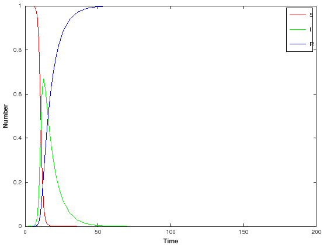

## Program 2.1 (SIR model) - original Matlab/Octave code


{:.input_area}
```octave
function dPop=Diff_2_1(t, pop, parameter)
    beta=parameter(1);
    gamma=parameter(2);
    S=pop(1);
    I=pop(2);
    R=pop(3);

    dPop=zeros(3,1);

    dPop(1)= -beta*S*I;
    dPop(2)= beta*S*I - gamma*I;
    dPop(3)= gamma*I;
endfunction
```


{:.input_area}
```octave
function [t,S,I,R] = Program_2_1(beta,gamma,S0,I0,MaxTime)
    S=S0;
    I=I0;
    R=1-S-I;
    [t, pop]=ode45(@(t,y) Diff_2_1(t,y,[beta gamma]),[0 MaxTime],[S I R]);
    S=pop(:,1); I=pop(:,2); R=pop(:,3);
endfunction
```


{:.input_area}
```octave
[t,S,I,R] = Program_2_1(1.4247,0.14286,1-1e-6,1e-6,70);
```


{:.input_area}
```octave
plot(t,S,"-r",t,I,"-g",t,R,"-b")
xlim([0 200])
xlabel("Time","fontweight","bold")
ylabel("Number","fontweight","bold")
h = legend("S","I","R");
legend(h,"show")
```




