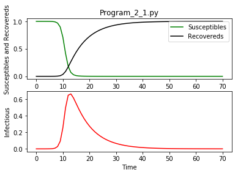

## Program 2.1 (SIR model) - original Python code


{:.input_area}
```python
import scipy.integrate as spi
import numpy as np
import pylab as pl
%matplotlib inline
```


{:.input_area}
```python
beta=1.4247
gamma=0.14286
TS=1.0
ND=70.0
S0=1-1e-6
I0=1e-6
INPUT = (S0, I0, 0.0)
```


{:.input_area}
```python
def diff_eqs(INP,t):  
	'''The main set of equations'''
	Y=np.zeros((3))
	V = INP    
	Y[0] = - beta * V[0] * V[1]
	Y[1] = beta * V[0] * V[1] - gamma * V[1]
	Y[2] = gamma * V[1]
	return Y   # For odeint
```


{:.input_area}
```python
t_start = 0.0; t_end = ND; t_inc = TS
t_range = np.arange(t_start, t_end+t_inc, t_inc)
RES = spi.odeint(diff_eqs,INPUT,t_range)
```


{:.input_area}
```python
#Ploting
pl.subplot(211)
pl.plot(RES[:,0], '-g', label='Susceptibles')
pl.plot(RES[:,2], '-k', label='Recovereds')
pl.legend(loc=0)
pl.title('Program_2_1.py')
pl.xlabel('Time')
pl.ylabel('Susceptibles and Recovereds')
pl.subplot(212)
pl.plot(RES[:,1], '-r', label='Infectious')
pl.xlabel('Time')
pl.ylabel('Infectious')
pl.show()
```




