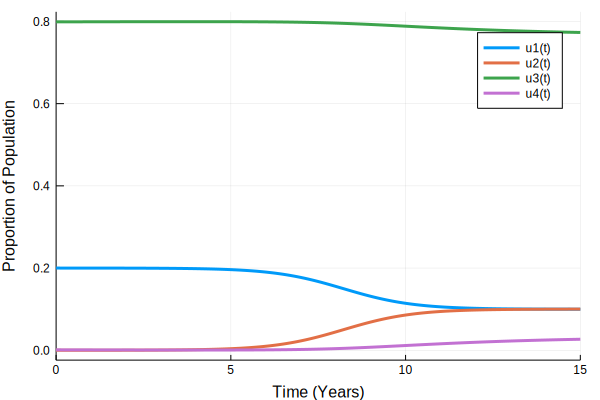

## Problem 3.1: SIS model with risk groups in Julia

Author: Emma Accorsi @emmaaccorsi

Date: 2018-10-02


{:.input_area}
```julia
using DifferentialEquations
```


{:.input_area}
```julia
function sis_ode(du,u,p,t)
        SH,IH,SL,IL = u
        betaHH,betaHL,betaLH,betaLL,gamma=p
        du[1]=-(betaHH*IH+betaHL*IL)*SH+gamma*IH
        du[2]=+(betaHH*IH+betaHL*IL)*SH-gamma*IH
        du[3]=-(betaLH*IH+betaLL*IL)*SL+gamma*IL
        du[4]=+(betaLH*IH+betaLL*IL)*SL-gamma*IL
    end
```


{:.output_data_text}
```
sis_ode (generic function with 1 method)
```


{:.input_area}
```julia
parms =[10,0.1,0.1,1,1]
init=[0.19999,0.00001,0.799,0.001]
tspan=tspan = (0.0,15.0)
```


{:.output_data_text}
```
(0.0, 15.0)
```


{:.input_area}
```julia
sis_prob = ODEProblem(sis_ode,init,tspan,parms)
sis_sol = solve(sis_prob,saveat=0.1)
```


{:.output_data_text}
```
retcode: Success
Interpolation: 1st order linear
t: 151-element Array{Float64,1}:
  0.0
  0.1
  0.2
  0.3
  0.4
  0.5
  0.6
  0.7
  0.8
  0.9
  1.0
  1.1
  1.2
  ⋮  
 13.9
 14.0
 14.1
 14.2
 14.3
 14.4
 14.5
 14.6
 14.7
 14.8
 14.9
 15.0
u: 151-element Array{Array{Float64,1},1}:
 [0.19999, 1.0e-5, 0.799, 0.001]              
 [0.199987, 1.31343e-5, 0.79902, 0.000980193] 
 [0.199983, 1.65569e-5, 0.799039, 0.000960808]
 [0.19998, 2.0299e-5, 0.799058, 0.000941839]  
 [0.199976, 2.43948e-5, 0.799077, 0.00092328] 
 [0.199971, 2.88825e-5, 0.799095, 0.000905125]
 [0.199966, 3.38042e-5, 0.799113, 0.000887371]
 [0.199961, 3.92064e-5, 0.79913, 0.000870012] 
 [0.199955, 4.51401e-5, 0.799147, 0.000853044]
 [0.199948, 5.16616e-5, 0.799164, 0.000836465]
 [0.199941, 5.88328e-5, 0.79918, 0.00082027]  
 [0.199933, 6.67232e-5, 0.799196, 0.000804459]
 [0.199925, 7.54101e-5, 0.799211, 0.000789029]
 ⋮                                            
 [0.100111, 0.0998891, 0.775299, 0.024701]    
 [0.100078, 0.0999224, 0.775082, 0.0249178]   
 [0.100048, 0.0999524, 0.774871, 0.0251294]   
 [0.100021, 0.0999794, 0.774664, 0.0253357]   
 [0.0999962, 0.100004, 0.774463, 0.0255369]   
 [0.0999737, 0.100026, 0.774267, 0.0257331]   
 [0.0999526, 0.100047, 0.774076, 0.0259244]   
 [0.0999326, 0.100067, 0.773889, 0.0261108]   
 [0.0999141, 0.100086, 0.773708, 0.0262925]   
 [0.0998972, 0.100103, 0.77353, 0.0264696]    
 [0.0998817, 0.100118, 0.773358, 0.0266423]   
 [0.0998676, 0.100132, 0.773189, 0.0268105]   
```


{:.input_area}
```julia
using Plots
```


{:.input_area}
```julia
plot(sis_sol,xlabel="Time (Years)",ylabel="Proportion of Population")
```





