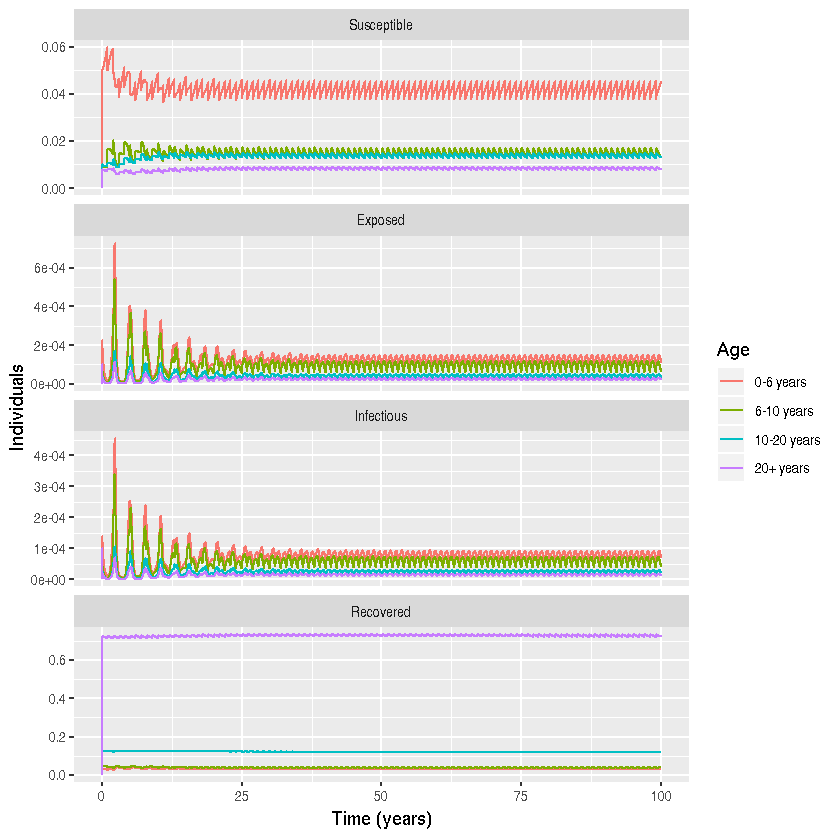

Program 3.4 from Keeling and Rohani 
----

Author: Theresa Stocks @theresasophia

Date: 2018-10-02

*NOTE*: This does not exactly reproduce the figures from the Python code.


{:.input_area}
```R
#Loading all necessary libraries 
library(deSolve)
library(tidyr)
library(reshape)
library(magrittr)
library(plyr)
library(ggplot2)
library(deSolve)
library(tidyr)
library(dplyr)
```

### Parameters


{:.input_area}
```R
m <- 4  #number of age classes
mu <- c(0,0,0,1/(55*365)) #death rate in each age group; it is assumed that only adults die
nu <- c(1/(55*365),0,0,0) #is the birth rate into the childhood class; it is assumed only adults give birth.
n <- c(6,4,10,55)/75 # fraction in each age class (assumption that life expectancy is 75 years)
S0 <- c(0.05,0.01,0.01,0.008) # inital value for number of susceptible
E0 <- c(0.0001,0.0001,0.0001,0.0001) # inital value for number of exposed
I0 <- c(0.0001,0.0001,0.0001,0.0001) # inital value for number of infectious
R0 <- c(0.0298, 0.04313333, 0.12313333, 0.72513333) # inital value for number of recovered
ND <- 365 # time to simulate
beta <- matrix(c(2.089, 2.089, 2.086, 2.037, 2.089, 9.336, 2.086, 2.037, 2.086, 2.086, 
                 2.086, 2.037, 2.037, 2.037, 2.037, 2.037), nrow=4, ncol=4) # matrix of transmission rates
gamma <- 1/5 # recovery rate
sigma <- 1/8 # rate at which individuals move from the exposed to the infectious classes
TS <- 1 # time step to simualte is days

# combining parameter and initial values
parms <- list(nu=nu, beta=beta, mu=mu, sigma=sigma, gamma=gamma)
INPUT <- c(S0, E0, I0, R0)

# constructing time vector
t_start <- 0 # starting time
t_end <- ND - 1 # ending time
t_inc <- TS #time increment
t_range <- seq(from= t_start, to=t_end+t_inc, by=t_inc) # vector with time steps
```

### Differential Equations


{:.input_area}
```R
# differential equations
diff_eqs <- function(times, Y, parms){
  dY <- numeric(length(Y))
  with(parms,{
    # creates an empty matrix               
    for(i in 1:m){
      dY[i] <- nu[i]*n[4] -  beta[,i]%*%Y[2*m + seq(1:m)] * Y[i] - mu[i] * Y[i] # S_i
      dY[m+i] <-  beta[,i] %*% Y[2*m + seq(1:m)] *Y[i] - mu[i] * Y[m+i] - sigma * Y[m+i] #E_i
      dY[2*m+i] <- sigma * Y[m+i] - gamma * Y[2*m + i] - mu[i] * Y[2*m+i] #I_i
      dY[3*m+i] <- gamma * Y[2*m+i] - mu[i] * Y[3*m + i] #R_i
    }
    list(dY) 
  })
}
```

### Ageing


{:.input_area}
```R
RES2=rep(0,17) #initalizing the result vector 
number_years <- 100 #set the number of years to simulate 

# initialize the loop
k=1
# yearly ageing
for(k in 1:number_years) {
  RES = lsoda(INPUT, t_range, diff_eqs, parms)
  #taking the last entry as the the new input that then is propagated accoring to the aging
  INPUT=RES[366,-1]
  INPUT[16]=INPUT[16]+INPUT[15]/10
  INPUT[15]=INPUT[15]+INPUT[14]/4-INPUT[15]/10
  INPUT[14]=INPUT[14]+INPUT[13]/6-INPUT[14]/4
  INPUT[13]=INPUT[13]-INPUT[13]/6

  INPUT[12]=INPUT[12]+INPUT[11]/10
  INPUT[11]=INPUT[11]+INPUT[10]/4-INPUT[11]/10
  INPUT[10]=INPUT[10]+INPUT[9]/6-INPUT[10]/4
  INPUT[9]=INPUT[9]-INPUT[9]/6
  
  INPUT[8]=INPUT[8]+INPUT[7]/10
  INPUT[7]=INPUT[7]+INPUT[6]/4-INPUT[7]/10
  INPUT[6]=INPUT[6]+INPUT[5]/6-INPUT[6]/4
  INPUT[5]=INPUT[5]-INPUT[5]/6

  INPUT[4]=INPUT[4]+INPUT[3]/10
  INPUT[3]=INPUT[3]+INPUT[2]/4-INPUT[3]/10
  INPUT[2]=INPUT[2]+INPUT[1]/6-INPUT[2]/4
  INPUT[1]=INPUT[1]-INPUT[1]/6
  RES2 <- rbind(RES2,RES)
  k=k+1
}
```

### Plotting


{:.input_area}
```R
#rescaling time to years
time <- seq(from=0, to=100*(ND+1))/(ND+1)
#changing time to the rescaled time
RES2[ ,"time"] <- time

#labeling of the output from ODE solver
label <- c("S1", "S2", "S3", "S4","E1", "E2", "E3", "E4", "I1", "I2", "I3", "I4", "R1", "R2", "R3", "R4")
label1 <- substr(label, 1, 1)
Age <- substr(label, 2, 2)

df <- data.frame(time = RES2[, 1],
                 label1 = rep(label1, each =  nrow(RES2)),
                 Age = rep(Age, each =  nrow(RES2)),
                 value = c(RES2[, -1]))

#plotting  the data
df$label1 <- factor(df$label1, levels = c("S","E","I","R"))
df$Age <- factor(df$Age)
df %>% mutate(label1 = recode(label1, S = "Susceptible")) %>% 
       mutate(label1 = recode(label1, E = "Exposed")) %>% 
       mutate(label1 = recode(label1, I = "Infectious")) %>%
       mutate(label1 = recode(label1, R = "Recovered"))  %>%
       mutate(Age = recode(Age, "1" = "0-6 years ")) %>%
       mutate(Age = recode(Age, "2" = "6-10 years ")) %>%
       mutate(Age = recode(Age, "3" = "10-20 years ")) %>%       
       mutate(Age = recode(Age, "4" = "20+ years ")) %>%  
ggplot() +
   geom_line(aes(x = time, y = value, color = Age)) +
   facet_wrap( ~label1, ncol=1, scales =  "free_y")+ 
   xlab("Time (years)") + ylab(" Individuals")
```




