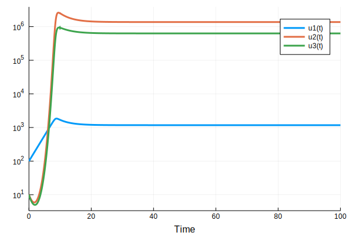

## Macroparasite model from May and Anderson (1978) in Julia

*Author*: Federica Giardina @federigia

*Date*: 2018-10-03 


{:.input_area}
```julia
using DifferentialEquations
```


{:.input_area}
```julia
function macrop_ode(dY,Y,p,t)
 dY[1] = (p[1]-p[2])*Y[1] - p[3]*Y[2]
 dY[2] = p[4]*Y[1]*Y[3] - (p[5]+p[3]+p[2])*Y[2] - (p[3]*((Y[2]^2)/Y[1])*((p[6]+1)/p[6])) 
 dY[3] = p[7]*Y[2] - (p[8]*Y[3]) - (p[4]*Y[1]*Y[3])
end
```


{:.output_data_text}
```
macrop_ode (generic function with 1 method)
```


{:.input_area}
```julia
par=[1.4,1.05,0.0003,0.01,0.5,0.1,10.0,10.0]
init=[100.0,10.0,10.0]
tspan=(0.0,100.0)
```


{:.output_data_text}
```
(0.0, 100.0)
```


{:.input_area}
```julia
macro_par = ODEProblem(macrop_ode,init,tspan,par)
```


{:.output_data_text}
```
DiffEqBase.ODEProblem with uType Array{Float64,1} and tType Float64. In-place: true
timespan: (0.0, 100.0)
u0: [100.0, 10.0, 10.0]
```


{:.input_area}
```julia
sol=solve(macro_par);
```


{:.input_area}
```julia
using Plots
```


{:.input_area}
```julia
plot(sol,xlabel="Time",yscale=:log10)
```





