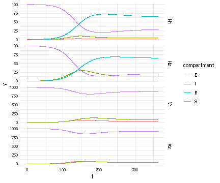

## Julia Implementation of Host SEIR + Vector SEI

*Author*: Carl A. B. Pearson @pearsonca

*Date*: 2018-10-02

This version considers multiple hosts *and* multiple vectors, which further complicates indexing.  Now the indexing scheme is:

 - all of host $i$ compartments ($S_H^i$, $E_H^i$, etc), for each $i \in 1\ldots N$
 - all of vector $j$ compartments ($S_V^j$, $E_V^j$, etc), for each $j \in 1\ldots M$

With this approach, we can again re-use the solutions for single host and single vector, with slight modifications:


{:.input_area}
```julia
H_comps = 4
V_comps = 3

# in sub functions, du / u are the particular relevant slices only
function F1H(du, u, p, t, βslice, I_V, N_H)
    S_H, E_H, I_H, R_H = u
    
    # host dynamics
    host_infection = sum(βslice .* I_V)*S_H/N_H
    host_mortality = p.μ_H .* u # include S_H, so easier to remove mortality
    host_births = sum(host_mortality)
    host_progression = p.σ_H*E_H
    recovery = p.λ*I_H
    
    du[1] = -host_infection + host_births
    du[2] = host_infection - host_progression
    du[3] = host_progression - recovery
    du[4] = recovery
    du[1:end] -= host_mortality 
end

# in sub functions, du / u are the particular relevant slices only
function F1V(du, u, p, t, βslice, I_H, N_H)
    S_V, E_V, I_V = u
    vec_infection = sum(βslice .* I_H)*S_V/N_H
    vec_mortality = p.μ_V .* u # include S_V, so easier to remove mortality
    vec_births = sum(vec_mortality)
    vec_progression = p.σ_V*E_V
    
    du[1] = -vec_infection + vec_births
    du[2] = vec_infection - vec_progression
    du[3] = vec_progression
    du[1:end] -= vec_mortality
end

function F(du,u,p,t)
    dH = @view(du[1:(p.nHosts*H_comps)])
    dV = @view(du[(p.nHosts*H_comps+1):end])
    Hs = @view(u[1:(p.nHosts*H_comps)])
    Vs = @view(u[(p.nHosts*H_comps+1):end])
    
    I_Vs = @view(Vs[3:V_comps:V_comps*p.nVecs])
    I_Hs = @view(Hs[3:H_comps:H_comps*p.nHosts])
    
    for host in 0:(p.nHosts-1)
        slice = (1:H_comps).+(H_comps*host)
        F1H(@view(dH[slice]), @view(Hs[slice]), p.host[host+1], t, @view(p.β[host+1,:]), I_Vs, p.N_H)
    end
    for vec in 0:(p.nVecs-1)
        slice = (1:V_comps).+(V_comps*vec)
        F1V(@view(dV[slice]), @view(Vs[slice]), p.vec[vec+1], t, @view(p.β[:,vec+1]), I_Hs, p.N_H)
    end
end
```


{:.output_data_text}
```
F (generic function with 1 method)
```


First, state initial conditions.  This code generates them randomly for convenience, though they could be assigned based on data, desired parameter space, or algorithmically as part of a fitting process:


{:.input_area}
```julia
nH = 2
nV = 2
srand(0)

S_Hs = ones(nH) .* 100.0
E_Hs = zeros(nH)
I_Hs = shuffle(vcat(zeros(nH-1),[1.0]))
R_Hs = zeros(nH)
host0 = reshape(hcat(S_Hs,E_Hs,I_Hs,R_Hs)', nH*H_comps, 1)

S_Vs = ones(nV) .* 1000.0
E_Vs = zeros(nV)
I_Vs = zeros(nV)
vec0 = reshape(hcat(S_Vs,E_Vs,I_Vs)', nV*V_comps, 1)

u0 = vcat(host0, vec0)
```


{:.output_data_text}
```
14×1 Array{Float64,2}:
  100.0
    0.0
    1.0
    0.0
  100.0
    0.0
    0.0
    0.0
 1000.0
    0.0
    0.0
 1000.0
    0.0
    0.0
```


Now, generate dynamic parameters.  Again: this code generates them randomly for convenience, though they could be assigned based on data, desired parameter space, or algorithmically as part of a fitting process:


{:.input_area}
```julia
srand(1)

μs = 1 ./ (rand(nH) .* 360)
σs = 1 ./ (rand(nH) .* 6)
μVs = 1 ./ (rand(nV) .* 60)
σVs = 1 ./ (rand(nV) .* 14)

λs = 1 ./ (rand(nH) .* 28)
βs = rand(nH*nV) ./ 10.0

using NamedTuples
# nb: in >= Julia v0.7, can eliminate this import
#  and the @NT syntax
p = @NT(
  nHosts = nH, nVecs = nV,
  N_H = sum(host0),
  β = reshape(βs,nH,nV), # information in hosts (rows) by vectors (cols)
  vec  = [@NT(μ_V=μVs[j], σ_V=σVs[j]) for j in 1:nV],
  host = [@NT(μ_H=μs[i], σ_H=σs[i], λ=λs[i]) for i in 1:nH]
  # just building up a random collection of params for demonstration
)
```


{:.output_data_text}
```
(nHosts = 2, nVecs = 2, N_H = 201.0, β = [0.0555751 0.0424718; 0.0437108 0.0773223], vec = NamedTuples._NT_μ__V_σ__V{Float64,Float64}[(μ_V = 0.0341102, σ_V = 0.0750366), (μ_V = 0.0790008, σ_V = 0.0714354)], host = NamedTuples._NT_μ__H_σ__H_λ{Float64,Float64,Float64}[(μ_H = 0.0117686, σ_H = 0.53298, λ = 0.141914), (μ_H = 0.00801628, σ_H = 21.0723, λ = 0.0361969)])
```


Now these values can be used with the ODE solver:


{:.input_area}
```julia
using DifferentialEquations
using IterableTables, DataFrames

tspan = (0.0, 365.0)
prob = ODEProblem(F, u0, tspan, p)
sol = solve(prob,Tsit5(),reltol=1e-8,abstol=1e-8,saveat=linspace(0,365,365*10+1))
```


{:.output_data_text}
```
retcode: Success
Interpolation: 1st order linear
t: 3651-element Array{Float64,1}:
   0.0
   0.1
   0.2
   0.3
   0.4
   0.5
   0.6
   0.7
   0.8
   0.9
   1.0
   1.1
   1.2
   ⋮  
 363.9
 364.0
 364.1
 364.2
 364.3
 364.4
 364.5
 364.6
 364.7
 364.8
 364.9
 365.0
u: 3651-element Array{Array{Float64,2},1}:
 [100.0; 0.0; … ; 0.0; 0.0]                       
 [100.001; 1.45562e-7; … ; 0.0208111; 7.45142e-5] 
 [100.002; 1.1395e-6; … ; 0.0409938; 0.000294274] 
 [100.004; 3.76354e-6; … ; 0.0605622; 0.000653715]
 [100.005; 8.73081e-6; … ; 0.0795303; 0.00114742] 
 [100.006; 1.66901e-5; … ; 0.0979121; 0.00177011] 
 [100.007; 2.82298e-5; … ; 0.115721; 0.00251664]  
 [100.008; 4.38818e-5; … ; 0.13297; 0.00338201]   
 [100.009; 6.41252e-5; … ; 0.149673; 0.00436136]  
 [100.01; 8.93894e-5; … ; 0.165843; 0.00544994]   
 [100.012; 0.000120058; … ; 0.181491; 0.00664314] 
 [100.013; 0.000156469; … ; 0.196631; 0.00793648] 
 [100.014; 0.000198924; … ; 0.211274; 0.00932559] 
 ⋮                                                
 [28.4073; 1.55928; … ; 40.3947; 36.2825]         
 [28.4077; 1.55936; … ; 40.3969; 36.2844]         
 [28.4082; 1.55943; … ; 40.3992; 36.2863]         
 [28.4086; 1.5595; … ; 40.4014; 36.2883]          
 [28.409; 1.55958; … ; 40.4036; 36.2902]          
 [28.4094; 1.55965; … ; 40.4058; 36.2921]         
 [28.4098; 1.55972; … ; 40.4081; 36.294]          
 [28.4101; 1.55979; … ; 40.4103; 36.296]          
 [28.4105; 1.55987; … ; 40.4125; 36.2979]         
 [28.4109; 1.55994; … ; 40.4147; 36.2998]         
 [28.4113; 1.56001; … ; 40.4169; 36.3018]         
 [28.4116; 1.56009; … ; 40.4191; 36.3037]         
```


{:.input_area}
```julia
# rename!(df, Dict(:timestamp => :t,
#  :value1 => :S_H, :value2 => :E_H, :value3 => :I_H, :value4 => :R_H,
#  :value5 => :S_V, :value6 => :E_V, :value7 => :I_V
# ))
# mlt[:host] = contains.(string.(mlt[:variable]),"H"); # tag which entries are host vs vector
# df
df = DataFrame(sol)
mlt = melt(df,:timestamp) # convert results into long format for plotting
mlt[:index] = parse.(Int,replace.(string.(mlt[:variable]),r"[^\d]+"=>""))
namekey = hcat(
  reshape(["$(compartment)_H$species" for compartment in ["S","E","I","R"], species in 1:nH],1,:),
  reshape(["$(compartment)_V$species" for compartment in ["S","E","I"], species in 1:nV],1,:)
)

mlt[:name] = namekey[mlt[:index]]
mlt[:facet] = replace.(string.(mlt[:name]),r"\w+_"=>"")
mlt[:compartment] = replace.(string.(mlt[:name]),r"_\w+"=>"")
mlt
```


<div markdown="0">
<table class="data-frame"><thead><tr><th></th><th>variable</th><th>value</th><th>timestamp</th><th>index</th><th>name</th><th>facet</th><th>compartment</th></tr></thead><tbody><tr><th>1</th><td>value1</td><td>100.0</td><td>0.0</td><td>1</td><td>S_H1</td><td>H1</td><td>S</td></tr><tr><th>2</th><td>value1</td><td>100.0011760184626</td><td>0.1</td><td>1</td><td>S_H1</td><td>H1</td><td>S</td></tr><tr><th>3</th><td>value1</td><td>100.0023497784613</td><td>0.2</td><td>1</td><td>S_H1</td><td>H1</td><td>S</td></tr><tr><th>4</th><td>value1</td><td>100.00352043359341</td><td>0.3</td><td>1</td><td>S_H1</td><td>H1</td><td>S</td></tr><tr><th>5</th><td>value1</td><td>100.0046871663549</td><td>0.4</td><td>1</td><td>S_H1</td><td>H1</td><td>S</td></tr><tr><th>6</th><td>value1</td><td>100.00584918746296</td><td>0.5</td><td>1</td><td>S_H1</td><td>H1</td><td>S</td></tr><tr><th>7</th><td>value1</td><td>100.00700573519084</td><td>0.6</td><td>1</td><td>S_H1</td><td>H1</td><td>S</td></tr><tr><th>8</th><td>value1</td><td>100.00815607470733</td><td>0.7</td><td>1</td><td>S_H1</td><td>H1</td><td>S</td></tr><tr><th>9</th><td>value1</td><td>100.00929949745365</td><td>0.8</td><td>1</td><td>S_H1</td><td>H1</td><td>S</td></tr><tr><th>10</th><td>value1</td><td>100.01043532049054</td><td>0.9</td><td>1</td><td>S_H1</td><td>H1</td><td>S</td></tr><tr><th>11</th><td>value1</td><td>100.01156288589394</td><td>1.0</td><td>1</td><td>S_H1</td><td>H1</td><td>S</td></tr><tr><th>12</th><td>value1</td><td>100.01268156016334</td><td>1.1</td><td>1</td><td>S_H1</td><td>H1</td><td>S</td></tr><tr><th>13</th><td>value1</td><td>100.0137907335866</td><td>1.2</td><td>1</td><td>S_H1</td><td>H1</td><td>S</td></tr><tr><th>14</th><td>value1</td><td>100.01488981970893</td><td>1.3</td><td>1</td><td>S_H1</td><td>H1</td><td>S</td></tr><tr><th>15</th><td>value1</td><td>100.01597825471352</td><td>1.4</td><td>1</td><td>S_H1</td><td>H1</td><td>S</td></tr><tr><th>16</th><td>value1</td><td>100.0170554968953</td><td>1.5</td><td>1</td><td>S_H1</td><td>H1</td><td>S</td></tr><tr><th>17</th><td>value1</td><td>100.0181210260885</td><td>1.6</td><td>1</td><td>S_H1</td><td>H1</td><td>S</td></tr><tr><th>18</th><td>value1</td><td>100.01917434313587</td><td>1.7</td><td>1</td><td>S_H1</td><td>H1</td><td>S</td></tr><tr><th>19</th><td>value1</td><td>100.02021496935933</td><td>1.8</td><td>1</td><td>S_H1</td><td>H1</td><td>S</td></tr><tr><th>20</th><td>value1</td><td>100.02124244603334</td><td>1.9</td><td>1</td><td>S_H1</td><td>H1</td><td>S</td></tr><tr><th>21</th><td>value1</td><td>100.02225633388129</td><td>2.0</td><td>1</td><td>S_H1</td><td>H1</td><td>S</td></tr><tr><th>22</th><td>value1</td><td>100.02325621257515</td><td>2.1</td><td>1</td><td>S_H1</td><td>H1</td><td>S</td></tr><tr><th>23</th><td>value1</td><td>100.02424168023792</td><td>2.2</td><td>1</td><td>S_H1</td><td>H1</td><td>S</td></tr><tr><th>24</th><td>value1</td><td>100.02521235297311</td><td>2.3</td><td>1</td><td>S_H1</td><td>H1</td><td>S</td></tr><tr><th>25</th><td>value1</td><td>100.02616786438361</td><td>2.4</td><td>1</td><td>S_H1</td><td>H1</td><td>S</td></tr><tr><th>26</th><td>value1</td><td>100.02710786511321</td><td>2.5</td><td>1</td><td>S_H1</td><td>H1</td><td>S</td></tr><tr><th>27</th><td>value1</td><td>100.02803202239623</td><td>2.6</td><td>1</td><td>S_H1</td><td>H1</td><td>S</td></tr><tr><th>28</th><td>value1</td><td>100.02894001960289</td><td>2.7</td><td>1</td><td>S_H1</td><td>H1</td><td>S</td></tr><tr><th>29</th><td>value1</td><td>100.02983155581597</td><td>2.8</td><td>1</td><td>S_H1</td><td>H1</td><td>S</td></tr><tr><th>30</th><td>value1</td><td>100.03070634539198</td><td>2.9</td><td>1</td><td>S_H1</td><td>H1</td><td>S</td></tr><tr><th>&vellip;</th><td>&vellip;</td><td>&vellip;</td><td>&vellip;</td><td>&vellip;</td><td>&vellip;</td><td>&vellip;</td><td>&vellip;</td></tr></tbody></table>
</div>


Now that we have a solution, we want to view what is happening in host vs mosquito population:


{:.input_area}
```julia
using RCall
# current version RCall supports better transfers, which would simplify this mess
# but requires Julia v >= 0.7
vals = mlt[:value]
tstamps = mlt[:timestamp]
fcts = mlt[:facet]
comps = mlt[:compartment]
@rput vals tstamps fcts comps
R"
library(ggplot2)
suppressPackageStartupMessages(library(data.table))
dt <- data.table(t=tstamps, y=vals, species=fcts, compartment=comps)
ggplot(dt) + aes(x=t, y=y, color=compartment) + facet_grid(species ~ ., scale = 'free_y') +
  theme_minimal() +
  geom_line()
"
```





{:.output_data_text}
```
RCall.RObject{RCall.VecSxp}

```


