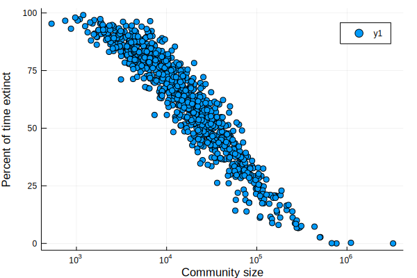
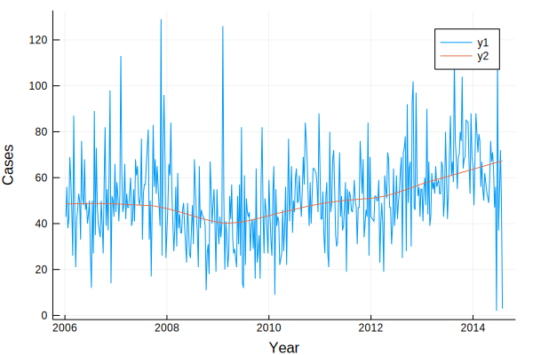
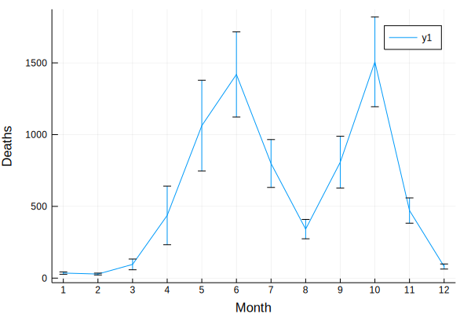

## Chapter 1 from Bjornstad (2018): original code in R

### Libraries


{:.input_area}
```julia
using RCall
using DataFrames
using StatsBase: mean, std
using Plots
```


{:.input_area}
```julia
@rlibrary epimdr
```

### Figure 1.2


{:.input_area}
```julia
ccs = rcopy(R"epimdr::ccs")
```


<div markdown="0">
<table class="data-frame"><thead><tr><th></th><th>fade3</th><th>ext</th><th>size</th><th>fade</th><th>se3</th><th>se</th><th>n3</th><th>n</th><th>names</th></tr><tr><th></th><th>Float64</th><th>Float64</th><th>Float64</th><th>Float64</th><th>Float64</th><th>Float64</th><th>Float64</th><th>Float64</th><th>String</th></tr></thead><tbody><tr><th>1</th><td>12.12</td><td>0.645985</td><td>11740.0</td><td>5.70161</td><td>1.76187</td><td>0.85271</td><td>50.0</td><td>124.0</td><td>Abingdon</td></tr><tr><th>2</th><td>14.7857</td><td>0.67427</td><td>6190.0</td><td>5.904</td><td>1.91198</td><td>0.854697</td><td>42.0</td><td>125.0</td><td>Abram</td></tr><tr><th>3</th><td>12.0</td><td>0.50365</td><td>39610.0</td><td>4.33858</td><td>2.20656</td><td>0.736264</td><td>35.0</td><td>127.0</td><td>Accrington</td></tr><tr><th>4</th><td>8.46429</td><td>0.341241</td><td>65790.0</td><td>3.21552</td><td>1.18465</td><td>0.399363</td><td>28.0</td><td>116.0</td><td>Acton</td></tr><tr><th>5</th><td>22.7778</td><td>0.797445</td><td>4110.0</td><td>11.4868</td><td>3.71571</td><td>2.14112</td><td>36.0</td><td>76.0</td><td>Adlington</td></tr><tr><th>6</th><td>12.8864</td><td>0.614051</td><td>18580.0</td><td>5.9469</td><td>1.98467</td><td>0.930404</td><td>44.0</td><td>113.0</td><td>Adwick.le.Street</td></tr><tr><th>7</th><td>21.1818</td><td>0.885949</td><td>2690.0</td><td>14.2647</td><td>2.63138</td><td>2.04628</td><td>44.0</td><td>68.0</td><td>Aldeburgh</td></tr><tr><th>8</th><td>21.1951</td><td>0.850365</td><td>3722.0</td><td>11.3537</td><td>3.45003</td><td>2.03406</td><td>41.0</td><td>82.0</td><td>Alderley.Edge</td></tr><tr><th>9</th><td>11.4878</td><td>0.546533</td><td>38180.0</td><td>4.70866</td><td>1.34397</td><td>0.601223</td><td>41.0</td><td>127.0</td><td>Aldershot</td></tr><tr><th>10</th><td>6.46875</td><td>0.334854</td><td>31440.0</td><td>2.73881</td><td>0.813178</td><td>0.270066</td><td>32.0</td><td>134.0</td><td>Aldridge</td></tr><tr><th>11</th><td>37.2963</td><td>0.936131</td><td>2150.0</td><td>27.7027</td><td>5.93815</td><td>5.04899</td><td>27.0</td><td>37.0</td><td>Alford</td></tr><tr><th>12</th><td>12.48</td><td>0.646898</td><td>23130.0</td><td>6.49541</td><td>1.78685</td><td>0.973539</td><td>50.0</td><td>109.0</td><td>Alfreton</td></tr><tr><th>13</th><td>29.1935</td><td>0.863139</td><td>7310.0</td><td>15.4918</td><td>5.62147</td><td>3.35647</td><td>31.0</td><td>61.0</td><td>Alnwick</td></tr><tr><th>14</th><td>10.9348</td><td>0.571168</td><td>27520.0</td><td>4.96032</td><td>1.23375</td><td>0.605729</td><td>46.0</td><td>126.0</td><td>Alreborough</td></tr><tr><th>15</th><td>12.9138</td><td>0.766423</td><td>5875.0</td><td>7.35965</td><td>1.76154</td><td>1.04004</td><td>58.0</td><td>114.0</td><td>Alsager</td></tr><tr><th>16</th><td>20.3158</td><td>0.773723</td><td>8660.0</td><td>9.73563</td><td>2.86096</td><td>1.59712</td><td>38.0</td><td>87.0</td><td>Alton</td></tr><tr><th>17</th><td>9.23256</td><td>0.445255</td><td>40070.0</td><td>4.59434</td><td>1.09758</td><td>0.581039</td><td>43.0</td><td>106.0</td><td>Altrincham</td></tr><tr><th>18</th><td>31.0</td><td>0.884124</td><td>4799.0</td><td>17.6</td><td>5.21845</td><td>3.46017</td><td>30.0</td><td>55.0</td><td>Amble</td></tr><tr><th>19</th><td>32.4444</td><td>0.858577</td><td>3000.0</td><td>13.4286</td><td>5.49963</td><td>2.77325</td><td>27.0</td><td>70.0</td><td>Amblecote</td></tr><tr><th>20</th><td>25.1316</td><td>0.903285</td><td>3050.0</td><td>16.7627</td><td>3.45097</td><td>2.66132</td><td>38.0</td><td>59.0</td><td>Ampthill</td></tr><tr><th>21</th><td>19.9706</td><td>0.709854</td><td>15600.0</td><td>8.26596</td><td>2.93163</td><td>1.3937</td><td>34.0</td><td>94.0</td><td>Andover</td></tr><tr><th>22</th><td>33.0345</td><td>0.895073</td><td>1698.0</td><td>21.3043</td><td>6.74381</td><td>4.80186</td><td>29.0</td><td>46.0</td><td>Appleby</td></tr><tr><th>23</th><td>13.561</td><td>0.596715</td><td>22000.0</td><td>6.33981</td><td>1.68061</td><td>0.884491</td><td>41.0</td><td>103.0</td><td>Arnold</td></tr><tr><th>24</th><td>29.7667</td><td>0.866788</td><td>2640.0</td><td>13.5571</td><td>5.37292</td><td>2.83885</td><td>30.0</td><td>70.0</td><td>Arundel</td></tr><tr><th>25</th><td>19.6923</td><td>0.770985</td><td>5470.0</td><td>9.48315</td><td>3.32357</td><td>1.73706</td><td>39.0</td><td>89.0</td><td>Ashbourne</td></tr><tr><th>26</th><td>48.8</td><td>0.92427</td><td>2695.0</td><td>24.0952</td><td>9.841</td><td>5.9085</td><td>20.0</td><td>42.0</td><td>Ashburton</td></tr><tr><th>27</th><td>16.4255</td><td>0.770985</td><td>6552.0</td><td>8.52525</td><td>2.27782</td><td>1.31687</td><td>47.0</td><td>99.0</td><td>Ashby.de.la.Zouch</td></tr><tr><th>28</th><td>20.1667</td><td>0.828467</td><td>3340.0</td><td>10.7976</td><td>2.59095</td><td>1.6488</td><td>42.0</td><td>84.0</td><td>Ashby.Woulds</td></tr><tr><th>29</th><td>11.3721</td><td>0.554745</td><td>25630.0</td><td>5.15254</td><td>1.54698</td><td>0.711205</td><td>43.0</td><td>118.0</td><td>Ashford</td></tr><tr><th>30</th><td>15.5</td><td>0.546533</td><td>28370.0</td><td>5.80583</td><td>2.28291</td><td>0.954421</td><td>32.0</td><td>103.0</td><td>Ashington</td></tr><tr><th>&vellip;</th><td>&vellip;</td><td>&vellip;</td><td>&vellip;</td><td>&vellip;</td><td>&vellip;</td><td>&vellip;</td><td>&vellip;</td><td>&vellip;</td><td>&vellip;</td></tr></tbody></table>
</div>


{:.input_area}
```julia
plot(ccs[:size], ccs[:ext]*100,
    seriestype=:scatter,
    xscale = :log10,
    xlabel = "Community size",
    ylabel = "Percent of time extinct")
```





### Fig 1.3a


{:.input_area}
```julia
magono = rcopy(R"epimdr::magono")
plot(magono[:time], magono[:number], ylabel = "Cases", xlabel = "Year")
smooth = rcopy(rcall(:lowess,x=magono[:time],y=magono[:number],f=0.4))
plot!(smooth[:x],smooth[:y])
```





### Fig 1.3b


{:.input_area}
```julia
cholera = rcopy(R"epimdr::cholera")
```


<div markdown="0">
<table class="data-frame"><thead><tr><th></th><th>Year</th><th>Month</th><th>Dacca</th><th>Population</th></tr><tr><th></th><th>Int64</th><th>Int64</th><th>Int64</th><th>Int64</th></tr></thead><tbody><tr><th>1</th><td>1891</td><td>1</td><td>2641</td><td>2420656</td></tr><tr><th>2</th><td>1891</td><td>2</td><td>939</td><td>2422563</td></tr><tr><th>3</th><td>1891</td><td>3</td><td>905</td><td>2424470</td></tr><tr><th>4</th><td>1891</td><td>4</td><td>1219</td><td>2426378</td></tr><tr><th>5</th><td>1891</td><td>5</td><td>368</td><td>2428285</td></tr><tr><th>6</th><td>1891</td><td>6</td><td>78</td><td>2430192</td></tr><tr><th>7</th><td>1891</td><td>7</td><td>29</td><td>2432099</td></tr><tr><th>8</th><td>1891</td><td>8</td><td>12</td><td>2434007</td></tr><tr><th>9</th><td>1891</td><td>9</td><td>30</td><td>2435914</td></tr><tr><th>10</th><td>1891</td><td>10</td><td>44</td><td>2437821</td></tr><tr><th>11</th><td>1891</td><td>11</td><td>270</td><td>2439728</td></tr><tr><th>12</th><td>1891</td><td>12</td><td>1149</td><td>2441635</td></tr><tr><th>13</th><td>1892</td><td>1</td><td>633</td><td>2443543</td></tr><tr><th>14</th><td>1892</td><td>2</td><td>501</td><td>2445450</td></tr><tr><th>15</th><td>1892</td><td>3</td><td>855</td><td>2447357</td></tr><tr><th>16</th><td>1892</td><td>4</td><td>1271</td><td>2449264</td></tr><tr><th>17</th><td>1892</td><td>5</td><td>666</td><td>2451171</td></tr><tr><th>18</th><td>1892</td><td>6</td><td>101</td><td>2453079</td></tr><tr><th>19</th><td>1892</td><td>7</td><td>62</td><td>2454986</td></tr><tr><th>20</th><td>1892</td><td>8</td><td>23</td><td>2456893</td></tr><tr><th>21</th><td>1892</td><td>9</td><td>20</td><td>2458800</td></tr><tr><th>22</th><td>1892</td><td>10</td><td>28</td><td>2460708</td></tr><tr><th>23</th><td>1892</td><td>11</td><td>461</td><td>2462615</td></tr><tr><th>24</th><td>1892</td><td>12</td><td>892</td><td>2464522</td></tr><tr><th>25</th><td>1893</td><td>1</td><td>751</td><td>2466429</td></tr><tr><th>26</th><td>1893</td><td>2</td><td>170</td><td>2468336</td></tr><tr><th>27</th><td>1893</td><td>3</td><td>253</td><td>2470244</td></tr><tr><th>28</th><td>1893</td><td>4</td><td>906</td><td>2472151</td></tr><tr><th>29</th><td>1893</td><td>5</td><td>700</td><td>2474058</td></tr><tr><th>30</th><td>1893</td><td>6</td><td>98</td><td>2475965</td></tr><tr><th>&vellip;</th><td>&vellip;</td><td>&vellip;</td><td>&vellip;</td><td>&vellip;</td></tr></tbody></table>
</div>


{:.input_area}
```julia
err(x)=1.96std(x)/sqrt(length(x))
ses = aggregate(cholera[[:Dacca,:Month]],:Month,[mean,err])
ses[:Month][1:6] = 7:12
ses[:Month][7:12] = 1:6
sort!(ses,(:Month))
```


<div markdown="0">
<table class="data-frame"><thead><tr><th></th><th>Month</th><th>Dacca_mean</th><th>Dacca_err</th></tr><tr><th></th><th>Int64</th><th>Float64</th><th>Float64</th></tr></thead><tbody><tr><th>1</th><td>1</td><td>35.18</td><td>8.18342</td></tr><tr><th>2</th><td>2</td><td>28.48</td><td>6.44006</td></tr><tr><th>3</th><td>3</td><td>95.58</td><td>37.4001</td></tr><tr><th>4</th><td>4</td><td>436.96</td><td>204.182</td></tr><tr><th>5</th><td>5</td><td>1062.58</td><td>316.323</td></tr><tr><th>6</th><td>6</td><td>1419.38</td><td>296.542</td></tr><tr><th>7</th><td>7</td><td>798.74</td><td>166.801</td></tr><tr><th>8</th><td>8</td><td>341.64</td><td>67.465</td></tr><tr><th>9</th><td>9</td><td>808.04</td><td>180.589</td></tr><tr><th>10</th><td>10</td><td>1507.04</td><td>312.602</td></tr><tr><th>11</th><td>11</td><td>471.02</td><td>88.1247</td></tr><tr><th>12</th><td>12</td><td>80.86</td><td>17.6863</td></tr></tbody></table>
</div>


{:.input_area}
```julia
plot(ses[:Month],ses[:Dacca_mean],yerr=ses[:Dacca_err],xlabel="Month",xticks=1:12,ylabel="Deaths")
```





