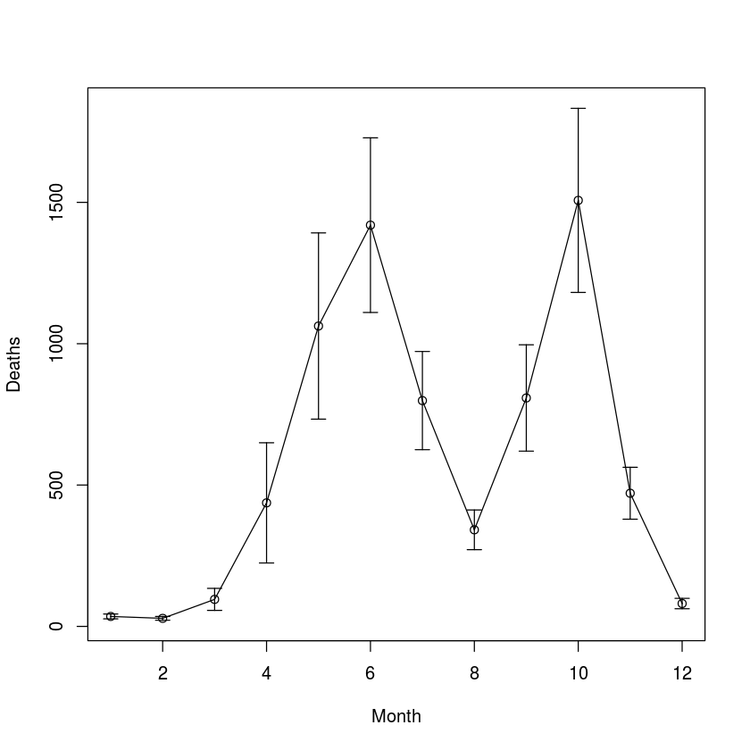

## Chapter 1 from Bjornstad (2018)

### Libraries


{:.input_area}
```R
library(epimdr)
```

### Figure 1.2


{:.input_area}
```R
data(ccs)
```


{:.input_area}
```R
plot(ccs$size, ccs$ext*100, log = "x", xlab =
     "Community size", ylab = "Percent 
     of time extinct")
```


### Fig 1.3a


{:.input_area}
```R
plot(magono$time, magono$number, ylab = "Cases", 
     xlab = "Year")
lines(lowess(x = magono$time, y = magono$number, f=.4))
```


### Fig 1.3b


{:.input_area}
```R
data(cholera)
ses = sesdv = rep(NA, 12)
ses[c(7:12, 1:6)] = sapply(split(cholera$Dacca, 
     cholera$Month), mean, na.rm = TRUE)
sesdv[c(7:12, 1:6)] = sapply(split(cholera$Dacca, 
     cholera$Month), sd, na.rm = TRUE)/
     sqrt(length(split(cholera$Dacca, cholera$Month)))
require(plotrix)
plotCI(x = 1:12, y = ses, ui = ses+sesdv, li = ses-
     sesdv, xlab = "Month", ylab = "Deaths")
lines(x = 1:12, y = ses)
```




