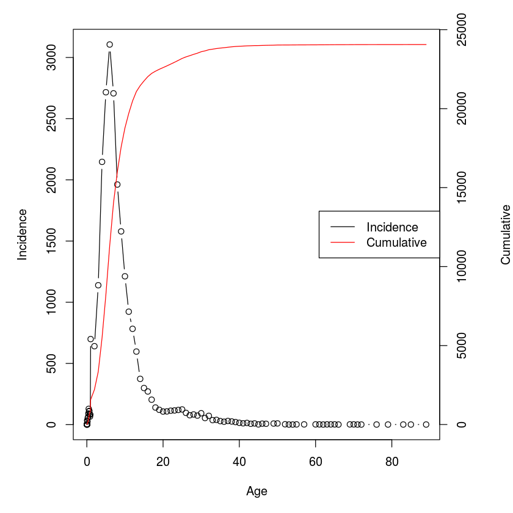

## Chapter 4 from Bjornstad (2018): Force of infection and age-dependent incidence

Let us assume we test some $n_a$ individuals of each age $a$ and find from serology that $i_a$ individuals have been previously infected. Inferring $\phi$ from this data is a standard(ish) binomial regression problem: $p(a)=1-exp(- \phi a)$ is the expected fraction infected (or seropositive) by age $a$. Thus $\log(-\log(1-p(a)))=\log(\phi)+\log(a)$, so we can estimate a constant log-FoI as the intercept from a `glm` with binomial error, a complimentary log-log link and log-age as a regression ‘offset. We can illustrate the approach using the pre-vaccination Measles antibody data. The data contain seroprevalence-by-age-bracket of some 300 people from around New Haven, Connecticut from blood drawn in the summer of 1957:


{:.input_area}
```R
library(epimdr)
data(black)
black
```


<div markdown="0">
<table>
<thead><tr><th scope=col>age</th><th scope=col>mid</th><th scope=col>n</th><th scope=col>pos</th><th scope=col>neg</th><th scope=col>f</th></tr></thead>
<tbody>
	<tr><td><span style=white-space:pre-wrap>&lt;1   </span></td><td> 0.75                                           </td><td>10                                              </td><td> 8                                              </td><td> 2                                              </td><td>0.8000000                                       </td></tr>
	<tr><td>1-4      </td><td> 2.50    </td><td>21       </td><td> 4       </td><td>17       </td><td>0.1904762</td></tr>
	<tr><td>5-9      </td><td> 7.00    </td><td>41       </td><td>31       </td><td>10       </td><td>0.7560976</td></tr>
	<tr><td>10-14    </td><td>12.00    </td><td>52       </td><td>50       </td><td> 2       </td><td>0.9615385</td></tr>
	<tr><td>15-19    </td><td>17.00    </td><td>30       </td><td>28       </td><td> 2       </td><td>0.9333333</td></tr>
	<tr><td>20-29    </td><td>25.00    </td><td>38       </td><td>37       </td><td> 1       </td><td>0.9736842</td></tr>
	<tr><td>30-39    </td><td>35.00    </td><td>51       </td><td>49       </td><td> 2       </td><td>0.9607843</td></tr>
	<tr><td>40-49    </td><td>45.00    </td><td>35       </td><td>31       </td><td> 4       </td><td>0.8857143</td></tr>
	<tr><td><span style=white-space:pre-wrap>&gt;50  </span></td><td>60.00                                           </td><td>30                                              </td><td>26                                              </td><td> 4                                              </td><td>0.8666667                                       </td></tr>
</tbody>
</table>

</div>


The age-profile of seroprevalence takes the characteristic shape of many pre-vaccination childhood diseases: High seroprevalence of the very young (&lt; 1 yr) due to the presence of maternal antibodies that wanes with age, followed by rapid build-up of immunity to almost 100% seroprevalence by age 20 (fig \[fig:black\]). There is perhaps some evidence of loss of immunity in the elderly. We use the binomial regression scheme to estimate the log-FoI based on the data for people in the 1-40 yr groups, and compare predicted and observed seroprevalence by age (\[fig:black\]):


{:.input_area}
```R
b2 = black[-c(1,8,9),]  #subsetting age brackets
#Estimate log-FoI
fit = glm(cbind(pos,neg) ~ offset(log(mid)), 
    family = binomial(link = "cloglog"), data = b2)
#Plot predicted and observed
phi = exp(coef(fit))
curve(1-exp(-phi*x), from = 0, to = 60, 
     ylab = "Seroprevalence", xlab = "Age")
points(black$mid, black$f, pch = "*", col = "red")
points(x = b2$mid, y = b2$f, pch = 8)
exp(fit$coef)
```


<div markdown="0">
<strong>(Intercept):</strong> 0.165332852827087
</div>


The estimated FoI is 0.16/year, giving a predicted mean age of infection of 6 years.

More flexible $\phi$-functions
------------------------------

The assumption of a constant, age-invariant FoI is usually too simplistic because of age- or time-varying patterns of mixing. We can use data on prevalence of the bacterium *Bordetella bronchiseptica* in a rabbit breeding facility to illustrate. *B. bronchiseptica* is a non-immunizing, largely avirulent (though it can cause snuffles), persistent infection of rabbits. Two-hundred and fourteen rabbits of known age were swabbed nasally and tested for the bacterium.


{:.input_area}
```R
data(rabbit)
head(rabbit)
```


<div markdown="0">
<table>
<thead><tr><th scope=col>a</th><th scope=col>n</th><th scope=col>inf</th></tr></thead>
<tbody>
	<tr><td>1.0</td><td>59 </td><td>3  </td></tr>
	<tr><td>2.0</td><td> 8 </td><td>7  </td></tr>
	<tr><td>2.5</td><td> 4 </td><td>4  </td></tr>
	<tr><td>3.0</td><td> 2 </td><td>1  </td></tr>
	<tr><td>3.5</td><td> 5 </td><td>1  </td></tr>
	<tr><td>4.0</td><td> 2 </td><td>0  </td></tr>
</tbody>
</table>

</div>


We first calculate the average FoI from the binomial regression scheme introduced above. In the breeding facility the older breeding animals are kept separate from the younger animals, so we restrict ourselves to rabbits $<1$ years old. We superimpose our fit on the plot of prevalence by age. In figure \[fig:rabbit\] the size of the circles is proportional to the sample size:


{:.input_area}
```R
rabbit$notinf = rabbit$n - rabbit$inf
#Binomial regression
fit = glm(cbind(inf, notinf) ~ offset(log(a)), 
    family = binomial(link = "cloglog"),
    data = rabbit, subset = a<12)
#Plot data
symbols(rabbit$inf/rabbit$n ~ rabbit$a, circles = rabbit$n, 
     inches = 0.5, xlab = "Age", ylab = "Prevalence")
#Predicted curves for <1 and all 
phi = exp(coef(fit))
curve(1-exp(-phi*x), from = 0, to = 12, add = TRUE)
curve(1-exp(-phi*x), from = 0, to = 30, add = TRUE, lty = 2)
1/phi
```


<div markdown="0">
<strong>(Intercept):</strong> 5.91827328566492
</div>


The predicted median age of infection is just under 6 months. The constant-FoI model seem to do well for up to about 15 months of age, but the model over-predicts the prevalence in older individuals. To allow for the scenario that the FoI varies with age, we need to implement our own framework (as opposed to using `glm`) using the maximum likelihood ideas introduced in section \[sec:c2cb\]. A simple model for age-specific FoI assumes a piecewise constant model , where individuals are classified into discrete age classes. For a piecewise constant model the integrand in equation \[eq:p\] integrates to $\phi_a (a-c_a)+ \sum_{k<a} \phi_k d_k$, where $\phi_a$ is the FoI of individuals in the $a$’th age bracket, and $c_a$ and $d_a$ are the lower cut-off age and duration of that bracket, respectively. We define a function for the integrand which takes the argument `a` for age, `up` is a vector of the upper cut-offs for each age bracket, and `foi` is the vector of age-specific FoI’s:


{:.input_area}
```R
integrandpc = function(a, up, foi){
  #Find which interval a belongs to
  wh = findInterval(a, sort(c(0,up)))
  #Calculate duration of each interval
  dur = diff(sort(c(0,up)))
  #Evaluate integrand
  inte = ifelse(wh == 1, foi[1]*a, 
       sum(foi[1:(wh-1)]*dur[1:(wh-1)])+
          foi[wh]*(a-up[wh-1]))
  return(inte)
}
```

The negative log-likelihood function for the piecewise constant model takes arguments corresponding to log-FoI (`par`), age (`age`), number of positives (`num`), number tested in each age group (`denom`) and age-class cut-offs (`up`). Estimating the FoI on a log-scale `(foi=exp(par))` ensures that all rates will be positive.


{:.input_area}
```R
llik.pc = function(par, age, num, denom, up) {
    ll = 0
    for (i in 1:length(age)) {
       p = 1 - exp(-integrandpc(a=age[i], up = up, 
          foi = exp(par)))
       ll = ll + dbinom(num[i], denom[i], p, log = T)
    }
return(-ll)
}
```

We use 1, 4, 8, 12, 18, 24 and 30 months as cut-off points for the age-categories and assign arbitrary initial values of 0.1 for each piece of the FoI-function:


{:.input_area}
```R
x = c(1, 4, 8, 12, 18, 24, 30)
para = rep(0.1, length(x))
```

For his analysis we use the `optim`-function (we could also use `mle2`) to find maximum likelihood estimates:


{:.input_area}
```R
est = optim(par=log(para),fn=llik.pc, age=rabbit$a, 
     num=rabbit$inf,  denom=rabbit$n, up=x, 
     method="Nelder-Mead", control=list(trace=2))
```

{:.output_stream}
```
  Nelder-Mead direct search function minimizer
function value for initial parameters = 70.627091
  Scaled convergence tolerance is 1.05243e-06
Stepsize computed as 0.230259
BUILD              8 73.376577 69.992539
EXTENSION         10 72.524831 68.209065
LO-REDUCTION      12 72.039597 68.209065
EXTENSION         14 71.252242 66.723042
LO-REDUCTION      16 71.023193 66.723042
LO-REDUCTION      18 70.627091 66.723042
EXTENSION         20 70.500600 65.488893
EXTENSION         22 69.992539 63.525916
LO-REDUCTION      24 68.616649 63.525916
LO-REDUCTION      26 68.209065 63.525916
REFLECTION        28 67.443654 63.293935
LO-REDUCTION      30 66.736993 63.293935
LO-REDUCTION      32 66.723042 63.293935
LO-REDUCTION      34 65.488893 63.293935
EXTENSION         36 64.279298 61.584960
LO-REDUCTION      38 64.093291 61.584960
LO-REDUCTION      40 63.954153 61.584960
LO-REDUCTION      42 63.547868 61.584960
EXTENSION         44 63.536244 60.916671
LO-REDUCTION      46 63.525916 60.916671
LO-REDUCTION      48 63.293935 60.916671
LO-REDUCTION      50 62.929887 60.916671
EXTENSION         52 62.382778 59.067972
LO-REDUCTION      54 62.095780 59.067972
LO-REDUCTION      56 61.584960 59.067972
LO-REDUCTION      58 61.565316 59.067972
EXTENSION         60 61.309788 58.044326
LO-REDUCTION      62 61.102808 58.044326
EXTENSION         64 60.916671 56.819122
LO-REDUCTION      66 60.080635 56.819122
LO-REDUCTION      68 59.557204 56.819122
LO-REDUCTION      70 59.368186 56.819122
EXTENSION         72 59.067972 56.209063
LO-REDUCTION      74 58.925916 56.209063
EXTENSION         76 58.044326 54.496513
LO-REDUCTION      78 57.359761 54.496513
LO-REDUCTION      80 57.208951 54.496513
LO-REDUCTION      82 56.991029 54.496513
LO-REDUCTION      84 56.819122 54.496513
LO-REDUCTION      86 56.290804 54.496513
LO-REDUCTION      88 56.209063 54.496513
LO-REDUCTION      90 55.678514 54.496513
LO-REDUCTION      92 55.598439 54.496513
EXTENSION         94 55.435797 54.048577
LO-REDUCTION      96 55.241465 54.048577
LO-REDUCTION      98 55.124332 54.048577
EXTENSION        100 54.942259 53.891665
EXTENSION        102 54.804349 53.326058
LO-REDUCTION     104 54.763115 53.326058
LO-REDUCTION     106 54.525127 53.326058
EXTENSION        108 54.496513 53.211699
LO-REDUCTION     110 54.159923 53.211699
REFLECTION       112 54.048577 53.003487
LO-REDUCTION     114 53.891665 53.003487
LO-REDUCTION     116 53.611130 53.003487
REFLECTION       118 53.352716 52.951346
REFLECTION       120 53.326058 52.932247
LO-REDUCTION     122 53.251431 52.889198
HI-REDUCTION     124 53.211699 52.889198
LO-REDUCTION     126 53.092364 52.889198
LO-REDUCTION     128 53.012348 52.889198
LO-REDUCTION     130 53.003487 52.885510
REFLECTION       132 52.987525 52.855935
LO-REDUCTION     134 52.959845 52.855935
EXTENSION        136 52.951346 52.812438
LO-REDUCTION     138 52.950106 52.812438
LO-REDUCTION     140 52.932247 52.812438
HI-REDUCTION     142 52.889198 52.812438
EXTENSION        144 52.885510 52.754761
LO-REDUCTION     146 52.884167 52.754761
LO-REDUCTION     148 52.856984 52.754761
LO-REDUCTION     150 52.855935 52.754761
HI-REDUCTION     152 52.837965 52.754761
EXTENSION        154 52.835756 52.738193
EXTENSION        156 52.812438 52.710775
LO-REDUCTION     158 52.801602 52.710775
LO-REDUCTION     160 52.801177 52.710775
LO-REDUCTION     162 52.797764 52.710775
REFLECTION       164 52.762494 52.709772
LO-REDUCTION     166 52.754761 52.709772
HI-REDUCTION     168 52.746775 52.709772
EXTENSION        170 52.740426 52.689098
LO-REDUCTION     172 52.738193 52.689098
LO-REDUCTION     174 52.736975 52.689098
REFLECTION       176 52.729361 52.689040
LO-REDUCTION     178 52.710775 52.689040
REFLECTION       180 52.710361 52.683867
LO-REDUCTION     182 52.709772 52.683867
REFLECTION       184 52.694633 52.674964
LO-REDUCTION     186 52.692379 52.674964
EXTENSION        188 52.689258 52.672696
LO-REDUCTION     190 52.689098 52.672696
LO-REDUCTION     192 52.689040 52.672696
LO-REDUCTION     194 52.685191 52.672696
LO-REDUCTION     196 52.683867 52.672696
LO-REDUCTION     198 52.680489 52.672696
LO-REDUCTION     200 52.677307 52.672696
EXTENSION        202 52.677003 52.667837
LO-REDUCTION     204 52.674964 52.667837
LO-REDUCTION     206 52.674548 52.667837
LO-REDUCTION     208 52.674236 52.667837
LO-REDUCTION     210 52.673884 52.667837
LO-REDUCTION     212 52.673157 52.667837
LO-REDUCTION     214 52.672696 52.667837
LO-REDUCTION     216 52.672434 52.667837
EXTENSION        218 52.671837 52.666201
EXTENSION        220 52.670747 52.662825
LO-REDUCTION     222 52.670300 52.662825
LO-REDUCTION     224 52.670144 52.662825
LO-REDUCTION     226 52.669299 52.662825
LO-REDUCTION     228 52.667979 52.662825
LO-REDUCTION     230 52.667837 52.662825
EXTENSION        232 52.666201 52.660660
EXTENSION        234 52.665349 52.658790
LO-REDUCTION     236 52.664502 52.658790
LO-REDUCTION     238 52.664037 52.658790
EXTENSION        240 52.663979 52.657737
EXTENSION        242 52.663215 52.656283
EXTENSION        244 52.662825 52.650946
LO-REDUCTION     246 52.660660 52.650946
LO-REDUCTION     248 52.659968 52.650946
LO-REDUCTION     250 52.659930 52.650946
EXTENSION        252 52.658790 52.646991
LO-REDUCTION     254 52.657737 52.646991
LO-REDUCTION     256 52.657293 52.646991
EXTENSION        258 52.656283 52.638375
LO-REDUCTION     260 52.653954 52.638375
LO-REDUCTION     262 52.653797 52.638375
EXTENSION        264 52.651014 52.630969
LO-REDUCTION     266 52.650946 52.630969
LO-REDUCTION     268 52.649617 52.630969
EXTENSION        270 52.646991 52.613139
LO-REDUCTION     272 52.645055 52.613139
LO-REDUCTION     274 52.641308 52.613139
EXTENSION        276 52.638375 52.609879
LO-REDUCTION     278 52.634698 52.609879
LO-REDUCTION     280 52.633245 52.609879
REFLECTION       282 52.630969 52.608838
HI-REDUCTION     284 52.619231 52.608838
REFLECTION       286 52.618887 52.605377
LO-REDUCTION     288 52.618189 52.605377
HI-REDUCTION     290 52.614203 52.605377
EXTENSION        292 52.613139 52.596329
HI-REDUCTION     294 52.612892 52.596329
LO-REDUCTION     296 52.610034 52.596329
HI-REDUCTION     298 52.609879 52.596329
LO-REDUCTION     300 52.608838 52.596329
LO-REDUCTION     302 52.608141 52.596329
LO-REDUCTION     304 52.607302 52.596329
EXTENSION        306 52.605377 52.591816
EXTENSION        308 52.605191 52.589462
EXTENSION        310 52.601049 52.580808
LO-REDUCTION     312 52.598607 52.580808
LO-REDUCTION     314 52.597895 52.580808
LO-REDUCTION     316 52.597300 52.580808
REFLECTION       318 52.596329 52.579661
REFLECTION       320 52.591816 52.576709
LO-REDUCTION     322 52.589462 52.576709
HI-REDUCTION     324 52.585667 52.576709
LO-REDUCTION     326 52.583747 52.576709
REFLECTION       328 52.582291 52.575985
LO-REDUCTION     330 52.582231 52.575985
LO-REDUCTION     332 52.580808 52.575985
LO-REDUCTION     334 52.579661 52.575985
LO-REDUCTION     336 52.577802 52.575985
LO-REDUCTION     338 52.577507 52.575985
LO-REDUCTION     340 52.577058 52.575985
HI-REDUCTION     342 52.576923 52.575985
LO-REDUCTION     344 52.576731 52.575985
LO-REDUCTION     346 52.576709 52.575941
LO-REDUCTION     348 52.576271 52.575941
REFLECTION       350 52.576214 52.575927
LO-REDUCTION     352 52.576206 52.575897
LO-REDUCTION     354 52.576202 52.575897
LO-REDUCTION     356 52.576144 52.575897
LO-REDUCTION     358 52.576101 52.575860
HI-REDUCTION     360 52.575985 52.575860
LO-REDUCTION     362 52.575952 52.575860
LO-REDUCTION     364 52.575941 52.575860
LO-REDUCTION     366 52.575927 52.575842
HI-REDUCTION     368 52.575925 52.575842
LO-REDUCTION     370 52.575910 52.575842
REFLECTION       372 52.575897 52.575802
HI-REDUCTION     374 52.575879 52.575802
LO-REDUCTION     376 52.575878 52.575802
LO-REDUCTION     378 52.575861 52.575802
HI-REDUCTION     380 52.575860 52.575802
LO-REDUCTION     382 52.575852 52.575802
LO-REDUCTION     384 52.575842 52.575802
LO-REDUCTION     386 52.575841 52.575802
REFLECTION       388 52.575832 52.575801
HI-REDUCTION     390 52.575830 52.575801
EXTENSION        392 52.575817 52.575776
LO-REDUCTION     394 52.575815 52.575776
EXTENSION        396 52.575810 52.575742
LO-REDUCTION     398 52.575807 52.575742
LO-REDUCTION     400 52.575802 52.575742
LO-REDUCTION     402 52.575802 52.575742
LO-REDUCTION     404 52.575801 52.575742
LO-REDUCTION     406 52.575784 52.575742
EXTENSION        408 52.575776 52.575739
REFLECTION       410 52.575776 52.575736
EXTENSION        412 52.575772 52.575686
LO-REDUCTION     414 52.575761 52.575686
LO-REDUCTION     416 52.575753 52.575686
LO-REDUCTION     418 52.575743 52.575686
EXTENSION        420 52.575742 52.575654
LO-REDUCTION     422 52.575739 52.575654
EXTENSION        424 52.575736 52.575630
EXTENSION        426 52.575706 52.575605
EXTENSION        428 52.575694 52.575553
LO-REDUCTION     430 52.575693 52.575553
EXTENSION        432 52.575686 52.575473
LO-REDUCTION     434 52.575668 52.575473
LO-REDUCTION     436 52.575654 52.575473
EXTENSION        438 52.575630 52.575356
LO-REDUCTION     440 52.575605 52.575356
LO-REDUCTION     442 52.575579 52.575356
LO-REDUCTION     444 52.575553 52.575356
EXTENSION        446 52.575494 52.575256
LO-REDUCTION     448 52.575477 52.575256
LO-REDUCTION     450 52.575473 52.575256
EXTENSION        452 52.575437 52.575224
LO-REDUCTION     454 52.575419 52.575224
LO-REDUCTION     456 52.575361 52.575224
LO-REDUCTION     458 52.575356 52.575224
LO-REDUCTION     460 52.575304 52.575224
LO-REDUCTION     462 52.575280 52.575222
LO-REDUCTION     464 52.575258 52.575222
REFLECTION       466 52.575256 52.575216
HI-REDUCTION     468 52.575249 52.575216
LO-REDUCTION     470 52.575231 52.575216
REFLECTION       472 52.575231 52.575216
LO-REDUCTION     474 52.575229 52.575216
LO-REDUCTION     476 52.575224 52.575216
EXTENSION        478 52.575224 52.575210
EXTENSION        480 52.575223 52.575202
LO-REDUCTION     482 52.575222 52.575202
LO-REDUCTION     484 52.575217 52.575202
EXTENSION        486 52.575216 52.575196
LO-REDUCTION     488 52.575216 52.575196
LO-REDUCTION     490 52.575216 52.575196
LO-REDUCTION     492 52.575211 52.575196
LO-REDUCTION     494 52.575210 52.575196
LO-REDUCTION     496 52.575209 52.575196
LO-REDUCTION     498 52.575206 52.575196
REFLECTION       500 52.575203 52.575195
Exiting from Nelder Mead minimizer
    502 function evaluations used

```

The maximum likelihood estimates for the log-FoI is given in `est$par`. The associated age-specific FoIs are:


{:.input_area}
```R
round(exp(est$par), 4)
```


<div markdown="0">
<ol class=list-inline>
	<li>0.0626</li>
	<li>0.3712</li>
	<li>0.0573</li>
	<li>0</li>
	<li>0</li>
	<li>0</li>
	<li>0.0027</li>
</ol>

</div>


We can predict the age-prevalence curve and plot it as a step function.


{:.input_area}
```R
#Make space for left and right axes
par(mar = c(5,5,2,5))
#Add beginning and ends to x and y for step plot
xvals=c(0,x)
yvals=exp(c(est$par, est$par[7]))
plot(xvals, yvals, type="s", xlab="age", ylab="FoI")

#Superimpose predicted curve
par(new=T)
p = rep(0, 28)
for (i in 1:28) {
     p[i] = 1 - exp(-integrandpc(a=i, up = x, 
        foi = exp(est$par)))
}
plot(p~c(1:28), ylim=c(0,1), type="l", col="red", 
     axes=FALSE, xlab=NA, ylab=NA)

#Add right axis and legend
axis(side = 4)
mtext(side = 4, line = 4, "Prevalence")
legend("right", legend=c("FoI", "Prevalence"),
     lty=c(1,1), col=c("black", "red"))
```


The FoI peaks perinatally and then falls to zero after the 8 month age class. This is likely due to the older breeder females being housed separately and only having contact with their kittens. used this (in combination with some other analyses; see section \[sec:c13bb\]) to conclude that most infections happen at a young age from infected mothers to their offspring and then among litter mates.

A log-spline model
------------------

An alternative non-parametric approach to the piecewise constant model is to use smoothing splines. A [](https://en.wikipedia.org/wiki/Smoothing_spline) is a smooth curve that can take an arbitrary shape except that it is constrained to be continuous and with continuous 1st and 2nd derivatives . The popularity of splines in non-parametric regression stems from its computational tractability; A spline can be fit by multiple regression on a set of ‘basis function’-decompositions of a covariate. The `gam` and `mgcv` packages offers automated ways to fit a variety of spline-variants to binomial data (and any other error distribution within the exponential family). Unfortunately, as with the case of the piecewise constant model, fitting the log-spline model is a bit more involved because of the integration step in equation \[eq:p\]. The `splines` package has functions to create various spline-bases that can be used with `lm`; `predict.lm` can predict values for the spline given regression coefficients.

The approach taken here is a bit cheeky in that it ‘hi-jacks’ a spline-regression object created using the `bs`-spline basis functions in combination with `lm` and use `optim` to update/override the regression coefficients in the `lm`-object until a maximum likelihood solution is found. First we set the number of degrees-of-freedom for the spline. The `dl`-object will end up as the hi-jacked object for the age-specific FoI .


{:.input_area}
```R
require(splines)
# Degrees-of-freedom
df = 7
# Construct dummy lm-object
dl = lm(inf ~ bs(a, df), data = rabbit)
```

We write a `tmpfn`-function to predict the spline on a log-transformed scale to ensure that the force-of-infection (FoI) is strictly positive:


{:.input_area}
```R
tmpfn = function(x, dl) {
    x = predict(dl, newdata = data.frame(a = x))
    exp(x)
}
```

The `tmpfn2`-function calculates the negative log-likelihood of the FoI as we did in the `foipc`-function above. In contrast to the piecewise constant model, the integrated splines do not have a closed form solution so we use Rs inbuilt numerical integrator, `integrate`:


{:.input_area}
```R
tmpfn2 = function(par, data, df){
   #Dummy lm-object
   dl = lm(inf ~ bs(a,df), data = data)
   #Overwrite spline coefficients with new values
   dl$coefficients = par
   #Calculate log-likelihood 
   ll = 0
   for(i in 1:length(data$a)){
     p = 1 - exp(-integrate(tmpfn, 0, i, dl = dl)$value)
     ll = ll + dbinom(data$inf[i], data$n[i], p ,log = T)
   }
 return(-ll)
 }
```

We use arbitrary initial values and minimize the negative log-likelihood using `optim`. (Warnings are turned off to avoid excessive output)


{:.input_area}
```R
options(warn=-1)
para = rep(-1, df + 1)
dspline = optim(par = para, fn = tmpfn2, data = rabbit, 
     df = df, method = "Nelder-Mead", control =
     list(trace = 2, maxit = 2000))
options(warn=0)
```

{:.output_stream}
```
  Nelder-Mead direct search function minimizer
function value for initial parameters = 143.107967
  Scaled convergence tolerance is 2.13247e-06
Stepsize computed as 0.100000
BUILD              9 208.890158 136.838368
LO-REDUCTION      11 160.486050 136.838368
EXTENSION         13 154.497562 113.605482
LO-REDUCTION      15 145.168488 113.605482
LO-REDUCTION      17 144.918156 113.605482
LO-REDUCTION      19 144.569912 113.605482
LO-REDUCTION      21 143.395341 113.605482
LO-REDUCTION      23 143.107967 113.605482
LO-REDUCTION      25 140.960762 113.605482
EXTENSION         27 136.838368 98.745777
LO-REDUCTION      29 131.266359 98.745777
LO-REDUCTION      31 129.073267 98.745777
LO-REDUCTION      33 126.571882 98.745777
EXTENSION         35 123.390222 85.412874
LO-REDUCTION      37 121.494057 85.412874
EXTENSION         39 118.281390 74.140531
LO-REDUCTION      41 113.605482 74.140531
LO-REDUCTION      43 105.059128 74.140531
LO-REDUCTION      45 103.755458 74.140531
EXTENSION         47 100.176186 63.644364
LO-REDUCTION      49 98.745777 63.644364
REFLECTION        51 90.193830 63.407645
REFLECTION        53 85.412874 62.612496
REFLECTION        55 78.453322 62.479692
REFLECTION        57 75.706534 62.171198
LO-REDUCTION      59 74.340958 62.171198
LO-REDUCTION      61 74.140531 62.121451
LO-REDUCTION      63 65.870336 62.121451
LO-REDUCTION      65 63.644364 62.121451
LO-REDUCTION      67 63.407645 62.121451
LO-REDUCTION      69 62.666244 62.121451
LO-REDUCTION      71 62.612496 62.121451
HI-REDUCTION      73 62.493571 62.121451
HI-REDUCTION      75 62.481437 62.121451
LO-REDUCTION      77 62.479692 62.121451
EXTENSION         79 62.347523 61.923681
LO-REDUCTION      81 62.337621 61.923681
LO-REDUCTION      83 62.293940 61.923681
LO-REDUCTION      85 62.273725 61.923681
EXTENSION         87 62.267333 61.869867
LO-REDUCTION      89 62.221955 61.869867
EXTENSION         91 62.171198 61.733317
EXTENSION         93 62.121451 61.327030
LO-REDUCTION      95 62.051158 61.327030
LO-REDUCTION      97 62.047967 61.327030
LO-REDUCTION      99 62.014560 61.327030
EXTENSION        101 61.945396 60.883681
LO-REDUCTION     103 61.923681 60.883681
LO-REDUCTION     105 61.869867 60.883681
EXTENSION        107 61.733317 60.558256
LO-REDUCTION     109 61.484953 60.558256
LO-REDUCTION     111 61.426583 60.558256
LO-REDUCTION     113 61.422825 60.558256
LO-REDUCTION     115 61.406159 60.558256
EXTENSION        117 61.327030 60.224650
LO-REDUCTION     119 61.171690 60.224650
LO-REDUCTION     121 60.883681 60.224650
REFLECTION       123 60.871040 60.215465
LO-REDUCTION     125 60.730754 60.215465
LO-REDUCTION     127 60.693176 60.215465
LO-REDUCTION     129 60.594718 60.215465
LO-REDUCTION     131 60.558256 60.215465
LO-REDUCTION     133 60.368485 60.211146
REFLECTION       135 60.336319 60.175697
LO-REDUCTION     137 60.274739 60.175697
LO-REDUCTION     139 60.273785 60.173571
LO-REDUCTION     141 60.232724 60.173571
EXTENSION        143 60.224650 60.089510
LO-REDUCTION     145 60.217783 60.089510
LO-REDUCTION     147 60.215465 60.089510
LO-REDUCTION     149 60.211146 60.089510
LO-REDUCTION     151 60.204384 60.089510
LO-REDUCTION     153 60.185507 60.089510
EXTENSION        155 60.175795 60.038540
LO-REDUCTION     157 60.175697 60.038540
LO-REDUCTION     159 60.173571 60.038540
EXTENSION        161 60.157371 59.966298
LO-REDUCTION     163 60.125594 59.966298
LO-REDUCTION     165 60.116567 59.966298
LO-REDUCTION     167 60.099834 59.966298
LO-REDUCTION     169 60.096702 59.966298
LO-REDUCTION     171 60.089510 59.966298
LO-REDUCTION     173 60.083027 59.966298
REFLECTION       175 60.042864 59.966293
EXTENSION        177 60.038540 59.910884
LO-REDUCTION     179 60.031123 59.910884
LO-REDUCTION     181 60.026525 59.910884
REFLECTION       183 60.016209 59.905031
LO-REDUCTION     185 59.981918 59.905031
EXTENSION        187 59.976385 59.873996
LO-REDUCTION     189 59.966298 59.873996
LO-REDUCTION     191 59.966293 59.873996
LO-REDUCTION     193 59.946586 59.873996
EXTENSION        195 59.937851 59.851807
LO-REDUCTION     197 59.917763 59.851807
LO-REDUCTION     199 59.917157 59.851807
EXTENSION        201 59.910884 59.829838
LO-REDUCTION     203 59.908333 59.829838
LO-REDUCTION     205 59.905031 59.829838
LO-REDUCTION     207 59.877899 59.829838
LO-REDUCTION     209 59.873996 59.829838
REFLECTION       211 59.872123 59.826785
HI-REDUCTION     213 59.853902 59.826785
HI-REDUCTION     215 59.852644 59.826785
LO-REDUCTION     217 59.851807 59.826785
EXTENSION        219 59.848868 59.807038
LO-REDUCTION     221 59.846838 59.807038
LO-REDUCTION     223 59.846601 59.807038
LO-REDUCTION     225 59.842601 59.807038
LO-REDUCTION     227 59.840188 59.807038
EXTENSION        229 59.836438 59.789206
EXTENSION        231 59.829838 59.775566
LO-REDUCTION     233 59.826785 59.775566
EXTENSION        235 59.820769 59.744107
LO-REDUCTION     237 59.819168 59.744107
LO-REDUCTION     239 59.813848 59.744107
LO-REDUCTION     241 59.808522 59.744107
EXTENSION        243 59.807038 59.713660
LO-REDUCTION     245 59.793337 59.713660
LO-REDUCTION     247 59.789206 59.713660
EXTENSION        249 59.775566 59.677198
LO-REDUCTION     251 59.774099 59.677198
EXTENSION        253 59.762318 59.636254
LO-REDUCTION     255 59.759325 59.636254
LO-REDUCTION     257 59.745618 59.636254
EXTENSION        259 59.744107 59.611910
EXTENSION        261 59.722300 59.573051
LO-REDUCTION     263 59.713660 59.573051
EXTENSION        265 59.695126 59.531587
EXTENSION        267 59.677198 59.497138
LO-REDUCTION     269 59.662559 59.497138
LO-REDUCTION     271 59.648718 59.497138
REFLECTION       273 59.636254 59.492002
LO-REDUCTION     275 59.611910 59.492002
REFLECTION       277 59.576619 59.474978
LO-REDUCTION     279 59.573051 59.474978
LO-REDUCTION     281 59.531587 59.474978
LO-REDUCTION     283 59.517237 59.474978
LO-REDUCTION     285 59.506390 59.474978
LO-REDUCTION     287 59.502819 59.474978
LO-REDUCTION     289 59.498525 59.474698
EXTENSION        291 59.497138 59.458901
LO-REDUCTION     293 59.492002 59.458901
HI-REDUCTION     295 59.485318 59.458901
LO-REDUCTION     297 59.484464 59.458901
EXTENSION        299 59.483056 59.438019
LO-REDUCTION     301 59.482313 59.438019
HI-REDUCTION     303 59.475503 59.438019
HI-REDUCTION     305 59.474978 59.438019
LO-REDUCTION     307 59.474698 59.438019
LO-REDUCTION     309 59.467571 59.438019
EXTENSION        311 59.464814 59.433976
REFLECTION       313 59.463691 59.432107
REFLECTION       315 59.461679 59.428852
LO-REDUCTION     317 59.458901 59.428852
EXTENSION        319 59.456410 59.412002
LO-REDUCTION     321 59.442917 59.412002
LO-REDUCTION     323 59.439308 59.412002
LO-REDUCTION     325 59.438019 59.412002
EXTENSION        327 59.433976 59.393514
LO-REDUCTION     329 59.432107 59.393514
EXTENSION        331 59.431142 59.379118
LO-REDUCTION     333 59.428852 59.379118
LO-REDUCTION     335 59.417955 59.379118
LO-REDUCTION     337 59.414438 59.379118
LO-REDUCTION     339 59.414073 59.379118
LO-REDUCTION     341 59.412002 59.379118
EXTENSION        343 59.408231 59.363015
LO-REDUCTION     345 59.398108 59.363015
EXTENSION        347 59.393514 59.344297
LO-REDUCTION     349 59.392588 59.344297
LO-REDUCTION     351 59.391621 59.344297
LO-REDUCTION     353 59.387371 59.344297
EXTENSION        355 59.383540 59.316214
LO-REDUCTION     357 59.379708 59.316214
LO-REDUCTION     359 59.379118 59.316214
EXTENSION        361 59.365807 59.285413
LO-REDUCTION     363 59.363015 59.285413
LO-REDUCTION     365 59.350240 59.285413
EXTENSION        367 59.345186 59.263699
LO-REDUCTION     369 59.344297 59.263699
LO-REDUCTION     371 59.326443 59.263699
LO-REDUCTION     373 59.323015 59.263699
EXTENSION        375 59.316214 59.204538
LO-REDUCTION     377 59.306696 59.204538
LO-REDUCTION     379 59.288397 59.204538
HI-REDUCTION     381 59.285413 59.204538
LO-REDUCTION     383 59.277933 59.204538
EXTENSION        385 59.267642 59.167399
LO-REDUCTION     387 59.266261 59.167399
LO-REDUCTION     389 59.263699 59.167399
EXTENSION        391 59.259571 59.140120
LO-REDUCTION     393 59.255134 59.140120
EXTENSION        395 59.216421 59.102754
EXTENSION        397 59.206032 59.058506
LO-REDUCTION     399 59.204538 59.058506
EXTENSION        401 59.185126 58.993605
LO-REDUCTION     403 59.178405 58.993605
LO-REDUCTION     405 59.167399 58.993605
LO-REDUCTION     407 59.142041 58.993605
LO-REDUCTION     409 59.140120 58.993605
EXTENSION        411 59.102754 58.954918
LO-REDUCTION     413 59.100601 58.954918
EXTENSION        415 59.080444 58.915734
EXTENSION        417 59.058506 58.791010
LO-REDUCTION     419 59.039087 58.791010
LO-REDUCTION     421 59.030646 58.791010
LO-REDUCTION     423 59.028152 58.791010
LO-REDUCTION     425 58.993605 58.791010
LO-REDUCTION     427 58.966737 58.791010
LO-REDUCTION     429 58.954918 58.791010
REFLECTION       431 58.915734 58.770748
EXTENSION        433 58.905273 58.638114
LO-REDUCTION     435 58.887693 58.638114
LO-REDUCTION     437 58.855010 58.638114
LO-REDUCTION     439 58.829838 58.638114
LO-REDUCTION     441 58.818448 58.638114
EXTENSION        443 58.817206 58.508691
EXTENSION        445 58.791010 58.349242
LO-REDUCTION     447 58.770748 58.349242
LO-REDUCTION     449 58.728280 58.349242
LO-REDUCTION     451 58.667731 58.349242
LO-REDUCTION     453 58.658305 58.349242
LO-REDUCTION     455 58.650596 58.349242
EXTENSION        457 58.638114 58.081425
LO-REDUCTION     459 58.586752 58.081425
LO-REDUCTION     461 58.508691 58.081425
EXTENSION        463 58.405573 57.879435
LO-REDUCTION     465 58.383924 57.879435
LO-REDUCTION     467 58.378741 57.879435
EXTENSION        469 58.359318 57.680746
LO-REDUCTION     471 58.349242 57.680746
REFLECTION       473 58.176254 57.631407
LO-REDUCTION     475 58.130983 57.631407
LO-REDUCTION     477 58.081425 57.631407
EXTENSION        479 57.997343 57.485909
LO-REDUCTION     481 57.923014 57.485909
LO-REDUCTION     483 57.879435 57.485909
LO-REDUCTION     485 57.815812 57.485909
LO-REDUCTION     487 57.784974 57.485909
LO-REDUCTION     489 57.680746 57.485909
HI-REDUCTION     491 57.664354 57.485909
LO-REDUCTION     493 57.663447 57.485909
LO-REDUCTION     495 57.631407 57.485909
LO-REDUCTION     497 57.623283 57.485909
LO-REDUCTION     499 57.608771 57.485909
LO-REDUCTION     501 57.604495 57.485909
LO-REDUCTION     503 57.565838 57.485909
LO-REDUCTION     505 57.562502 57.485909
EXTENSION        507 57.557571 57.448131
LO-REDUCTION     509 57.550478 57.448131
LO-REDUCTION     511 57.539655 57.448131
LO-REDUCTION     513 57.537945 57.448131
EXTENSION        515 57.534937 57.415980
EXTENSION        517 57.508752 57.344479
LO-REDUCTION     519 57.486134 57.344479
LO-REDUCTION     521 57.485909 57.344479
LO-REDUCTION     523 57.480293 57.344479
EXTENSION        525 57.468841 57.281398
LO-REDUCTION     527 57.461756 57.281398
LO-REDUCTION     529 57.448131 57.281398
LO-REDUCTION     531 57.415980 57.281398
LO-REDUCTION     533 57.407478 57.281398
EXTENSION        535 57.400192 57.278900
REFLECTION       537 57.393838 57.262797
EXTENSION        539 57.344479 57.116846
LO-REDUCTION     541 57.341200 57.116846
LO-REDUCTION     543 57.313052 57.116846
LO-REDUCTION     545 57.301857 57.116846
LO-REDUCTION     547 57.289368 57.116846
LO-REDUCTION     549 57.281398 57.116846
LO-REDUCTION     551 57.278900 57.116846
LO-REDUCTION     553 57.262797 57.116846
EXTENSION        555 57.231237 57.047477
LO-REDUCTION     557 57.227540 57.047477
LO-REDUCTION     559 57.211860 57.047477
EXTENSION        561 57.201065 56.983878
LO-REDUCTION     563 57.183216 56.983878
LO-REDUCTION     565 57.180599 56.983878
REFLECTION       567 57.119954 56.967707
EXTENSION        569 57.116846 56.930068
EXTENSION        571 57.087183 56.908420
REFLECTION       573 57.068935 56.904428
REFLECTION       575 57.047477 56.885085
LO-REDUCTION     577 57.007651 56.885085
LO-REDUCTION     579 56.988545 56.885085
LO-REDUCTION     581 56.983878 56.885085
HI-REDUCTION     583 56.967707 56.885085
LO-REDUCTION     585 56.930068 56.885085
EXTENSION        587 56.922211 56.865029
HI-REDUCTION     589 56.908420 56.865029
LO-REDUCTION     591 56.904428 56.865029
LO-REDUCTION     593 56.903365 56.865029
LO-REDUCTION     595 56.899519 56.865029
LO-REDUCTION     597 56.896169 56.865029
LO-REDUCTION     599 56.893840 56.865029
REFLECTION       601 56.886385 56.859734
REFLECTION       603 56.885085 56.857207
LO-REDUCTION     605 56.881598 56.857207
LO-REDUCTION     607 56.872493 56.857207
LO-REDUCTION     609 56.870715 56.857207
LO-REDUCTION     611 56.866955 56.857207
REFLECTION       613 56.866011 56.856704
HI-REDUCTION     615 56.865029 56.856704
LO-REDUCTION     617 56.862298 56.856704
EXTENSION        619 56.861313 56.853993
LO-REDUCTION     621 56.859964 56.853993
LO-REDUCTION     623 56.859734 56.853993
EXTENSION        625 56.859108 56.846771
LO-REDUCTION     627 56.857972 56.846771
LO-REDUCTION     629 56.857239 56.846771
LO-REDUCTION     631 56.857207 56.846771
LO-REDUCTION     633 56.856704 56.846771
LO-REDUCTION     635 56.855970 56.846771
LO-REDUCTION     637 56.855256 56.846771
EXTENSION        639 56.853993 56.842603
LO-REDUCTION     641 56.853154 56.842603
LO-REDUCTION     643 56.852762 56.842603
EXTENSION        645 56.851667 56.841160
EXTENSION        647 56.851577 56.834939
LO-REDUCTION     649 56.848503 56.834939
LO-REDUCTION     651 56.847492 56.834939
EXTENSION        653 56.846771 56.826029
LO-REDUCTION     655 56.845477 56.826029
LO-REDUCTION     657 56.843339 56.826029
LO-REDUCTION     659 56.842603 56.826029
EXTENSION        661 56.841160 56.821426
EXTENSION        663 56.835918 56.817763
EXTENSION        665 56.835734 56.814940
LO-REDUCTION     667 56.834939 56.814940
LO-REDUCTION     669 56.831928 56.814940
REFLECTION       671 56.828767 56.811790
LO-REDUCTION     673 56.827513 56.811790
LO-REDUCTION     675 56.826029 56.811790
LO-REDUCTION     677 56.821426 56.811790
LO-REDUCTION     679 56.817763 56.811790
LO-REDUCTION     681 56.816791 56.811790
LO-REDUCTION     683 56.816522 56.811790
LO-REDUCTION     685 56.814940 56.811790
LO-REDUCTION     687 56.814729 56.811790
EXTENSION        689 56.814653 56.810089
LO-REDUCTION     691 56.813617 56.810089
LO-REDUCTION     693 56.813531 56.810089
LO-REDUCTION     695 56.813522 56.810089
EXTENSION        697 56.813118 56.809215
LO-REDUCTION     699 56.812627 56.809215
LO-REDUCTION     701 56.812586 56.809215
EXTENSION        703 56.811790 56.808212
LO-REDUCTION     705 56.811570 56.808212
EXTENSION        707 56.811553 56.805091
LO-REDUCTION     709 56.810575 56.805091
LO-REDUCTION     711 56.810230 56.805091
LO-REDUCTION     713 56.810089 56.805091
LO-REDUCTION     715 56.809640 56.805091
LO-REDUCTION     717 56.809215 56.805091
LO-REDUCTION     719 56.809080 56.805091
LO-REDUCTION     721 56.808212 56.805091
EXTENSION        723 56.807708 56.804624
EXTENSION        725 56.807555 56.802539
LO-REDUCTION     727 56.806892 56.802539
EXTENSION        729 56.806877 56.800421
LO-REDUCTION     731 56.806420 56.800421
EXTENSION        733 56.805670 56.796606
LO-REDUCTION     735 56.805463 56.796606
LO-REDUCTION     737 56.805091 56.796606
LO-REDUCTION     739 56.804624 56.796606
LO-REDUCTION     741 56.802856 56.796606
LO-REDUCTION     743 56.802539 56.796606
EXTENSION        745 56.801523 56.793056
LO-REDUCTION     747 56.800511 56.793056
EXTENSION        749 56.800421 56.790183
LO-REDUCTION     751 56.799818 56.790183
LO-REDUCTION     753 56.798413 56.790183
LO-REDUCTION     755 56.798257 56.790183
EXTENSION        757 56.796786 56.786921
EXTENSION        759 56.796606 56.782818
LO-REDUCTION     761 56.794597 56.782818
LO-REDUCTION     763 56.793285 56.782818
LO-REDUCTION     765 56.793056 56.782818
EXTENSION        767 56.792275 56.780840
LO-REDUCTION     769 56.791397 56.780840
LO-REDUCTION     771 56.790183 56.780840
LO-REDUCTION     773 56.788719 56.780840
EXTENSION        775 56.786921 56.779171
LO-REDUCTION     777 56.785385 56.779171
EXTENSION        779 56.785297 56.777228
LO-REDUCTION     781 56.783405 56.777228
REFLECTION       783 56.782818 56.776172
LO-REDUCTION     785 56.782734 56.776172
LO-REDUCTION     787 56.781500 56.776172
HI-REDUCTION     789 56.780840 56.776172
LO-REDUCTION     791 56.779573 56.776172
LO-REDUCTION     793 56.779171 56.776172
LO-REDUCTION     795 56.778373 56.776172
EXTENSION        797 56.778178 56.772581
LO-REDUCTION     799 56.777733 56.772581
LO-REDUCTION     801 56.777228 56.772581
LO-REDUCTION     803 56.776626 56.772581
LO-REDUCTION     805 56.776468 56.772581
LO-REDUCTION     807 56.776352 56.772581
LO-REDUCTION     809 56.776190 56.772581
EXTENSION        811 56.776172 56.771280
EXTENSION        813 56.775506 56.769115
LO-REDUCTION     815 56.774904 56.769115
LO-REDUCTION     817 56.774147 56.769115
LO-REDUCTION     819 56.774009 56.769115
EXTENSION        821 56.773962 56.765807
LO-REDUCTION     823 56.773111 56.765807
EXTENSION        825 56.772581 56.761620
LO-REDUCTION     827 56.771280 56.761620
LO-REDUCTION     829 56.770188 56.761620
EXTENSION        831 56.769376 56.758036
LO-REDUCTION     833 56.769197 56.758036
LO-REDUCTION     835 56.769115 56.758036
LO-REDUCTION     837 56.767302 56.758036
REFLECTION       839 56.765807 56.757328
EXTENSION        841 56.764143 56.754977
EXTENSION        843 56.762835 56.749433
LO-REDUCTION     845 56.761620 56.749433
LO-REDUCTION     847 56.760808 56.749433
LO-REDUCTION     849 56.758900 56.749433
LO-REDUCTION     851 56.758325 56.749433
LO-REDUCTION     853 56.758036 56.749433
LO-REDUCTION     855 56.757328 56.749433
LO-REDUCTION     857 56.754977 56.749433
EXTENSION        859 56.753448 56.746252
LO-REDUCTION     861 56.752619 56.746252
LO-REDUCTION     863 56.750962 56.746252
EXTENSION        865 56.750556 56.746022
EXTENSION        867 56.750435 56.741703
LO-REDUCTION     869 56.750367 56.741703
LO-REDUCTION     871 56.749584 56.741703
EXTENSION        873 56.749433 56.736134
LO-REDUCTION     875 56.746406 56.736134
LO-REDUCTION     877 56.746371 56.736134
LO-REDUCTION     879 56.746252 56.736134
LO-REDUCTION     881 56.746022 56.736134
LO-REDUCTION     883 56.743384 56.736134
EXTENSION        885 56.743204 56.730637
LO-REDUCTION     887 56.741703 56.730637
LO-REDUCTION     889 56.740722 56.730637
LO-REDUCTION     891 56.740060 56.730637
LO-REDUCTION     893 56.739949 56.730637
EXTENSION        895 56.739498 56.723634
LO-REDUCTION     897 56.737462 56.723634
LO-REDUCTION     899 56.736134 56.723634
EXTENSION        901 56.735096 56.719998
EXTENSION        903 56.733738 56.714760
LO-REDUCTION     905 56.731995 56.714760
EXTENSION        907 56.731080 56.702156
LO-REDUCTION     909 56.730637 56.702156
LO-REDUCTION     911 56.726154 56.702156
LO-REDUCTION     913 56.725860 56.702156
EXTENSION        915 56.723634 56.687292
LO-REDUCTION     917 56.719998 56.687292
LO-REDUCTION     919 56.714974 56.687292
EXTENSION        921 56.714760 56.679752
EXTENSION        923 56.708971 56.664625
LO-REDUCTION     925 56.706147 56.664625
LO-REDUCTION     927 56.704021 56.664625
EXTENSION        929 56.702156 56.646642
LO-REDUCTION     931 56.691505 56.646642
LO-REDUCTION     933 56.689243 56.646642
EXTENSION        935 56.687292 56.640029
EXTENSION        937 56.679752 56.632868
EXTENSION        939 56.670447 56.622539
LO-REDUCTION     941 56.665197 56.622539
LO-REDUCTION     943 56.664625 56.622539
LO-REDUCTION     945 56.659363 56.622539
REFLECTION       947 56.652768 56.614194
LO-REDUCTION     949 56.646642 56.614194
HI-REDUCTION     951 56.640029 56.614194
EXTENSION        953 56.633924 56.601877
LO-REDUCTION     955 56.632868 56.601877
LO-REDUCTION     957 56.630477 56.601877
EXTENSION        959 56.627765 56.584607
LO-REDUCTION     961 56.624295 56.584607
LO-REDUCTION     963 56.622539 56.584607
LO-REDUCTION     965 56.621726 56.584607
EXTENSION        967 56.614194 56.559337
LO-REDUCTION     969 56.612284 56.559337
LO-REDUCTION     971 56.606098 56.559337
LO-REDUCTION     973 56.603550 56.559337
LO-REDUCTION     975 56.601877 56.559337
EXTENSION        977 56.595432 56.546002
LO-REDUCTION     979 56.594102 56.546002
LO-REDUCTION     981 56.587257 56.546002
EXTENSION        983 56.584607 56.542417
EXTENSION        985 56.576886 56.525335
EXTENSION        987 56.576738 56.502465
LO-REDUCTION     989 56.564714 56.502465
LO-REDUCTION     991 56.559337 56.502465
LO-REDUCTION     993 56.554832 56.502465
LO-REDUCTION     995 56.551507 56.502465
LO-REDUCTION     997 56.546002 56.502465
LO-REDUCTION     999 56.542417 56.502465
REFLECTION      1001 56.525335 56.498582
LO-REDUCTION    1003 56.518489 56.498582
EXTENSION       1005 56.518236 56.494694
LO-REDUCTION    1007 56.516248 56.494694
EXTENSION       1009 56.514561 56.488616
LO-REDUCTION    1011 56.509203 56.488616
REFLECTION      1013 56.508478 56.487274
LO-REDUCTION    1015 56.504871 56.487274
LO-REDUCTION    1017 56.502465 56.487274
LO-REDUCTION    1019 56.498582 56.487274
LO-REDUCTION    1021 56.496919 56.487274
LO-REDUCTION    1023 56.494694 56.487274
REFLECTION      1025 56.493138 56.486362
REFLECTION      1027 56.492382 56.486222
LO-REDUCTION    1029 56.489185 56.486222
LO-REDUCTION    1031 56.489144 56.486083
REFLECTION      1033 56.488616 56.485800
REFLECTION      1035 56.487890 56.485621
HI-REDUCTION    1037 56.487817 56.485621
LO-REDUCTION    1039 56.487356 56.485517
REFLECTION      1041 56.487274 56.485397
REFLECTION      1043 56.486362 56.484474
HI-REDUCTION    1045 56.486222 56.484474
HI-REDUCTION    1047 56.486199 56.484474
LO-REDUCTION    1049 56.486083 56.484474
LO-REDUCTION    1051 56.485800 56.484474
LO-REDUCTION    1053 56.485621 56.484474
REFLECTION      1055 56.485517 56.484403
EXTENSION       1057 56.485397 56.483500
HI-REDUCTION    1059 56.485255 56.483500
LO-REDUCTION    1061 56.485230 56.483500
LO-REDUCTION    1063 56.485086 56.483500
LO-REDUCTION    1065 56.485013 56.483500
REFLECTION      1067 56.484903 56.483465
REFLECTION      1069 56.484611 56.483158
LO-REDUCTION    1071 56.484474 56.483158
REFLECTION      1073 56.484403 56.483157
EXTENSION       1075 56.484023 56.481826
LO-REDUCTION    1077 56.483811 56.481826
LO-REDUCTION    1079 56.483523 56.481826
LO-REDUCTION    1081 56.483500 56.481826
LO-REDUCTION    1083 56.483465 56.481826
LO-REDUCTION    1085 56.483369 56.481826
LO-REDUCTION    1087 56.483158 56.481826
LO-REDUCTION    1089 56.483157 56.481826
LO-REDUCTION    1091 56.483041 56.481826
EXTENSION       1093 56.482815 56.481455
LO-REDUCTION    1095 56.482489 56.481455
EXTENSION       1097 56.482428 56.481281
EXTENSION       1099 56.482331 56.480959
EXTENSION       1101 56.482190 56.480780
LO-REDUCTION    1103 56.482011 56.480780
HI-REDUCTION    1105 56.481899 56.480780
LO-REDUCTION    1107 56.481826 56.480780
LO-REDUCTION    1109 56.481647 56.480780
LO-REDUCTION    1111 56.481455 56.480780
REFLECTION      1113 56.481284 56.480704
HI-REDUCTION    1115 56.481281 56.480704
LO-REDUCTION    1117 56.481277 56.480704
LO-REDUCTION    1119 56.481004 56.480704
EXTENSION       1121 56.480959 56.480640
EXTENSION       1123 56.480959 56.480577
REFLECTION      1125 56.480915 56.480538
LO-REDUCTION    1127 56.480909 56.480538
HI-REDUCTION    1129 56.480868 56.480538
REFLECTION      1131 56.480780 56.480501
LO-REDUCTION    1133 56.480733 56.480501
REFLECTION      1135 56.480704 56.480468
LO-REDUCTION    1137 56.480671 56.480468
HI-REDUCTION    1139 56.480666 56.480468
REFLECTION      1141 56.480640 56.480443
LO-REDUCTION    1143 56.480577 56.480443
LO-REDUCTION    1145 56.480554 56.480443
LO-REDUCTION    1147 56.480538 56.480443
LO-REDUCTION    1149 56.480535 56.480443
LO-REDUCTION    1151 56.480513 56.480443
EXTENSION       1153 56.480501 56.480416
REFLECTION      1155 56.480470 56.480407
LO-REDUCTION    1157 56.480468 56.480407
LO-REDUCTION    1159 56.480466 56.480407
REFLECTION      1161 56.480464 56.480402
LO-REDUCTION    1163 56.480449 56.480402
LO-REDUCTION    1165 56.480444 56.480402
LO-REDUCTION    1167 56.480443 56.480402
LO-REDUCTION    1169 56.480423 56.480402
EXTENSION       1171 56.480421 56.480370
LO-REDUCTION    1173 56.480416 56.480370
LO-REDUCTION    1175 56.480411 56.480370
LO-REDUCTION    1177 56.480409 56.480370
LO-REDUCTION    1179 56.480407 56.480370
LO-REDUCTION    1181 56.480406 56.480370
LO-REDUCTION    1183 56.480403 56.480370
EXTENSION       1185 56.480402 56.480349
LO-REDUCTION    1187 56.480394 56.480349
LO-REDUCTION    1189 56.480389 56.480349
EXTENSION       1191 56.480387 56.480326
LO-REDUCTION    1193 56.480384 56.480326
EXTENSION       1195 56.480377 56.480295
LO-REDUCTION    1197 56.480371 56.480295
LO-REDUCTION    1199 56.480370 56.480295
LO-REDUCTION    1201 56.480359 56.480295
EXTENSION       1203 56.480353 56.480288
EXTENSION       1205 56.480349 56.480254
EXTENSION       1207 56.480342 56.480207
LO-REDUCTION    1209 56.480326 56.480207
LO-REDUCTION    1211 56.480310 56.480207
EXTENSION       1213 56.480309 56.480167
LO-REDUCTION    1215 56.480299 56.480167
EXTENSION       1217 56.480295 56.480115
LO-REDUCTION    1219 56.480288 56.480115
LO-REDUCTION    1221 56.480254 56.480115
EXTENSION       1223 56.480224 56.480042
LO-REDUCTION    1225 56.480214 56.480042
LO-REDUCTION    1227 56.480207 56.480042
LO-REDUCTION    1229 56.480193 56.480042
EXTENSION       1231 56.480174 56.479955
LO-REDUCTION    1233 56.480167 56.479955
LO-REDUCTION    1235 56.480131 56.479955
LO-REDUCTION    1237 56.480115 56.479955
EXTENSION       1239 56.480083 56.479939
EXTENSION       1241 56.480080 56.479907
LO-REDUCTION    1243 56.480075 56.479907
REFLECTION      1245 56.480042 56.479879
LO-REDUCTION    1247 56.480020 56.479879
EXTENSION       1249 56.479991 56.479815
LO-REDUCTION    1251 56.479982 56.479815
LO-REDUCTION    1253 56.479955 56.479815
LO-REDUCTION    1255 56.479939 56.479815
LO-REDUCTION    1257 56.479909 56.479815
LO-REDUCTION    1259 56.479907 56.479815
LO-REDUCTION    1261 56.479897 56.479815
LO-REDUCTION    1263 56.479879 56.479815
REFLECTION      1265 56.479860 56.479812
EXTENSION       1267 56.479858 56.479766
LO-REDUCTION    1269 56.479849 56.479766
LO-REDUCTION    1271 56.479833 56.479766
LO-REDUCTION    1273 56.479831 56.479766
LO-REDUCTION    1275 56.479826 56.479766
EXTENSION       1277 56.479816 56.479731
LO-REDUCTION    1279 56.479815 56.479731
LO-REDUCTION    1281 56.479812 56.479731
LO-REDUCTION    1283 56.479803 56.479731
REFLECTION      1285 56.479794 56.479730
EXTENSION       1287 56.479775 56.479718
LO-REDUCTION    1289 56.479774 56.479718
EXTENSION       1291 56.479767 56.479693
LO-REDUCTION    1293 56.479766 56.479693
REFLECTION      1295 56.479750 56.479686
LO-REDUCTION    1297 56.479732 56.479686
LO-REDUCTION    1299 56.479731 56.479686
LO-REDUCTION    1301 56.479731 56.479686
REFLECTION      1303 56.479730 56.479684
LO-REDUCTION    1305 56.479718 56.479684
LO-REDUCTION    1307 56.479707 56.479684
REFLECTION      1309 56.479705 56.479677
REFLECTION      1311 56.479700 56.479672
REFLECTION      1313 56.479697 56.479672
EXTENSION       1315 56.479693 56.479646
LO-REDUCTION    1317 56.479687 56.479646
LO-REDUCTION    1319 56.479686 56.479646
LO-REDUCTION    1321 56.479686 56.479646
LO-REDUCTION    1323 56.479684 56.479646
LO-REDUCTION    1325 56.479677 56.479646
EXTENSION       1327 56.479672 56.479640
LO-REDUCTION    1329 56.479672 56.479640
EXTENSION       1331 56.479671 56.479620
LO-REDUCTION    1333 56.479664 56.479620
LO-REDUCTION    1335 56.479658 56.479620
LO-REDUCTION    1337 56.479654 56.479620
LO-REDUCTION    1339 56.479654 56.479620
EXTENSION       1341 56.479651 56.479607
EXTENSION       1343 56.479646 56.479575
LO-REDUCTION    1345 56.479640 56.479575
LO-REDUCTION    1347 56.479627 56.479575
LO-REDUCTION    1349 56.479626 56.479575
LO-REDUCTION    1351 56.479625 56.479575
LO-REDUCTION    1353 56.479623 56.479575
EXTENSION       1355 56.479620 56.479550
LO-REDUCTION    1357 56.479607 56.479550
EXTENSION       1359 56.479594 56.479528
LO-REDUCTION    1361 56.479584 56.479528
EXTENSION       1363 56.479581 56.479514
LO-REDUCTION    1365 56.479580 56.479514
LO-REDUCTION    1367 56.479580 56.479514
LO-REDUCTION    1369 56.479575 56.479514
LO-REDUCTION    1371 56.479559 56.479514
REFLECTION      1373 56.479550 56.479509
EXTENSION       1375 56.479541 56.479457
LO-REDUCTION    1377 56.479534 56.479457
LO-REDUCTION    1379 56.479528 56.479457
LO-REDUCTION    1381 56.479519 56.479457
LO-REDUCTION    1383 56.479518 56.479457
EXTENSION       1385 56.479516 56.479441
EXTENSION       1387 56.479514 56.479407
LO-REDUCTION    1389 56.479509 56.479407
LO-REDUCTION    1391 56.479489 56.479407
EXTENSION       1393 56.479483 56.479372
LO-REDUCTION    1395 56.479478 56.479372
LO-REDUCTION    1397 56.479467 56.479372
EXTENSION       1399 56.479457 56.479342
LO-REDUCTION    1401 56.479454 56.479342
EXTENSION       1403 56.479441 56.479295
LO-REDUCTION    1405 56.479417 56.479295
LO-REDUCTION    1407 56.479412 56.479295
EXTENSION       1409 56.479407 56.479262
EXTENSION       1411 56.479382 56.479218
LO-REDUCTION    1413 56.479372 56.479218
LO-REDUCTION    1415 56.479349 56.479218
LO-REDUCTION    1417 56.479342 56.479218
LO-REDUCTION    1419 56.479329 56.479218
REFLECTION      1421 56.479306 56.479215
LO-REDUCTION    1423 56.479295 56.479215
LO-REDUCTION    1425 56.479272 56.479215
EXTENSION       1427 56.479264 56.479186
LO-REDUCTION    1429 56.479262 56.479186
LO-REDUCTION    1431 56.479241 56.479186
EXTENSION       1433 56.479232 56.479148
LO-REDUCTION    1435 56.479225 56.479148
LO-REDUCTION    1437 56.479222 56.479148
EXTENSION       1439 56.479218 56.479137
HI-REDUCTION    1441 56.479215 56.479137
LO-REDUCTION    1443 56.479198 56.479137
EXTENSION       1445 56.479192 56.479118
LO-REDUCTION    1447 56.479186 56.479118
LO-REDUCTION    1449 56.479184 56.479118
EXTENSION       1451 56.479179 56.479064
LO-REDUCTION    1453 56.479155 56.479064
LO-REDUCTION    1455 56.479151 56.479064
LO-REDUCTION    1457 56.479148 56.479064
LO-REDUCTION    1459 56.479141 56.479064
LO-REDUCTION    1461 56.479137 56.479064
LO-REDUCTION    1463 56.479123 56.479064
LO-REDUCTION    1465 56.479118 56.479064
LO-REDUCTION    1467 56.479116 56.479064
EXTENSION       1469 56.479105 56.479034
LO-REDUCTION    1471 56.479100 56.479034
LO-REDUCTION    1473 56.479090 56.479034
EXTENSION       1475 56.479086 56.479000
LO-REDUCTION    1477 56.479079 56.479000
EXTENSION       1479 56.479073 56.478960
LO-REDUCTION    1481 56.479071 56.478960
LO-REDUCTION    1483 56.479064 56.478960
LO-REDUCTION    1485 56.479042 56.478960
EXTENSION       1487 56.479038 56.478912
LO-REDUCTION    1489 56.479034 56.478912
EXTENSION       1491 56.479007 56.478877
LO-REDUCTION    1493 56.479000 56.478877
EXTENSION       1495 56.478986 56.478830
EXTENSION       1497 56.478978 56.478761
LO-REDUCTION    1499 56.478969 56.478761
LO-REDUCTION    1501 56.478960 56.478761
EXTENSION       1503 56.478919 56.478658
LO-REDUCTION    1505 56.478912 56.478658
LO-REDUCTION    1507 56.478886 56.478658
LO-REDUCTION    1509 56.478877 56.478658
EXTENSION       1511 56.478830 56.478568
LO-REDUCTION    1513 56.478802 56.478568
LO-REDUCTION    1515 56.478791 56.478568
EXTENSION       1517 56.478761 56.478403
LO-REDUCTION    1519 56.478712 56.478403
LO-REDUCTION    1521 56.478697 56.478403
LO-REDUCTION    1523 56.478659 56.478403
LO-REDUCTION    1525 56.478658 56.478403
LO-REDUCTION    1527 56.478609 56.478403
LO-REDUCTION    1529 56.478584 56.478403
REFLECTION      1531 56.478568 56.478384
LO-REDUCTION    1533 56.478551 56.478384
EXTENSION       1535 56.478480 56.478243
LO-REDUCTION    1537 56.478462 56.478243
LO-REDUCTION    1539 56.478415 56.478243
LO-REDUCTION    1541 56.478411 56.478243
LO-REDUCTION    1543 56.478410 56.478243
EXTENSION       1545 56.478403 56.478175
LO-REDUCTION    1547 56.478395 56.478175
LO-REDUCTION    1549 56.478384 56.478175
EXTENSION       1551 56.478341 56.478099
LO-REDUCTION    1553 56.478316 56.478099
EXTENSION       1555 56.478282 56.478025
EXTENSION       1557 56.478271 56.477898
LO-REDUCTION    1559 56.478251 56.477898
LO-REDUCTION    1561 56.478243 56.477898
LO-REDUCTION    1563 56.478217 56.477898
LO-REDUCTION    1565 56.478175 56.477898
LO-REDUCTION    1567 56.478105 56.477898
LO-REDUCTION    1569 56.478099 56.477898
REFLECTION      1571 56.478037 56.477892
LO-REDUCTION    1573 56.478025 56.477892
EXTENSION       1575 56.478021 56.477805
EXTENSION       1577 56.477943 56.477717
LO-REDUCTION    1579 56.477940 56.477717
LO-REDUCTION    1581 56.477921 56.477717
EXTENSION       1583 56.477906 56.477628
LO-REDUCTION    1585 56.477900 56.477628
EXTENSION       1587 56.477898 56.477528
LO-REDUCTION    1589 56.477892 56.477528
LO-REDUCTION    1591 56.477809 56.477528
LO-REDUCTION    1593 56.477805 56.477528
LO-REDUCTION    1595 56.477745 56.477528
LO-REDUCTION    1597 56.477718 56.477528
LO-REDUCTION    1599 56.477717 56.477528
REFLECTION      1601 56.477683 56.477515
EXTENSION       1603 56.477672 56.477383
LO-REDUCTION    1605 56.477628 56.477383
LO-REDUCTION    1607 56.477587 56.477383
EXTENSION       1609 56.477542 56.477208
LO-REDUCTION    1611 56.477536 56.477208
LO-REDUCTION    1613 56.477534 56.477208
LO-REDUCTION    1615 56.477528 56.477208
LO-REDUCTION    1617 56.477515 56.477208
EXTENSION       1619 56.477404 56.476938
LO-REDUCTION    1621 56.477394 56.476938
LO-REDUCTION    1623 56.477388 56.476938
LO-REDUCTION    1625 56.477383 56.476938
LO-REDUCTION    1627 56.477331 56.476938
LO-REDUCTION    1629 56.477317 56.476938
EXTENSION       1631 56.477208 56.476659
LO-REDUCTION    1633 56.477208 56.476659
LO-REDUCTION    1635 56.477172 56.476659
EXTENSION       1637 56.477107 56.476439
LO-REDUCTION    1639 56.477073 56.476439
LO-REDUCTION    1641 56.476968 56.476439
LO-REDUCTION    1643 56.476948 56.476439
EXTENSION       1645 56.476938 56.476289
EXTENSION       1647 56.476789 56.476146
LO-REDUCTION    1649 56.476786 56.476146
REFLECTION      1651 56.476659 56.476101
EXTENSION       1653 56.476503 56.475811
LO-REDUCTION    1655 56.476498 56.475811
LO-REDUCTION    1657 56.476479 56.475811
LO-REDUCTION    1659 56.476439 56.475811
LO-REDUCTION    1661 56.476289 56.475811
LO-REDUCTION    1663 56.476160 56.475811
LO-REDUCTION    1665 56.476146 56.475811
LO-REDUCTION    1667 56.476101 56.475811
EXTENSION       1669 56.476073 56.475729
EXTENSION       1671 56.475928 56.475256
LO-REDUCTION    1673 56.475919 56.475256
LO-REDUCTION    1675 56.475888 56.475256
LO-REDUCTION    1677 56.475857 56.475256
LO-REDUCTION    1679 56.475847 56.475256
LO-REDUCTION    1681 56.475817 56.475256
EXTENSION       1683 56.475811 56.475035
LO-REDUCTION    1685 56.475729 56.475035
LO-REDUCTION    1687 56.475580 56.475035
EXTENSION       1689 56.475540 56.474664
LO-REDUCTION    1691 56.475494 56.474664
LO-REDUCTION    1693 56.475478 56.474664
EXTENSION       1695 56.475338 56.474192
LO-REDUCTION    1697 56.475256 56.474192
LO-REDUCTION    1699 56.475125 56.474192
LO-REDUCTION    1701 56.475097 56.474192
EXTENSION       1703 56.475035 56.473687
EXTENSION       1705 56.474749 56.472972
LO-REDUCTION    1707 56.474709 56.472972
LO-REDUCTION    1709 56.474664 56.472972
LO-REDUCTION    1711 56.474358 56.472972
LO-REDUCTION    1713 56.474353 56.472972
EXTENSION       1715 56.474236 56.472507
EXTENSION       1717 56.474192 56.471585
LO-REDUCTION    1719 56.473687 56.471585
LO-REDUCTION    1721 56.473512 56.471585
EXTENSION       1723 56.473260 56.470923
LO-REDUCTION    1725 56.473164 56.470923
LO-REDUCTION    1727 56.472997 56.470923
LO-REDUCTION    1729 56.472972 56.470923
LO-REDUCTION    1731 56.472507 56.470923
EXTENSION       1733 56.472207 56.470435
EXTENSION       1735 56.471776 56.470159
LO-REDUCTION    1737 56.471585 56.470159
LO-REDUCTION    1739 56.471498 56.470159
LO-REDUCTION    1741 56.471340 56.470159
LO-REDUCTION    1743 56.471290 56.470159
REFLECTION      1745 56.471237 56.470019
REFLECTION      1747 56.470923 56.469930
LO-REDUCTION    1749 56.470617 56.469930
LO-REDUCTION    1751 56.470539 56.469930
LO-REDUCTION    1753 56.470435 56.469930
HI-REDUCTION    1755 56.470391 56.469930
LO-REDUCTION    1757 56.470343 56.469930
LO-REDUCTION    1759 56.470159 56.469930
HI-REDUCTION    1761 56.470143 56.469930
LO-REDUCTION    1763 56.470080 56.469930
HI-REDUCTION    1765 56.470079 56.469930
EXTENSION       1767 56.470058 56.469828
LO-REDUCTION    1769 56.470020 56.469828
LO-REDUCTION    1771 56.470019 56.469828
LO-REDUCTION    1773 56.470015 56.469828
LO-REDUCTION    1775 56.470007 56.469828
EXTENSION       1777 56.470004 56.469739
LO-REDUCTION    1779 56.469932 56.469739
LO-REDUCTION    1781 56.469930 56.469739
LO-REDUCTION    1783 56.469922 56.469739
EXTENSION       1785 56.469914 56.469666
EXTENSION       1787 56.469876 56.469590
LO-REDUCTION    1789 56.469861 56.469590
LO-REDUCTION    1791 56.469828 56.469590
EXTENSION       1793 56.469791 56.469540
EXTENSION       1795 56.469775 56.469481
LO-REDUCTION    1797 56.469747 56.469481
LO-REDUCTION    1799 56.469739 56.469481
LO-REDUCTION    1801 56.469666 56.469481
EXTENSION       1803 56.469646 56.469410
REFLECTION      1805 56.469614 56.469409
LO-REDUCTION    1807 56.469590 56.469409
LO-REDUCTION    1809 56.469572 56.469409
EXTENSION       1811 56.469540 56.469353
LO-REDUCTION    1813 56.469530 56.469353
LO-REDUCTION    1815 56.469490 56.469353
EXTENSION       1817 56.469489 56.469257
LO-REDUCTION    1819 56.469481 56.469257
LO-REDUCTION    1821 56.469448 56.469257
LO-REDUCTION    1823 56.469438 56.469257
LO-REDUCTION    1825 56.469410 56.469257
LO-REDUCTION    1827 56.469409 56.469257
LO-REDUCTION    1829 56.469391 56.469257
EXTENSION       1831 56.469360 56.469148
LO-REDUCTION    1833 56.469353 56.469148
LO-REDUCTION    1835 56.469337 56.469148
EXTENSION       1837 56.469306 56.469067
LO-REDUCTION    1839 56.469295 56.469067
LO-REDUCTION    1841 56.469295 56.469067
LO-REDUCTION    1843 56.469262 56.469067
LO-REDUCTION    1845 56.469257 56.469067
EXTENSION       1847 56.469217 56.469028
REFLECTION      1849 56.469193 56.469024
REFLECTION      1851 56.469177 56.468998
EXTENSION       1853 56.469148 56.468926
LO-REDUCTION    1855 56.469108 56.468926
LO-REDUCTION    1857 56.469095 56.468926
REFLECTION      1859 56.469069 56.468924
LO-REDUCTION    1861 56.469067 56.468924
LO-REDUCTION    1863 56.469028 56.468924
LO-REDUCTION    1865 56.469024 56.468924
LO-REDUCTION    1867 56.468998 56.468924
LO-REDUCTION    1869 56.468984 56.468924
EXTENSION       1871 56.468944 56.468836
LO-REDUCTION    1873 56.468937 56.468836
LO-REDUCTION    1875 56.468936 56.468836
LO-REDUCTION    1877 56.468935 56.468836
LO-REDUCTION    1879 56.468933 56.468836
LO-REDUCTION    1881 56.468927 56.468836
LO-REDUCTION    1883 56.468926 56.468836
LO-REDUCTION    1885 56.468924 56.468836
LO-REDUCTION    1887 56.468903 56.468836
EXTENSION       1889 56.468896 56.468796
EXTENSION       1891 56.468892 56.468747
LO-REDUCTION    1893 56.468885 56.468747
LO-REDUCTION    1895 56.468875 56.468747
LO-REDUCTION    1897 56.468847 56.468747
LO-REDUCTION    1899 56.468838 56.468747
EXTENSION       1901 56.468838 56.468729
EXTENSION       1903 56.468836 56.468640
LO-REDUCTION    1905 56.468796 56.468640
LO-REDUCTION    1907 56.468785 56.468640
EXTENSION       1909 56.468768 56.468574
LO-REDUCTION    1911 56.468755 56.468574
LO-REDUCTION    1913 56.468753 56.468574
LO-REDUCTION    1915 56.468747 56.468574
LO-REDUCTION    1917 56.468729 56.468574
EXTENSION       1919 56.468697 56.468534
REFLECTION      1921 56.468666 56.468533
EXTENSION       1923 56.468656 56.468456
LO-REDUCTION    1925 56.468640 56.468456
LO-REDUCTION    1927 56.468614 56.468456
EXTENSION       1929 56.468584 56.468348
LO-REDUCTION    1931 56.468579 56.468348
LO-REDUCTION    1933 56.468574 56.468348
LO-REDUCTION    1935 56.468534 56.468348
EXTENSION       1937 56.468533 56.468316
LO-REDUCTION    1939 56.468472 56.468316
LO-REDUCTION    1941 56.468462 56.468316
REFLECTION      1943 56.468456 56.468307
REFLECTION      1945 56.468424 56.468273
EXTENSION       1947 56.468414 56.468156
LO-REDUCTION    1949 56.468410 56.468156
EXTENSION       1951 56.468348 56.467968
LO-REDUCTION    1953 56.468346 56.467968
LO-REDUCTION    1955 56.468326 56.467968
LO-REDUCTION    1957 56.468316 56.467968
LO-REDUCTION    1959 56.468307 56.467968
EXTENSION       1961 56.468273 56.467885
LO-REDUCTION    1963 56.468190 56.467885
EXTENSION       1965 56.468158 56.467650
LO-REDUCTION    1967 56.468156 56.467650
LO-REDUCTION    1969 56.468097 56.467650
LO-REDUCTION    1971 56.468094 56.467650
LO-REDUCTION    1973 56.467994 56.467650
LO-REDUCTION    1975 56.467968 56.467650
EXTENSION       1977 56.467950 56.467509
EXTENSION       1979 56.467885 56.467227
EXTENSION       1981 56.467775 56.466935
LO-REDUCTION    1983 56.467706 56.466935
LO-REDUCTION    1985 56.467676 56.466935
LO-REDUCTION    1987 56.467655 56.466935
EXTENSION       1989 56.467654 56.466624
LO-REDUCTION    1991 56.467650 56.466624
LO-REDUCTION    1993 56.467509 56.466624
EXTENSION       1995 56.467227 56.466056
LO-REDUCTION    1997 56.467171 56.466056
EXTENSION       1999 56.467133 56.465595
Exiting from Nelder Mead minimizer
    2001 function evaluations used

```

We can plot the resultant maximum likelihood fits.


{:.input_area}
```R
options(warn=-1)
par(mar = c(5, 5, 2, 5)) #Room for two axes
#Overwrite dummy-objects coefficients with MLEs
dl$coefficients = dspline$par 
#Age-prevalce plot
plot(tmpfn(rabbit$a,dl) ~ rabbit$a, type = "l", ylab = "FoI", 
     xlab = "Age (mos)", las = 1)
#Overlay FoI
par(new = TRUE)
p = rep(0, 28)
for (i in 1:28) {
     p[i] = 1 - exp(-integrate(tmpfn, 0, i, 
          dl = dl)$value)
}
plot(p ~ c(1:28), ylim = c(0,1), type = "l", col = "red", 
     axes = FALSE, xlab = NA, ylab = NA)
axis(side = 4, las = 1)
mtext(side = 4, line = 4, "Prevalence")
legend("topright", legend = c("FoI", "Prevalence"),
     lty = c(1,1), col = c("black", "red"))
options(warn=0)
```


Both the piecewise and spline model show strong evidence of age-specificity in the FoI with a peak in transmission somewhere between 1 and 5 months of age, suggesting that circulation is mainly among the young and among litter-mates . We revisit on this case study in section \[sec:c13bb\].

### Rubella

Rubella is a relatively mild, vaccine-preventable infection except that infection during pregnancy leads to stillbirths or [](https://en.wikipedia.org/wiki/Congenital_rubella_syndrome). The main public health objective is therefore to minimize the FoI in women of childbearing age. The issue was made clear because of a surprising surge in CRS cases in Greece in the mid-90s following a low-intensity vaccination campaign .

Age-intensity data is less ideal than seroprevalence data for catalytic analysis, however it is more common and therefore worth considering. studied age-intensity curves for rubella across the provinces of Peru between 1997 and 2009. There were $24,116$ reported cases during the period. The data are -monthly to age 1 and yearly thereafter (fig. \[fig:peru\]). With age-incidence data on immunizing infections, we can use the catalytic framework to estimate the relative age-specific FoI using the cumulative incidence by age (in place of age-seroprevalence or age-prevalence). For the analysis we use the total number of cases as our denominator because the actual number of susceptibles in each age group is not monitored. Hence, the estimate is a *relative* FoI because of the unknown baseline. Using the total cases as a denominator, further leads to sever biases of the FoI at old age classes (because exactly all of the assumed susceptibles in the final age class will be presumed to be infected at the time), so it should only be applied to the younger portion of the data. Its application also assumes a uniform age-distribution, so a correction for the age-pyramid may be necessary for a more refined analysis .


{:.input_area}
```R
data(peru)
head(peru)
#Calculate cumulative incidence
peru$cumulative=cumsum(peru$incidence)
#Define denominator
peru$n=sum(peru$incidence)
par(mar = c(5,5,2,5)) #Make room for two axes and plot
#Plot incidence with cumulative overlaid
plot(peru$incidence~peru$age, type="b", xlab="Age", 
     ylab="Incidence")
par(new=T)
plot(peru$cumulative~peru$age, type="l", col="red", 
     axes=FALSE, xlab=NA, ylab=NA)
axis(side = 4)
mtext(side = 4, line = 4, "Cumulative")
legend("right", legend=c("Incidence", "Cumulative"),
     lty=c(1,1), col=c("black", "red"))
```


<div markdown="0">
<table>
<thead><tr><th></th><th scope=col>age</th><th scope=col>incidence</th><th scope=col>cumulative</th><th scope=col>n</th></tr></thead>
<tbody>
	<tr><th scope=row>2</th><td>0.01095890</td><td>1         </td><td>56        </td><td>24116     </td></tr>
	<tr><th scope=row>3</th><td>0.01369863</td><td>1         </td><td>57        </td><td>24116     </td></tr>
	<tr><th scope=row>4</th><td>0.01643836</td><td>1         </td><td>58        </td><td>24116     </td></tr>
	<tr><th scope=row>5</th><td>0.01917808</td><td>2         </td><td>60        </td><td>24116     </td></tr>
	<tr><th scope=row>6</th><td>0.03561644</td><td>1         </td><td>61        </td><td>24116     </td></tr>
	<tr><th scope=row>7</th><td>0.03835616</td><td>2         </td><td>63        </td><td>24116     </td></tr>
</tbody>
</table>

</div>





We first apply the piecewise model assuming a separate FoI for each year up to age 20 and 10 year classes there after. Convergence of the piecewise model with this many segments is very slow so the actual figure (Fig. \[fig:peru2\]) was produce by doing repeat calls to `optim` using different optimization methods (`Nelder-Mead`, `BFGS` and `SANN`), feeding the estimates from each call as starting values for the next. However, the basic analysis is:


{:.input_area}
```R
#Upper age cut-offs
up = c(1:20, 30, 40, 50, 60, 70,100)
para = rep(.1, length(up)) #Inital values
#Minimize log-likelihood
est2 = optim(par = log(para),fn = llik.pc, age = peru$age, 
     num = peru$cumulative, denom = peru$n, up = up, 
     method = "Nelder-Mead", control =
     list(trace = 2, maxit = 2000))
#Step plot
x = c(0, up)
y = exp(c(est2$par, est2$par[26]))
plot(x, y, ylab = "Relative FoI", xlab = "Age", type = "s", 
     ylim = c(0, 0.25), xlim = c(0, 80))
```

{:.output_stream}
```
  Nelder-Mead direct search function minimizer
function value for initial parameters = 30792.290816
  Scaled convergence tolerance is 0.000458841
Stepsize computed as 0.230259
BUILD             27 32644.012507 27891.708805
EXTENSION         29 30792.290816 26148.012817
LO-REDUCTION      31 30785.524198 26148.012817
LO-REDUCTION      33 30762.120773 26148.012817
LO-REDUCTION      35 30693.446532 26148.012817
LO-REDUCTION      37 30445.317869 26148.012817
LO-REDUCTION      39 30244.073674 26148.012817
LO-REDUCTION      41 30183.815776 26148.012817
LO-REDUCTION      43 30114.622720 26148.012817
LO-REDUCTION      45 30035.359103 26148.012817
LO-REDUCTION      47 29946.057015 26148.012817
LO-REDUCTION      49 29846.604916 26148.012817
LO-REDUCTION      51 29757.054415 26148.012817
LO-REDUCTION      53 29735.263764 26148.012817
LO-REDUCTION      55 29663.961312 26148.012817
LO-REDUCTION      57 29611.449145 26148.012817
LO-REDUCTION      59 29479.559477 26148.012817
LO-REDUCTION      61 29433.000113 26148.012817
LO-REDUCTION      63 29342.705126 26148.012817
EXTENSION         65 29202.140241 24056.568565
LO-REDUCTION      67 29133.054983 24056.568565
LO-REDUCTION      69 29065.276771 24056.568565
LO-REDUCTION      71 28944.240445 24056.568565
LO-REDUCTION      73 28930.966484 24056.568565
LO-REDUCTION      75 28854.762184 24056.568565
LO-REDUCTION      77 28838.073244 24056.568565
LO-REDUCTION      79 28311.139331 24056.568565
LO-REDUCTION      81 28132.378257 24056.568565
LO-REDUCTION      83 27955.387260 24056.568565
LO-REDUCTION      85 27891.708805 24056.568565
LO-REDUCTION      87 27839.602535 24056.568565
LO-REDUCTION      89 27813.522829 24056.568565
LO-REDUCTION      91 27750.129399 24056.568565
EXTENSION         93 27612.837620 22051.973101
LO-REDUCTION      95 27477.620198 22051.973101
LO-REDUCTION      97 27346.367239 22051.973101
LO-REDUCTION      99 27220.202702 22051.973101
LO-REDUCTION     101 27100.483895 22051.973101
LO-REDUCTION     103 27038.620414 22051.973101
LO-REDUCTION     105 26795.426891 22051.973101
LO-REDUCTION     107 26782.687516 22051.973101
LO-REDUCTION     109 26453.869549 22051.973101
LO-REDUCTION     111 26332.616836 22051.973101
LO-REDUCTION     113 26175.961611 22051.973101
EXTENSION        115 26148.012817 20009.219162
LO-REDUCTION     117 25727.584601 20009.219162
LO-REDUCTION     119 25562.591445 20009.219162
LO-REDUCTION     121 25339.929462 20009.219162
LO-REDUCTION     123 25184.946973 20009.219162
LO-REDUCTION     125 24953.147857 20009.219162
LO-REDUCTION     127 24880.617444 20009.219162
LO-REDUCTION     129 24806.230567 20009.219162
LO-REDUCTION     131 24735.238881 20009.219162
LO-REDUCTION     133 24735.079918 20009.219162
LO-REDUCTION     135 24682.573428 20009.219162
LO-REDUCTION     137 24481.421316 20009.219162
EXTENSION        139 24399.043464 17088.367412
LO-REDUCTION     141 24167.420309 17088.367412
LO-REDUCTION     143 24056.568565 17088.367412
LO-REDUCTION     145 23629.846423 17088.367412
LO-REDUCTION     147 23471.826478 17088.367412
LO-REDUCTION     149 23307.698290 17088.367412
LO-REDUCTION     151 23135.649432 17088.367412
LO-REDUCTION     153 22953.395647 17088.367412
LO-REDUCTION     155 22871.092426 17088.367412
LO-REDUCTION     157 22729.259484 17088.367412
LO-REDUCTION     159 22368.721844 17088.367412
LO-REDUCTION     161 22357.980371 17088.367412
LO-REDUCTION     163 22216.371496 17088.367412
LO-REDUCTION     165 22161.783754 17088.367412
LO-REDUCTION     167 22051.973101 17088.367412
LO-REDUCTION     169 21575.846655 17088.367412
LO-REDUCTION     171 21432.660605 17088.367412
EXTENSION        173 21296.925663 14745.923237
LO-REDUCTION     175 21174.648476 14745.923237
LO-REDUCTION     177 21115.446898 14745.923237
LO-REDUCTION     179 21045.421036 14745.923237
LO-REDUCTION     181 20971.493618 14745.923237
LO-REDUCTION     183 20441.856023 14745.923237
LO-REDUCTION     185 20401.454676 14745.923237
LO-REDUCTION     187 20289.657273 14745.923237
LO-REDUCTION     189 20009.219162 14745.923237
LO-REDUCTION     191 19584.986722 14745.923237
LO-REDUCTION     193 19471.639961 14745.923237
LO-REDUCTION     195 19254.052729 14745.923237
EXTENSION        197 19230.293589 11968.209117
LO-REDUCTION     199 19226.076504 11968.209117
LO-REDUCTION     201 19038.899258 11968.209117
LO-REDUCTION     203 18856.872993 11968.209117
LO-REDUCTION     205 18685.026754 11968.209117
LO-REDUCTION     207 18530.293531 11968.209117
LO-REDUCTION     209 18314.039037 11968.209117
LO-REDUCTION     211 18079.036629 11968.209117
LO-REDUCTION     213 18001.936507 11968.209117
LO-REDUCTION     215 17686.420266 11968.209117
LO-REDUCTION     217 17374.059931 11968.209117
LO-REDUCTION     219 17236.924681 11968.209117
LO-REDUCTION     221 17225.219641 11968.209117
LO-REDUCTION     223 17088.367412 11968.209117
LO-REDUCTION     225 16713.848489 11968.209117
LO-REDUCTION     227 16705.399333 11968.209117
EXTENSION        229 16280.571364 9392.576398
LO-REDUCTION     231 16017.050847 9392.576398
LO-REDUCTION     233 16014.793251 9392.576398
LO-REDUCTION     235 15913.049117 9392.576398
LO-REDUCTION     237 15740.314206 9392.576398
LO-REDUCTION     239 15626.256773 9392.576398
LO-REDUCTION     241 15502.208214 9392.576398
LO-REDUCTION     243 15317.884950 9392.576398
LO-REDUCTION     245 14986.733812 9392.576398
LO-REDUCTION     247 14880.373612 9392.576398
LO-REDUCTION     249 14745.923237 9392.576398
LO-REDUCTION     251 14288.611666 9392.576398
LO-REDUCTION     253 14099.573362 9392.576398
LO-REDUCTION     255 13904.424283 9392.576398
LO-REDUCTION     257 13699.934485 9392.576398
LO-REDUCTION     259 13594.167502 9392.576398
EXTENSION        261 13504.912960 8264.085411
LO-REDUCTION     263 13482.636423 8264.085411
LO-REDUCTION     265 13061.580991 8264.085411
LO-REDUCTION     267 12988.333790 8264.085411
LO-REDUCTION     269 12763.378443 8264.085411
LO-REDUCTION     271 12446.414238 8264.085411
LO-REDUCTION     273 12327.217596 8264.085411
EXTENSION        275 12176.021980 6696.563310
LO-REDUCTION     277 12079.538043 6696.563310
LO-REDUCTION     279 11968.209117 6696.563310
LO-REDUCTION     281 11407.510874 6696.563310
LO-REDUCTION     283 11387.299084 6696.563310
LO-REDUCTION     285 11358.187266 6696.563310
LO-REDUCTION     287 11219.356451 6696.563310
LO-REDUCTION     289 11110.891311 6696.563310
LO-REDUCTION     291 10973.455382 6696.563310
LO-REDUCTION     293 10690.352475 6696.563310
LO-REDUCTION     295 10299.276005 6696.563310
LO-REDUCTION     297 10261.932587 6696.563310
LO-REDUCTION     299 10067.942245 6696.563310
LO-REDUCTION     301 10041.581195 6696.563310
LO-REDUCTION     303 9927.200297 6696.563310
LO-REDUCTION     305 9799.508604 6696.563310
LO-REDUCTION     307 9690.325702 6696.563310
LO-REDUCTION     309 9612.754853 6696.563310
LO-REDUCTION     311 9392.576398 6696.563310
LO-REDUCTION     313 9000.259823 6696.563310
LO-REDUCTION     315 8855.847012 6696.563310
LO-REDUCTION     317 8711.900350 6696.563310
LO-REDUCTION     319 8673.527221 6696.563310
LO-REDUCTION     321 8665.992147 6696.563310
LO-REDUCTION     323 8557.092335 6696.563310
LO-REDUCTION     325 8320.272070 6696.563310
LO-REDUCTION     327 8309.155816 6696.563310
LO-REDUCTION     329 8264.085411 6696.563310
LO-REDUCTION     331 8253.167147 6696.563310
EXTENSION        333 8150.111699 6100.064178
LO-REDUCTION     335 8142.881103 6100.064178
LO-REDUCTION     337 8133.631177 6100.064178
LO-REDUCTION     339 8124.549832 6100.064178
LO-REDUCTION     341 8113.873828 6100.064178
LO-REDUCTION     343 8083.382148 6100.064178
LO-REDUCTION     345 8044.363324 6100.064178
LO-REDUCTION     347 7976.245842 6100.064178
LO-REDUCTION     349 7851.956985 6100.064178
EXTENSION        351 7695.111457 5358.611322
LO-REDUCTION     353 7592.086454 5358.611322
LO-REDUCTION     355 7533.614080 5358.611322
LO-REDUCTION     357 7528.110572 5358.611322
HI-REDUCTION     359 7484.437260 5358.611322
LO-REDUCTION     361 7464.280206 5358.611322
LO-REDUCTION     363 7432.527233 5358.611322
LO-REDUCTION     365 7379.383631 5358.611322
LO-REDUCTION     367 7319.050777 5358.611322
LO-REDUCTION     369 7287.565549 5358.611322
LO-REDUCTION     371 7254.284078 5358.611322
LO-REDUCTION     373 7245.985799 5358.611322
LO-REDUCTION     375 7183.356347 5358.611322
EXTENSION        377 7125.160760 4451.331861
LO-REDUCTION     379 7100.659475 4451.331861
LO-REDUCTION     381 6946.184063 4451.331861
LO-REDUCTION     383 6923.856910 4451.331861
LO-REDUCTION     385 6898.220501 4451.331861
LO-REDUCTION     387 6826.116413 4451.331861
LO-REDUCTION     389 6787.061468 4451.331861
LO-REDUCTION     391 6734.691449 4451.331861
LO-REDUCTION     393 6720.634064 4451.331861
HI-REDUCTION     395 6696.563310 4451.331861
LO-REDUCTION     397 6526.273860 4451.331861
LO-REDUCTION     399 6383.811473 4451.331861
LO-REDUCTION     401 6364.934414 4451.331861
LO-REDUCTION     403 6100.064178 4451.331861
LO-REDUCTION     405 6008.494804 4451.331861
LO-REDUCTION     407 5996.256806 4451.331861
LO-REDUCTION     409 5944.654491 4451.331861
EXTENSION        411 5909.330389 3896.546242
LO-REDUCTION     413 5889.719039 3896.546242
LO-REDUCTION     415 5822.164958 3896.546242
LO-REDUCTION     417 5723.399149 3896.546242
LO-REDUCTION     419 5716.476148 3896.546242
LO-REDUCTION     421 5675.947343 3896.546242
LO-REDUCTION     423 5596.079664 3896.546242
LO-REDUCTION     425 5582.147537 3896.546242
EXTENSION        427 5548.322961 3430.292439
LO-REDUCTION     429 5509.276424 3430.292439
LO-REDUCTION     431 5381.772635 3430.292439
LO-REDUCTION     433 5358.611322 3430.292439
LO-REDUCTION     435 5141.179455 3430.292439
LO-REDUCTION     437 5126.251662 3430.292439
LO-REDUCTION     439 4971.422111 3430.292439
LO-REDUCTION     441 4967.907627 3430.292439
LO-REDUCTION     443 4847.075287 3430.292439
LO-REDUCTION     445 4788.387546 3430.292439
LO-REDUCTION     447 4766.505111 3430.292439
EXTENSION        449 4711.370125 2808.838057
LO-REDUCTION     451 4707.960120 2808.838057
LO-REDUCTION     453 4671.031179 2808.838057
LO-REDUCTION     455 4570.388802 2808.838057
LO-REDUCTION     457 4555.449446 2808.838057
LO-REDUCTION     459 4516.422898 2808.838057
LO-REDUCTION     461 4461.901225 2808.838057
LO-REDUCTION     463 4451.331861 2808.838057
LO-REDUCTION     465 4336.184117 2808.838057
LO-REDUCTION     467 4237.581311 2808.838057
LO-REDUCTION     469 4147.577229 2808.838057
LO-REDUCTION     471 4089.763221 2808.838057
LO-REDUCTION     473 4018.297573 2808.838057
LO-REDUCTION     475 3992.646734 2808.838057
LO-REDUCTION     477 3915.951787 2808.838057
LO-REDUCTION     479 3896.546242 2808.838057
EXTENSION        481 3864.750999 2697.767876
EXTENSION        483 3804.531375 2349.101570
LO-REDUCTION     485 3765.390939 2349.101570
LO-REDUCTION     487 3734.052945 2349.101570
LO-REDUCTION     489 3653.404850 2349.101570
LO-REDUCTION     491 3597.606758 2349.101570
LO-REDUCTION     493 3569.635449 2349.101570
LO-REDUCTION     495 3536.341413 2349.101570
LO-REDUCTION     497 3513.473224 2349.101570
LO-REDUCTION     499 3479.523400 2349.101570
LO-REDUCTION     501 3431.356341 2349.101570
LO-REDUCTION     503 3430.292439 2349.101570
LO-REDUCTION     505 3407.300808 2349.101570
LO-REDUCTION     507 3175.942472 2349.101570
LO-REDUCTION     509 3153.165375 2349.101570
LO-REDUCTION     511 3099.327372 2349.101570
LO-REDUCTION     513 3097.347833 2349.101570
LO-REDUCTION     515 3026.989011 2349.101570
EXTENSION        517 2988.474441 2250.382557
LO-REDUCTION     519 2987.212331 2250.382557
LO-REDUCTION     521 2986.251268 2250.382557
LO-REDUCTION     523 2943.979840 2250.382557
LO-REDUCTION     525 2933.494482 2250.382557
LO-REDUCTION     527 2926.602162 2250.382557
LO-REDUCTION     529 2882.895202 2250.382557
REFLECTION       531 2808.838057 2218.400248
LO-REDUCTION     533 2747.798594 2218.400248
EXTENSION        535 2697.767876 2064.635073
LO-REDUCTION     537 2690.500495 2064.635073
LO-REDUCTION     539 2684.092885 2064.635073
LO-REDUCTION     541 2656.518484 2064.635073
LO-REDUCTION     543 2653.948659 2064.635073
LO-REDUCTION     545 2619.028918 2064.635073
LO-REDUCTION     547 2618.990511 2064.635073
LO-REDUCTION     549 2579.815171 2064.635073
LO-REDUCTION     551 2571.893278 2064.635073
LO-REDUCTION     553 2565.052163 2064.635073
LO-REDUCTION     555 2563.055191 2064.635073
LO-REDUCTION     557 2545.106551 2064.635073
LO-REDUCTION     559 2542.075589 2064.635073
LO-REDUCTION     561 2523.038458 2064.635073
LO-REDUCTION     563 2509.013524 2064.635073
LO-REDUCTION     565 2495.025087 2064.635073
EXTENSION        567 2457.647497 1995.393988
LO-REDUCTION     569 2444.011777 1995.393988
LO-REDUCTION     571 2435.852345 1995.393988
LO-REDUCTION     573 2416.663558 1995.393988
EXTENSION        575 2415.957806 1973.490974
LO-REDUCTION     577 2350.761153 1973.490974
LO-REDUCTION     579 2349.101570 1973.490974
LO-REDUCTION     581 2338.809655 1973.490974
EXTENSION        583 2328.194642 1941.813813
EXTENSION        585 2313.001054 1863.389793
LO-REDUCTION     587 2307.558538 1863.389793
LO-REDUCTION     589 2307.371663 1863.389793
EXTENSION        591 2301.173896 1712.847904
LO-REDUCTION     593 2250.382557 1712.847904
LO-REDUCTION     595 2218.400248 1712.847904
LO-REDUCTION     597 2215.145661 1712.847904
LO-REDUCTION     599 2206.090801 1712.847904
HI-REDUCTION     601 2197.066677 1712.847904
LO-REDUCTION     603 2179.586978 1712.847904
LO-REDUCTION     605 2166.074881 1712.847904
LO-REDUCTION     607 2164.023731 1712.847904
LO-REDUCTION     609 2157.026265 1712.847904
LO-REDUCTION     611 2143.948130 1712.847904
LO-REDUCTION     613 2121.357969 1712.847904
LO-REDUCTION     615 2116.791304 1712.847904
LO-REDUCTION     617 2103.638510 1712.847904
LO-REDUCTION     619 2094.994788 1712.847904
LO-REDUCTION     621 2080.762015 1712.847904
LO-REDUCTION     623 2064.635073 1712.847904
LO-REDUCTION     625 2045.726717 1712.847904
LO-REDUCTION     627 2040.062975 1712.847904
LO-REDUCTION     629 2035.137594 1712.847904
LO-REDUCTION     631 2019.512646 1712.847904
LO-REDUCTION     633 2016.604950 1712.847904
LO-REDUCTION     635 1995.393988 1712.847904
LO-REDUCTION     637 1974.973345 1712.847904
LO-REDUCTION     639 1973.490974 1712.847904
LO-REDUCTION     641 1962.664417 1712.847904
LO-REDUCTION     643 1957.903134 1712.847904
LO-REDUCTION     645 1941.813813 1712.847904
LO-REDUCTION     647 1912.045476 1712.847904
LO-REDUCTION     649 1903.960851 1712.847904
LO-REDUCTION     651 1900.291164 1712.847904
LO-REDUCTION     653 1893.252226 1712.847904
LO-REDUCTION     655 1889.747732 1712.847904
LO-REDUCTION     657 1885.507470 1712.847904
LO-REDUCTION     659 1882.047085 1712.847904
LO-REDUCTION     661 1881.977388 1712.847904
EXTENSION        663 1877.497160 1674.090697
LO-REDUCTION     665 1874.764867 1674.090697
LO-REDUCTION     667 1874.492941 1674.090697
LO-REDUCTION     669 1863.389793 1674.090697
LO-REDUCTION     671 1851.552919 1674.090697
LO-REDUCTION     673 1846.190450 1674.090697
LO-REDUCTION     675 1839.770568 1674.090697
LO-REDUCTION     677 1838.799975 1674.090697
LO-REDUCTION     679 1835.103711 1674.090697
LO-REDUCTION     681 1830.658015 1674.090697
LO-REDUCTION     683 1827.679533 1674.090697
LO-REDUCTION     685 1821.368992 1674.090697
LO-REDUCTION     687 1815.439650 1674.090697
EXTENSION        689 1789.342608 1587.943089
LO-REDUCTION     691 1786.525899 1587.943089
LO-REDUCTION     693 1785.838849 1587.943089
LO-REDUCTION     695 1783.713996 1587.943089
LO-REDUCTION     697 1779.337539 1587.943089
LO-REDUCTION     699 1759.833633 1587.943089
LO-REDUCTION     701 1759.191531 1587.943089
LO-REDUCTION     703 1756.846122 1587.943089
LO-REDUCTION     705 1744.660538 1587.943089
LO-REDUCTION     707 1743.348497 1587.943089
LO-REDUCTION     709 1742.565167 1587.943089
LO-REDUCTION     711 1740.663813 1587.943089
LO-REDUCTION     713 1738.022641 1587.943089
LO-REDUCTION     715 1737.488912 1587.943089
LO-REDUCTION     717 1736.543132 1587.943089
EXTENSION        719 1736.360164 1557.907468
LO-REDUCTION     721 1729.447126 1557.907468
LO-REDUCTION     723 1727.909460 1557.907468
LO-REDUCTION     725 1720.002482 1557.907468
EXTENSION        727 1715.353642 1494.501207
LO-REDUCTION     729 1712.847904 1494.501207
LO-REDUCTION     731 1711.855947 1494.501207
LO-REDUCTION     733 1689.327972 1494.501207
LO-REDUCTION     735 1682.207061 1494.501207
LO-REDUCTION     737 1678.042619 1494.501207
LO-REDUCTION     739 1676.422756 1494.501207
LO-REDUCTION     741 1674.090697 1494.501207
LO-REDUCTION     743 1660.224159 1494.501207
LO-REDUCTION     745 1656.860957 1494.501207
LO-REDUCTION     747 1655.850140 1494.501207
LO-REDUCTION     749 1651.886861 1494.501207
LO-REDUCTION     751 1632.828981 1494.501207
LO-REDUCTION     753 1631.963446 1494.501207
LO-REDUCTION     755 1629.197031 1494.501207
LO-REDUCTION     757 1626.969780 1494.501207
LO-REDUCTION     759 1626.639782 1494.501207
LO-REDUCTION     761 1625.744684 1494.501207
LO-REDUCTION     763 1614.516589 1494.501207
EXTENSION        765 1613.534933 1468.582638
EXTENSION        767 1613.529436 1424.775652
LO-REDUCTION     769 1598.658147 1424.775652
LO-REDUCTION     771 1598.467803 1424.775652
LO-REDUCTION     773 1592.923028 1424.775652
LO-REDUCTION     775 1592.211748 1424.775652
LO-REDUCTION     777 1589.113596 1424.775652
LO-REDUCTION     779 1587.943089 1424.775652
LO-REDUCTION     781 1578.965152 1424.775652
EXTENSION        783 1557.907468 1369.512689
LO-REDUCTION     785 1546.654380 1369.512689
LO-REDUCTION     787 1545.232149 1369.512689
LO-REDUCTION     789 1543.467071 1369.512689
LO-REDUCTION     791 1542.031225 1369.512689
LO-REDUCTION     793 1532.016355 1369.512689
LO-REDUCTION     795 1524.926301 1369.512689
LO-REDUCTION     797 1524.265837 1369.512689
LO-REDUCTION     799 1522.356328 1369.512689
LO-REDUCTION     801 1522.236037 1369.512689
LO-REDUCTION     803 1521.025015 1369.512689
EXTENSION        805 1518.097498 1310.736061
LO-REDUCTION     807 1512.141707 1310.736061
LO-REDUCTION     809 1500.450954 1310.736061
LO-REDUCTION     811 1500.092795 1310.736061
LO-REDUCTION     813 1498.545794 1310.736061
LO-REDUCTION     815 1494.501207 1310.736061
LO-REDUCTION     817 1473.655226 1310.736061
LO-REDUCTION     819 1471.367251 1310.736061
LO-REDUCTION     821 1468.582638 1310.736061
LO-REDUCTION     823 1461.217368 1310.736061
LO-REDUCTION     825 1455.227840 1310.736061
LO-REDUCTION     827 1442.343128 1310.736061
LO-REDUCTION     829 1441.071361 1310.736061
LO-REDUCTION     831 1437.361768 1310.736061
LO-REDUCTION     833 1432.603142 1310.736061
EXTENSION        835 1432.508830 1259.430996
LO-REDUCTION     837 1426.387633 1259.430996
LO-REDUCTION     839 1424.775652 1259.430996
LO-REDUCTION     841 1422.157271 1259.430996
LO-REDUCTION     843 1419.781065 1259.430996
LO-REDUCTION     845 1413.578432 1259.430996
LO-REDUCTION     847 1403.092069 1259.430996
LO-REDUCTION     849 1395.458369 1259.430996
LO-REDUCTION     851 1389.175901 1259.430996
LO-REDUCTION     853 1386.826495 1259.430996
LO-REDUCTION     855 1382.566044 1259.430996
LO-REDUCTION     857 1376.754889 1259.430996
EXTENSION        859 1375.545701 1218.177396
LO-REDUCTION     861 1369.512689 1218.177396
LO-REDUCTION     863 1366.293466 1218.177396
LO-REDUCTION     865 1365.021556 1218.177396
LO-REDUCTION     867 1361.664968 1218.177396
LO-REDUCTION     869 1348.743506 1218.177396
LO-REDUCTION     871 1348.176368 1218.177396
LO-REDUCTION     873 1345.115600 1218.177396
LO-REDUCTION     875 1341.763449 1218.177396
LO-REDUCTION     877 1332.891748 1218.177396
EXTENSION        879 1328.385536 1182.348289
LO-REDUCTION     881 1324.715133 1182.348289
LO-REDUCTION     883 1323.921488 1182.348289
LO-REDUCTION     885 1322.347217 1182.348289
LO-REDUCTION     887 1320.555751 1182.348289
LO-REDUCTION     889 1317.859360 1182.348289
LO-REDUCTION     891 1310.736061 1182.348289
LO-REDUCTION     893 1293.751591 1182.348289
EXTENSION        895 1291.950784 1157.097084
LO-REDUCTION     897 1281.769216 1157.097084
LO-REDUCTION     899 1277.939320 1157.097084
LO-REDUCTION     901 1275.353401 1157.097084
LO-REDUCTION     903 1274.807127 1157.097084
LO-REDUCTION     905 1272.790917 1157.097084
EXTENSION        907 1269.990780 1152.516814
LO-REDUCTION     909 1262.234607 1152.516814
LO-REDUCTION     911 1260.250594 1152.516814
LO-REDUCTION     913 1259.430996 1152.516814
REFLECTION       915 1242.001840 1137.335760
LO-REDUCTION     917 1236.825880 1137.335760
LO-REDUCTION     919 1235.358477 1137.335760
REFLECTION       921 1232.471339 1135.374802
LO-REDUCTION     923 1230.710875 1135.374802
EXTENSION        925 1229.303307 1119.731017
LO-REDUCTION     927 1220.586771 1119.731017
LO-REDUCTION     929 1218.177396 1119.731017
LO-REDUCTION     931 1215.837377 1119.731017
LO-REDUCTION     933 1215.317885 1119.731017
EXTENSION        935 1209.543636 1080.802619
LO-REDUCTION     937 1209.041630 1080.802619
LO-REDUCTION     939 1204.439191 1080.802619
LO-REDUCTION     941 1192.198866 1080.802619
LO-REDUCTION     943 1189.500860 1080.802619
LO-REDUCTION     945 1185.661005 1080.802619
LO-REDUCTION     947 1182.348289 1080.802619
LO-REDUCTION     949 1179.125625 1080.802619
LO-REDUCTION     951 1178.619342 1080.802619
LO-REDUCTION     953 1177.571594 1080.802619
HI-REDUCTION     955 1172.329948 1080.802619
LO-REDUCTION     957 1165.843115 1080.802619
LO-REDUCTION     959 1163.222075 1080.802619
LO-REDUCTION     961 1157.097084 1080.802619
LO-REDUCTION     963 1156.248042 1080.802619
EXTENSION        965 1154.565041 1073.360761
LO-REDUCTION     967 1152.516814 1073.360761
LO-REDUCTION     969 1140.825289 1073.360761
LO-REDUCTION     971 1138.724907 1073.360761
EXTENSION        973 1137.968972 1060.709194
LO-REDUCTION     975 1137.943087 1060.709194
LO-REDUCTION     977 1137.335760 1060.709194
LO-REDUCTION     979 1135.926979 1060.709194
LO-REDUCTION     981 1135.652643 1060.709194
LO-REDUCTION     983 1135.374802 1060.709194
LO-REDUCTION     985 1125.912797 1060.709194
LO-REDUCTION     987 1125.209428 1060.709194
LO-REDUCTION     989 1123.981456 1060.709194
REFLECTION       991 1120.522926 1059.765035
LO-REDUCTION     993 1119.731017 1059.765035
LO-REDUCTION     995 1115.525742 1059.765035
LO-REDUCTION     997 1115.177781 1059.765035
REFLECTION       999 1112.959665 1059.445316
REFLECTION      1001 1112.925938 1056.130845
REFLECTION      1003 1108.288355 1054.959477
LO-REDUCTION    1005 1105.317933 1054.959477
LO-REDUCTION    1007 1103.404050 1054.959477
LO-REDUCTION    1009 1100.061193 1054.959477
LO-REDUCTION    1011 1096.712054 1054.959477
REFLECTION      1013 1092.735483 1048.242717
LO-REDUCTION    1015 1091.192415 1048.242717
LO-REDUCTION    1017 1087.452302 1048.242717
REFLECTION      1019 1086.669206 1047.979953
LO-REDUCTION    1021 1085.755325 1047.979953
LO-REDUCTION    1023 1083.066188 1047.979953
LO-REDUCTION    1025 1081.914674 1047.979953
LO-REDUCTION    1027 1081.719538 1047.979953
LO-REDUCTION    1029 1080.802619 1047.979953
LO-REDUCTION    1031 1080.762416 1047.979953
REFLECTION      1033 1078.708879 1045.960150
LO-REDUCTION    1035 1073.360761 1045.960150
LO-REDUCTION    1037 1071.740174 1045.960150
REFLECTION      1039 1069.256959 1041.232977
LO-REDUCTION    1041 1065.791686 1041.232977
LO-REDUCTION    1043 1063.368117 1041.232977
LO-REDUCTION    1045 1062.069204 1041.232977
LO-REDUCTION    1047 1061.618545 1041.232977
LO-REDUCTION    1049 1061.338802 1041.232977
LO-REDUCTION    1051 1060.960725 1041.232977
LO-REDUCTION    1053 1060.709194 1041.232977
LO-REDUCTION    1055 1060.095448 1041.232977
LO-REDUCTION    1057 1059.765035 1041.232977
LO-REDUCTION    1059 1059.445316 1041.232977
LO-REDUCTION    1061 1057.205332 1041.232977
LO-REDUCTION    1063 1056.130845 1041.232977
EXTENSION       1065 1055.905771 1038.266051
LO-REDUCTION    1067 1055.342847 1038.266051
LO-REDUCTION    1069 1055.204324 1038.266051
LO-REDUCTION    1071 1054.959477 1038.266051
REFLECTION      1073 1053.866612 1036.890302
LO-REDUCTION    1075 1051.830593 1036.890302
LO-REDUCTION    1077 1050.999248 1036.890302
LO-REDUCTION    1079 1050.419123 1036.890302
LO-REDUCTION    1081 1050.201780 1036.890302
EXTENSION       1083 1049.140523 1032.157608
LO-REDUCTION    1085 1048.685037 1032.157608
LO-REDUCTION    1087 1048.409717 1032.157608
LO-REDUCTION    1089 1048.388421 1032.157608
LO-REDUCTION    1091 1048.242717 1032.157608
LO-REDUCTION    1093 1047.979953 1032.157608
LO-REDUCTION    1095 1047.389348 1032.157608
LO-REDUCTION    1097 1046.364306 1032.157608
EXTENSION       1099 1045.960150 1030.944801
LO-REDUCTION    1101 1044.801401 1030.944801
LO-REDUCTION    1103 1044.645382 1030.944801
EXTENSION       1105 1044.484821 1025.407113
LO-REDUCTION    1107 1044.306020 1025.407113
LO-REDUCTION    1109 1044.229784 1025.407113
LO-REDUCTION    1111 1043.613857 1025.407113
LO-REDUCTION    1113 1043.483421 1025.407113
EXTENSION       1115 1043.086306 1018.436161
LO-REDUCTION    1117 1041.996408 1018.436161
LO-REDUCTION    1119 1041.232977 1018.436161
LO-REDUCTION    1121 1041.205194 1018.436161
LO-REDUCTION    1123 1039.964177 1018.436161
LO-REDUCTION    1125 1039.703791 1018.436161
LO-REDUCTION    1127 1038.266051 1018.436161
LO-REDUCTION    1129 1037.877434 1018.436161
LO-REDUCTION    1131 1037.405255 1018.436161
LO-REDUCTION    1133 1037.204247 1018.436161
LO-REDUCTION    1135 1037.104053 1018.436161
LO-REDUCTION    1137 1036.921254 1018.436161
LO-REDUCTION    1139 1036.890302 1018.436161
EXTENSION       1141 1036.127425 1011.058907
LO-REDUCTION    1143 1036.005452 1011.058907
LO-REDUCTION    1145 1035.750968 1011.058907
LO-REDUCTION    1147 1035.429755 1011.058907
LO-REDUCTION    1149 1032.192667 1011.058907
LO-REDUCTION    1151 1032.157608 1011.058907
LO-REDUCTION    1153 1032.066169 1011.058907
LO-REDUCTION    1155 1032.065014 1011.058907
LO-REDUCTION    1157 1031.650689 1011.058907
LO-REDUCTION    1159 1030.944801 1011.058907
LO-REDUCTION    1161 1030.785826 1011.058907
LO-REDUCTION    1163 1029.424975 1011.058907
LO-REDUCTION    1165 1028.527475 1011.058907
LO-REDUCTION    1167 1028.416889 1011.058907
LO-REDUCTION    1169 1027.588012 1011.058907
EXTENSION       1171 1026.705048 1001.639022
LO-REDUCTION    1173 1025.550370 1001.639022
LO-REDUCTION    1175 1025.407113 1001.639022
LO-REDUCTION    1177 1024.680715 1001.639022
LO-REDUCTION    1179 1024.234158 1001.639022
LO-REDUCTION    1181 1023.621928 1001.639022
LO-REDUCTION    1183 1023.008359 1001.639022
LO-REDUCTION    1185 1021.615379 1001.639022
LO-REDUCTION    1187 1021.415688 1001.639022
LO-REDUCTION    1189 1020.991470 1001.639022
LO-REDUCTION    1191 1020.297846 1001.639022
LO-REDUCTION    1193 1019.976965 1001.639022
LO-REDUCTION    1195 1019.933688 1001.639022
EXTENSION       1197 1019.541476 998.154531
LO-REDUCTION    1199 1018.436161 998.154531
LO-REDUCTION    1201 1017.426794 998.154531
LO-REDUCTION    1203 1017.032267 998.154531
EXTENSION       1205 1015.941848 993.192601
LO-REDUCTION    1207 1015.912396 993.192601
LO-REDUCTION    1209 1013.483891 993.192601
LO-REDUCTION    1211 1012.904583 993.192601
LO-REDUCTION    1213 1012.282351 993.192601
EXTENSION       1215 1011.765080 988.754006
LO-REDUCTION    1217 1011.720574 988.754006
LO-REDUCTION    1219 1011.229341 988.754006
LO-REDUCTION    1221 1011.083814 988.754006
LO-REDUCTION    1223 1011.058907 988.754006
LO-REDUCTION    1225 1009.158261 988.754006
LO-REDUCTION    1227 1008.907004 988.754006
LO-REDUCTION    1229 1007.206134 988.754006
LO-REDUCTION    1231 1006.094824 988.754006
LO-REDUCTION    1233 1006.033051 988.754006
EXTENSION       1235 1005.136889 984.344970
LO-REDUCTION    1237 1004.884196 984.344970
LO-REDUCTION    1239 1004.725267 984.344970
LO-REDUCTION    1241 1004.126221 984.344970
LO-REDUCTION    1243 1003.311043 984.344970
LO-REDUCTION    1245 1002.273812 984.344970
LO-REDUCTION    1247 1001.639022 984.344970
LO-REDUCTION    1249 1001.453074 984.344970
LO-REDUCTION    1251 1001.156469 984.344970
LO-REDUCTION    1253 999.659784 984.344970
LO-REDUCTION    1255 998.154531 984.344970
LO-REDUCTION    1257 996.958437 984.344970
LO-REDUCTION    1259 995.177613 984.344970
LO-REDUCTION    1261 995.143887 984.344970
EXTENSION       1263 994.647444 982.500139
LO-REDUCTION    1265 994.230251 982.500139
LO-REDUCTION    1267 994.228715 982.500139
LO-REDUCTION    1269 993.569382 982.500139
LO-REDUCTION    1271 993.556633 982.500139
HI-REDUCTION    1273 993.397873 982.500139
LO-REDUCTION    1275 993.192601 982.500139
LO-REDUCTION    1277 991.411857 982.500139
HI-REDUCTION    1279 991.282900 982.500139
LO-REDUCTION    1281 990.531080 982.500139
LO-REDUCTION    1283 990.514486 982.500139
REFLECTION      1285 989.924531 980.817387
LO-REDUCTION    1287 989.133664 980.817387
LO-REDUCTION    1289 988.754006 980.817387
LO-REDUCTION    1291 988.436401 980.817387
LO-REDUCTION    1293 988.072240 980.817387
EXTENSION       1295 987.655166 979.480907
LO-REDUCTION    1297 987.550072 979.480907
EXTENSION       1299 987.436766 977.631769
LO-REDUCTION    1301 987.192478 977.631769
LO-REDUCTION    1303 986.060143 977.631769
LO-REDUCTION    1305 985.986343 977.631769
LO-REDUCTION    1307 985.337155 977.631769
LO-REDUCTION    1309 985.267465 977.631769
LO-REDUCTION    1311 985.020827 977.631769
LO-REDUCTION    1313 984.898615 977.631769
LO-REDUCTION    1315 984.783000 977.631769
LO-REDUCTION    1317 984.777110 977.631769
LO-REDUCTION    1319 984.562801 977.631769
LO-REDUCTION    1321 984.505476 977.631769
LO-REDUCTION    1323 984.361409 977.631769
LO-REDUCTION    1325 984.344970 977.631769
EXTENSION       1327 983.370089 975.908389
LO-REDUCTION    1329 983.166722 975.908389
LO-REDUCTION    1331 983.019158 975.908389
LO-REDUCTION    1333 983.016623 975.908389
LO-REDUCTION    1335 982.863973 975.908389
LO-REDUCTION    1337 982.500139 975.908389
LO-REDUCTION    1339 982.185064 975.908389
LO-REDUCTION    1341 982.063662 975.908389
LO-REDUCTION    1343 981.765901 975.908389
LO-REDUCTION    1345 981.573178 975.908389
LO-REDUCTION    1347 981.197759 975.908389
LO-REDUCTION    1349 981.127973 975.908389
LO-REDUCTION    1351 980.926694 975.908389
HI-REDUCTION    1353 980.898005 975.908389
EXTENSION       1355 980.817387 975.739572
LO-REDUCTION    1357 980.435882 975.739572
REFLECTION      1359 980.256482 975.675894
EXTENSION       1361 980.180627 974.371914
LO-REDUCTION    1363 980.128288 974.371914
LO-REDUCTION    1365 979.930987 974.371914
LO-REDUCTION    1367 979.866758 974.371914
LO-REDUCTION    1369 979.520698 974.371914
EXTENSION       1371 979.480907 973.480715
LO-REDUCTION    1373 979.204554 973.480715
LO-REDUCTION    1375 978.645388 973.480715
LO-REDUCTION    1377 978.457902 973.480715
LO-REDUCTION    1379 978.375425 973.480715
LO-REDUCTION    1381 978.124121 973.480715
LO-REDUCTION    1383 977.954338 973.480715
EXTENSION       1385 977.747913 972.939411
LO-REDUCTION    1387 977.732806 972.939411
LO-REDUCTION    1389 977.631769 972.939411
LO-REDUCTION    1391 977.030339 972.939411
LO-REDUCTION    1393 976.984479 972.939411
LO-REDUCTION    1395 976.840747 972.939411
LO-REDUCTION    1397 976.776362 972.939411
LO-REDUCTION    1399 976.594938 972.939411
EXTENSION       1401 976.491778 971.732308
LO-REDUCTION    1403 976.240381 971.732308
LO-REDUCTION    1405 976.233119 971.732308
LO-REDUCTION    1407 975.908389 971.732308
LO-REDUCTION    1409 975.877938 971.732308
LO-REDUCTION    1411 975.739572 971.732308
LO-REDUCTION    1413 975.675894 971.732308
HI-REDUCTION    1415 975.673287 971.732308
LO-REDUCTION    1417 975.067530 971.732308
LO-REDUCTION    1419 974.887318 971.732308
LO-REDUCTION    1421 974.886868 971.732308
LO-REDUCTION    1423 974.864416 971.732308
LO-REDUCTION    1425 974.860887 971.732308
LO-REDUCTION    1427 974.711227 971.732308
LO-REDUCTION    1429 974.613795 971.732308
LO-REDUCTION    1431 974.545149 971.732308
LO-REDUCTION    1433 974.371914 971.732308
LO-REDUCTION    1435 974.110906 971.732308
LO-REDUCTION    1437 974.089209 971.732308
LO-REDUCTION    1439 974.047696 971.732308
LO-REDUCTION    1441 973.997904 971.732308
EXTENSION       1443 973.972559 970.740844
LO-REDUCTION    1445 973.758452 970.740844
LO-REDUCTION    1447 973.638967 970.740844
LO-REDUCTION    1449 973.577850 970.740844
LO-REDUCTION    1451 973.540714 970.740844
LO-REDUCTION    1453 973.540226 970.740844
LO-REDUCTION    1455 973.480715 970.740844
LO-REDUCTION    1457 973.346271 970.740844
LO-REDUCTION    1459 973.339201 970.740844
LO-REDUCTION    1461 973.204161 970.740844
LO-REDUCTION    1463 973.129233 970.740844
LO-REDUCTION    1465 972.939526 970.740844
LO-REDUCTION    1467 972.939411 970.740844
LO-REDUCTION    1469 972.928939 970.740844
EXTENSION       1471 972.593014 969.779295
LO-REDUCTION    1473 972.563274 969.779295
LO-REDUCTION    1475 972.548453 969.779295
LO-REDUCTION    1477 972.422767 969.779295
LO-REDUCTION    1479 972.408620 969.779295
LO-REDUCTION    1481 972.360753 969.779295
LO-REDUCTION    1483 972.352697 969.779295
LO-REDUCTION    1485 972.333037 969.779295
LO-REDUCTION    1487 972.309560 969.779295
LO-REDUCTION    1489 971.971389 969.779295
LO-REDUCTION    1491 971.925732 969.779295
LO-REDUCTION    1493 971.826756 969.779295
LO-REDUCTION    1495 971.804425 969.779295
EXTENSION       1497 971.732308 968.805382
LO-REDUCTION    1499 971.702424 968.805382
LO-REDUCTION    1501 971.567321 968.805382
LO-REDUCTION    1503 971.519720 968.805382
LO-REDUCTION    1505 971.358040 968.805382
LO-REDUCTION    1507 971.347642 968.805382
LO-REDUCTION    1509 971.345117 968.805382
LO-REDUCTION    1511 971.336388 968.805382
LO-REDUCTION    1513 971.324130 968.805382
LO-REDUCTION    1515 971.181968 968.805382
LO-REDUCTION    1517 971.138899 968.805382
LO-REDUCTION    1519 970.978798 968.805382
LO-REDUCTION    1521 970.950297 968.805382
LO-REDUCTION    1523 970.903238 968.805382
LO-REDUCTION    1525 970.740844 968.805382
LO-REDUCTION    1527 970.722685 968.805382
EXTENSION       1529 970.685010 967.546521
LO-REDUCTION    1531 970.674717 967.546521
LO-REDUCTION    1533 970.508681 967.546521
LO-REDUCTION    1535 970.503436 967.546521
LO-REDUCTION    1537 970.363931 967.546521
LO-REDUCTION    1539 970.250704 967.546521
LO-REDUCTION    1541 970.229768 967.546521
LO-REDUCTION    1543 970.155114 967.546521
LO-REDUCTION    1545 970.148019 967.546521
LO-REDUCTION    1547 970.118608 967.546521
LO-REDUCTION    1549 969.856452 967.546521
LO-REDUCTION    1551 969.853277 967.546521
LO-REDUCTION    1553 969.779295 967.546521
LO-REDUCTION    1555 969.666683 967.546521
LO-REDUCTION    1557 969.588503 967.546521
EXTENSION       1559 969.446638 967.116089
LO-REDUCTION    1561 969.416161 967.116089
LO-REDUCTION    1563 969.362679 967.116089
EXTENSION       1565 969.327957 966.139302
LO-REDUCTION    1567 969.205369 966.139302
LO-REDUCTION    1569 969.184177 966.139302
LO-REDUCTION    1571 969.097741 966.139302
LO-REDUCTION    1573 969.035292 966.139302
LO-REDUCTION    1575 969.029977 966.139302
LO-REDUCTION    1577 968.906601 966.139302
LO-REDUCTION    1579 968.805382 966.139302
LO-REDUCTION    1581 968.744975 966.139302
LO-REDUCTION    1583 968.351407 966.139302
LO-REDUCTION    1585 968.307359 966.139302
LO-REDUCTION    1587 968.299310 966.139302
EXTENSION       1589 968.296814 965.315846
LO-REDUCTION    1591 968.279765 965.315846
LO-REDUCTION    1593 968.276206 965.315846
LO-REDUCTION    1595 968.259557 965.315846
LO-REDUCTION    1597 968.247763 965.315846
LO-REDUCTION    1599 968.136217 965.315846
EXTENSION       1601 967.898753 964.312616
LO-REDUCTION    1603 967.807599 964.312616
LO-REDUCTION    1605 967.742021 964.312616
LO-REDUCTION    1607 967.575042 964.312616
LO-REDUCTION    1609 967.546521 964.312616
LO-REDUCTION    1611 967.455164 964.312616
LO-REDUCTION    1613 967.434143 964.312616
LO-REDUCTION    1615 967.371413 964.312616
LO-REDUCTION    1617 967.296415 964.312616
LO-REDUCTION    1619 967.186108 964.312616
LO-REDUCTION    1621 967.116089 964.312616
LO-REDUCTION    1623 966.988566 964.312616
LO-REDUCTION    1625 966.988270 964.312616
EXTENSION       1627 966.846266 963.320516
LO-REDUCTION    1629 966.818230 963.320516
LO-REDUCTION    1631 966.606761 963.320516
LO-REDUCTION    1633 966.458064 963.320516
LO-REDUCTION    1635 966.406238 963.320516
LO-REDUCTION    1637 966.367406 963.320516
LO-REDUCTION    1639 966.178744 963.320516
LO-REDUCTION    1641 966.139302 963.320516
LO-REDUCTION    1643 966.075780 963.320516
LO-REDUCTION    1645 965.949834 963.320516
EXTENSION       1647 965.718146 962.446629
LO-REDUCTION    1649 965.592596 962.446629
LO-REDUCTION    1651 965.583944 962.446629
LO-REDUCTION    1653 965.412168 962.446629
LO-REDUCTION    1655 965.315846 962.446629
LO-REDUCTION    1657 965.169697 962.446629
LO-REDUCTION    1659 965.101252 962.446629
LO-REDUCTION    1661 965.093009 962.446629
LO-REDUCTION    1663 965.081974 962.446629
EXTENSION       1665 964.903824 961.020361
LO-REDUCTION    1667 964.806549 961.020361
LO-REDUCTION    1669 964.768263 961.020361
LO-REDUCTION    1671 964.758887 961.020361
LO-REDUCTION    1673 964.672174 961.020361
LO-REDUCTION    1675 964.628404 961.020361
LO-REDUCTION    1677 964.312616 961.020361
LO-REDUCTION    1679 964.179201 961.020361
LO-REDUCTION    1681 963.956710 961.020361
LO-REDUCTION    1683 963.834654 961.020361
LO-REDUCTION    1685 963.824164 961.020361
LO-REDUCTION    1687 963.712822 961.020361
LO-REDUCTION    1689 963.661470 961.020361
LO-REDUCTION    1691 963.649170 961.020361
EXTENSION       1693 963.446557 959.862590
LO-REDUCTION    1695 963.368096 959.862590
LO-REDUCTION    1697 963.333458 959.862590
LO-REDUCTION    1699 963.320516 959.862590
LO-REDUCTION    1701 963.064127 959.862590
LO-REDUCTION    1703 962.977972 959.862590
LO-REDUCTION    1705 962.774649 959.862590
LO-REDUCTION    1707 962.754773 959.862590
LO-REDUCTION    1709 962.713908 959.862590
LO-REDUCTION    1711 962.655114 959.862590
LO-REDUCTION    1713 962.630365 959.862590
LO-REDUCTION    1715 962.484250 959.862590
LO-REDUCTION    1717 962.446629 959.862590
LO-REDUCTION    1719 962.242497 959.862590
LO-REDUCTION    1721 962.194012 959.862590
LO-REDUCTION    1723 962.087631 959.862590
LO-REDUCTION    1725 961.990438 959.862590
LO-REDUCTION    1727 961.962658 959.862590
EXTENSION       1729 961.812204 959.646082
LO-REDUCTION    1731 961.675173 959.646082
LO-REDUCTION    1733 961.607891 959.646082
LO-REDUCTION    1735 961.509939 959.646082
LO-REDUCTION    1737 961.488282 959.646082
LO-REDUCTION    1739 961.458421 959.646082
LO-REDUCTION    1741 961.360490 959.646082
LO-REDUCTION    1743 961.358082 959.646082
EXTENSION       1745 961.217481 959.335567
LO-REDUCTION    1747 961.076529 959.335567
LO-REDUCTION    1749 961.020361 959.335567
LO-REDUCTION    1751 960.920065 959.335567
REFLECTION      1753 960.895823 959.317870
LO-REDUCTION    1755 960.867950 959.317870
LO-REDUCTION    1757 960.852437 959.317870
LO-REDUCTION    1759 960.798913 959.317870
LO-REDUCTION    1761 960.578487 959.317870
REFLECTION      1763 960.526298 959.290446
LO-REDUCTION    1765 960.493740 959.290446
LO-REDUCTION    1767 960.456658 959.290446
EXTENSION       1769 960.411175 958.890988
LO-REDUCTION    1771 960.343791 958.890988
LO-REDUCTION    1773 960.327956 958.890988
LO-REDUCTION    1775 960.321628 958.890988
LO-REDUCTION    1777 960.307817 958.890988
LO-REDUCTION    1779 960.179583 958.890988
LO-REDUCTION    1781 960.151391 958.890988
LO-REDUCTION    1783 959.995690 958.890988
LO-REDUCTION    1785 959.961710 958.890988
LO-REDUCTION    1787 959.920878 958.890988
EXTENSION       1789 959.906388 958.639683
LO-REDUCTION    1791 959.867618 958.639683
EXTENSION       1793 959.862590 957.944839
LO-REDUCTION    1795 959.827095 957.944839
LO-REDUCTION    1797 959.655641 957.944839
LO-REDUCTION    1799 959.646082 957.944839
LO-REDUCTION    1801 959.612178 957.944839
LO-REDUCTION    1803 959.578756 957.944839
LO-REDUCTION    1805 959.550677 957.944839
LO-REDUCTION    1807 959.549431 957.944839
LO-REDUCTION    1809 959.429639 957.944839
LO-REDUCTION    1811 959.390213 957.944839
LO-REDUCTION    1813 959.339492 957.944839
LO-REDUCTION    1815 959.335567 957.944839
HI-REDUCTION    1817 959.317870 957.944839
LO-REDUCTION    1819 959.290446 957.944839
LO-REDUCTION    1821 959.283603 957.944839
LO-REDUCTION    1823 959.256079 957.944839
LO-REDUCTION    1825 959.248688 957.944839
LO-REDUCTION    1827 959.221326 957.944839
LO-REDUCTION    1829 959.177374 957.944839
EXTENSION       1831 959.130663 957.652139
LO-REDUCTION    1833 959.086635 957.652139
LO-REDUCTION    1835 959.065986 957.652139
LO-REDUCTION    1837 959.022480 957.652139
LO-REDUCTION    1839 959.009205 957.652139
EXTENSION       1841 958.988732 957.343080
LO-REDUCTION    1843 958.890988 957.343080
LO-REDUCTION    1845 958.767024 957.343080
LO-REDUCTION    1847 958.639683 957.343080
LO-REDUCTION    1849 958.616652 957.343080
LO-REDUCTION    1851 958.616132 957.343080
LO-REDUCTION    1853 958.594233 957.343080
LO-REDUCTION    1855 958.547726 957.343080
EXTENSION       1857 958.529265 956.901292
LO-REDUCTION    1859 958.501962 956.901292
LO-REDUCTION    1861 958.465786 956.901292
LO-REDUCTION    1863 958.460923 956.901292
LO-REDUCTION    1865 958.432344 956.901292
LO-REDUCTION    1867 958.431655 956.901292
LO-REDUCTION    1869 958.344017 956.901292
LO-REDUCTION    1871 958.337842 956.901292
LO-REDUCTION    1873 958.311910 956.901292
LO-REDUCTION    1875 958.272253 956.901292
EXTENSION       1877 958.116495 956.234285
LO-REDUCTION    1879 958.001364 956.234285
LO-REDUCTION    1881 957.978814 956.234285
LO-REDUCTION    1883 957.944839 956.234285
LO-REDUCTION    1885 957.924576 956.234285
LO-REDUCTION    1887 957.818801 956.234285
LO-REDUCTION    1889 957.753165 956.234285
LO-REDUCTION    1891 957.719212 956.234285
LO-REDUCTION    1893 957.713782 956.234285
LO-REDUCTION    1895 957.706441 956.234285
LO-REDUCTION    1897 957.664611 956.234285
LO-REDUCTION    1899 957.652139 956.234285
LO-REDUCTION    1901 957.591327 956.234285
LO-REDUCTION    1903 957.576134 956.234285
EXTENSION       1905 957.469752 956.014464
LO-REDUCTION    1907 957.434526 956.014464
LO-REDUCTION    1909 957.418386 956.014464
LO-REDUCTION    1911 957.371179 956.014464
EXTENSION       1913 957.343080 955.726396
LO-REDUCTION    1915 957.246457 955.726396
LO-REDUCTION    1917 957.200104 955.726396
LO-REDUCTION    1919 957.048383 955.726396
LO-REDUCTION    1921 957.033759 955.726396
LO-REDUCTION    1923 957.005088 955.726396
LO-REDUCTION    1925 956.934436 955.726396
LO-REDUCTION    1927 956.901292 955.726396
LO-REDUCTION    1929 956.828480 955.726396
LO-REDUCTION    1931 956.826266 955.726396
LO-REDUCTION    1933 956.796424 955.726396
EXTENSION       1935 956.764747 955.532850
LO-REDUCTION    1937 956.714004 955.532850
LO-REDUCTION    1939 956.695218 955.532850
LO-REDUCTION    1941 956.694019 955.532850
EXTENSION       1943 956.686285 955.389268
LO-REDUCTION    1945 956.632085 955.389268
LO-REDUCTION    1947 956.604181 955.389268
LO-REDUCTION    1949 956.479658 955.389268
LO-REDUCTION    1951 956.392614 955.389268
LO-REDUCTION    1953 956.358611 955.389268
LO-REDUCTION    1955 956.334556 955.389268
LO-REDUCTION    1957 956.325083 955.389268
EXTENSION       1959 956.291804 955.085118
LO-REDUCTION    1961 956.288597 955.085118
LO-REDUCTION    1963 956.234285 955.085118
LO-REDUCTION    1965 956.155974 955.085118
LO-REDUCTION    1967 956.134995 955.085118
EXTENSION       1969 956.072531 954.885738
LO-REDUCTION    1971 956.041954 954.885738
LO-REDUCTION    1973 956.014464 954.885738
LO-REDUCTION    1975 956.001108 954.885738
LO-REDUCTION    1977 955.995755 954.885738
LO-REDUCTION    1979 955.993674 954.885738
LO-REDUCTION    1981 955.900719 954.885738
LO-REDUCTION    1983 955.885319 954.885738
LO-REDUCTION    1985 955.745945 954.885738
EXTENSION       1987 955.726396 954.267731
LO-REDUCTION    1989 955.707032 954.267731
LO-REDUCTION    1991 955.660783 954.267731
LO-REDUCTION    1993 955.631740 954.267731
LO-REDUCTION    1995 955.572693 954.267731
LO-REDUCTION    1997 955.551922 954.267731
LO-REDUCTION    1999 955.532850 954.267731
Exiting from Nelder Mead minimizer
    2001 function evaluations used

```


We see a clear peak in FoI in the 8-10 age-group. The pattern makes sense given the biology of rubella and the assortative mixing commonly seen in the human host with most contacts being among same-aged individuals (see section \[sec:waifw\]). Peru has a life-expectancy of around 75 years, and the $R_0$ of rubella is typically quoted in the 4-10 range, so according to $\bar{a} \simeq L /(R_0 -1)$ the peak in circulation is predicted to be in an interval around 10 yrs of age.

We can do a more refined scenario-analyses regarding consequences of vaccination using the spline model. We focus on the 0-45 year age-range as this spans the pre- to post- child-bearing age:


{:.input_area}
```R
data3 = peru[peru$age < 45, ]
df = 5
para = rep(0.1, df + 1)
```

We use a log-transformation to constrain the FoI to be positive, create the ‘dummy’ `lm`-object, and define the function to evaluate the negative log-likelihood of the FoI curve given the data:


{:.input_area}
```R
#Prediction function
tmpfn=function(x,dl){
    x=predict(dl, newdata=data.frame(age=x))
exp(x)}
#Dummy lm-object
dl=lm(cumulative~bs(age,df), data=data3)
#Log-likelihood function
tmpfn2=function(par,data, df){
    dl=lm(cumulative~bs(age,df), data=data)
    dl$coefficients=par
    ll=0
    for(a in 1:length(data$age)){
      p=((1-exp(-integrate(tmpfn,0,data$age[a],
         dl=dl)$value)))
      ll=ll+dbinom(data$cumulative[a],data$n[a],p,log=T)
    }
 return(-ll)
 }
```

Getting a good fit is, again, computationally expensive, but reveals and interesting two-peaked force-of-infection. A dominant peak just under 10 years and a subdominant peak around 35. A plausible scenario is that most people get infected in school but the fraction that escapes this dominant mode of infection are most likely to contract the virus from their children when they reach school age.


{:.input_area}
```R
#Fit model
options(warn=-1)
dspline.a45.df5=optim(par=log(para),fn=tmpfn2,
     data=data3, df=df, method="Nelder-Mead", 
     control=list(trace=4, maxit=5000))
#Overwrite dummy-objects coefficients with MLEs
dl$coefficients=dspline.a45.df5$par
plot(exp(predict(dl))~data3$age, xlab="Age", 
     ylab="Relative FoI", type="l")
options(warn=0)
```

{:.output_stream}
```
  Nelder-Mead direct search function minimizer
function value for initial parameters = 1141035.737231
  Scaled convergence tolerance is 0.0170028
Stepsize computed as 0.230259
BUILD              7 1141035.737231 970950.627465
LO-REDUCTION       9 1137877.634033 970950.627465
LO-REDUCTION      11 1121934.640856 970950.627465
EXTENSION         13 1103727.484754 894493.206451
LO-REDUCTION      15 1094400.861158 894493.206451
EXTENSION         17 1079917.487811 761540.193954
LO-REDUCTION      19 1029493.054676 761540.193954
EXTENSION         21 996693.178557 619430.190272
LO-REDUCTION      23 970950.627465 619430.190272
EXTENSION         25 918394.487677 408688.548477
LO-REDUCTION      27 894493.206451 408688.548477
EXTENSION         29 783649.934481 182510.957601
LO-REDUCTION      31 761540.193954 182510.957601
EXTENSION         33 658497.237544 47258.246308
LO-REDUCTION      35 619430.190272 47258.246308
REFLECTION        37 468878.161804 31095.755010
LO-REDUCTION      39 408688.548477 31095.755010
LO-REDUCTION      41 261614.367647 31095.755010
LO-REDUCTION      43 182510.957601 31095.755010
LO-REDUCTION      45 66959.772115 31095.755010
HI-REDUCTION      47 52966.279618 31095.755010
HI-REDUCTION      49 47258.246308 31095.755010
REFLECTION        51 43604.874615 28776.840485
HI-REDUCTION      53 42346.151702 28776.840485
HI-REDUCTION      55 40424.787118 28776.840485
LO-REDUCTION      57 38066.900745 28776.840485
LO-REDUCTION      59 35451.202011 28776.840485
LO-REDUCTION      61 34814.010063 28776.840485
REFLECTION        63 34143.055709 28506.940407
EXTENSION         65 31445.429957 21176.909535
LO-REDUCTION      67 31207.697066 21176.909535
LO-REDUCTION      69 31095.755010 21176.909535
LO-REDUCTION      71 29098.474935 21176.909535
LO-REDUCTION      73 28776.840485 21176.909535
LO-REDUCTION      75 28506.940407 21176.909535
EXTENSION         77 27408.403349 18366.599514
LO-REDUCTION      79 27096.774006 18366.599514
EXTENSION         81 26052.414300 15284.134064
EXTENSION         83 24026.686318 13111.402965
LO-REDUCTION      85 22449.874820 13111.402965
LO-REDUCTION      87 21176.909535 13111.402965
LO-REDUCTION      89 19537.352869 13111.402965
REFLECTION        91 18366.599514 12586.831755
LO-REDUCTION      93 15284.134064 12586.831755
LO-REDUCTION      95 14190.658465 12586.831755
LO-REDUCTION      97 13939.482253 12577.831769
LO-REDUCTION      99 13275.391433 12577.831769
EXTENSION        101 13161.410838 11577.146834
LO-REDUCTION     103 13111.402965 11577.146834
LO-REDUCTION     105 12876.586151 11577.146834
LO-REDUCTION     107 12666.355041 11577.146834
LO-REDUCTION     109 12586.831755 11577.146834
EXTENSION        111 12577.831769 10590.968896
LO-REDUCTION     113 12418.402837 10590.968896
LO-REDUCTION     115 12180.684631 10590.968896
LO-REDUCTION     117 11742.337489 10590.968896
EXTENSION        119 11593.281076 10172.903525
EXTENSION        121 11577.146834 9533.393929
EXTENSION        123 10739.809207 7962.424225
LO-REDUCTION     125 10665.176354 7962.424225
LO-REDUCTION     127 10614.654952 7962.424225
LO-REDUCTION     129 10590.968896 7962.424225
LO-REDUCTION     131 10172.903525 7962.424225
EXTENSION        133 9533.393929 7150.111287
LO-REDUCTION     135 9505.111273 7150.111287
LO-REDUCTION     137 9214.893047 7150.111287
EXTENSION        139 8594.588817 6596.633387
EXTENSION        141 8456.567112 6067.016373
LO-REDUCTION     143 7962.424225 6067.016373
LO-REDUCTION     145 7380.577804 6067.016373
REFLECTION       147 7233.347930 5933.121935
LO-REDUCTION     149 7150.111287 5933.121935
LO-REDUCTION     151 6596.633387 5933.121935
HI-REDUCTION     153 6318.080595 5933.121935
LO-REDUCTION     155 6201.346820 5930.467955
LO-REDUCTION     157 6134.151016 5930.467955
LO-REDUCTION     159 6073.762972 5930.467955
LO-REDUCTION     161 6067.016373 5930.467955
LO-REDUCTION     163 6062.670160 5930.467955
LO-REDUCTION     165 6001.672658 5922.318282
HI-REDUCTION     167 5972.542566 5922.318282
REFLECTION       169 5946.950869 5915.101412
HI-REDUCTION     171 5940.925650 5915.101412
LO-REDUCTION     173 5937.226996 5915.101412
EXTENSION        175 5933.121935 5883.760920
HI-REDUCTION     177 5930.467955 5883.760920
EXTENSION        179 5922.318282 5857.294098
LO-REDUCTION     181 5917.852532 5857.294098
LO-REDUCTION     183 5916.222641 5857.294098
LO-REDUCTION     185 5915.101412 5857.294098
REFLECTION       187 5909.987086 5842.045879
EXTENSION        189 5883.760920 5813.310104
EXTENSION        191 5873.500097 5792.104271
EXTENSION        193 5870.161746 5763.437681
EXTENSION        195 5860.075843 5710.543964
LO-REDUCTION     197 5857.294098 5710.543964
EXTENSION        199 5842.045879 5648.989094
EXTENSION        201 5813.310104 5583.707062
LO-REDUCTION     203 5792.104271 5583.707062
LO-REDUCTION     205 5763.437681 5583.707062
LO-REDUCTION     207 5740.700966 5583.707062
REFLECTION       209 5710.543964 5561.988414
LO-REDUCTION     211 5657.388879 5561.988414
LO-REDUCTION     213 5648.989094 5561.988414
REFLECTION       215 5604.169243 5545.560302
LO-REDUCTION     217 5594.315468 5545.560302
HI-REDUCTION     219 5584.183963 5545.560302
REFLECTION       221 5583.707062 5545.514183
HI-REDUCTION     223 5570.854400 5545.514183
LO-REDUCTION     225 5561.988414 5544.025590
LO-REDUCTION     227 5561.861342 5542.837341
REFLECTION       229 5556.165142 5540.985397
LO-REDUCTION     231 5546.353619 5540.985397
HI-REDUCTION     233 5545.560302 5539.803463
LO-REDUCTION     235 5545.514183 5538.843731
LO-REDUCTION     237 5544.025590 5538.224451
LO-REDUCTION     239 5542.837341 5537.506031
LO-REDUCTION     241 5541.396140 5537.073016
LO-REDUCTION     243 5540.985397 5537.073016
HI-REDUCTION     245 5539.803463 5537.073016
LO-REDUCTION     247 5538.843731 5537.073016
HI-REDUCTION     249 5538.224451 5537.073016
LO-REDUCTION     251 5538.041671 5537.053088
EXTENSION        253 5537.977325 5535.829720
LO-REDUCTION     255 5537.543782 5535.829720
LO-REDUCTION     257 5537.506031 5535.829720
LO-REDUCTION     259 5537.236770 5535.829720
REFLECTION       261 5537.073016 5535.682087
LO-REDUCTION     263 5537.053088 5535.682087
LO-REDUCTION     265 5536.616032 5535.682087
REFLECTION       267 5536.234784 5535.456893
EXTENSION        269 5536.083439 5534.630453
EXTENSION        271 5535.937781 5533.841274
LO-REDUCTION     273 5535.834275 5533.841274
LO-REDUCTION     275 5535.829720 5533.841274
EXTENSION        277 5535.682087 5533.451985
LO-REDUCTION     279 5535.456893 5533.451985
EXTENSION        281 5534.767577 5531.144436
LO-REDUCTION     283 5534.630453 5531.144436
EXTENSION        285 5534.026940 5530.320350
EXTENSION        287 5533.841274 5528.297363
LO-REDUCTION     289 5533.683622 5528.297363
LO-REDUCTION     291 5533.451985 5528.297363
EXTENSION        293 5531.688770 5523.459832
LO-REDUCTION     295 5531.144436 5523.459832
LO-REDUCTION     297 5530.320350 5523.459832
LO-REDUCTION     299 5530.259005 5523.459832
LO-REDUCTION     301 5530.118847 5523.459832
EXTENSION        303 5528.297363 5516.912103
LO-REDUCTION     305 5527.973868 5516.912103
LO-REDUCTION     307 5526.551832 5516.912103
LO-REDUCTION     309 5526.035695 5516.912103
EXTENSION        311 5524.005433 5511.388785
EXTENSION        313 5523.459832 5505.313381
LO-REDUCTION     315 5520.714541 5505.313381
EXTENSION        317 5517.708138 5496.798019
LO-REDUCTION     319 5517.027072 5496.798019
LO-REDUCTION     321 5516.912103 5496.798019
EXTENSION        323 5511.388785 5488.706153
EXTENSION        325 5505.875596 5470.032942
LO-REDUCTION     327 5505.313381 5470.032942
LO-REDUCTION     329 5499.140655 5470.032942
LO-REDUCTION     331 5497.158880 5470.032942
EXTENSION        333 5496.798019 5467.593306
LO-REDUCTION     335 5488.706153 5467.593306
EXTENSION        337 5483.331213 5441.048621
LO-REDUCTION     339 5475.510890 5441.048621
LO-REDUCTION     341 5474.436289 5441.048621
EXTENSION        343 5470.032942 5434.943656
HI-REDUCTION     345 5469.201029 5434.943656
EXTENSION        347 5467.593306 5421.359733
EXTENSION        349 5453.193140 5387.642786
LO-REDUCTION     351 5448.338777 5387.642786
LO-REDUCTION     353 5446.888799 5387.642786
LO-REDUCTION     355 5441.048621 5387.642786
LO-REDUCTION     357 5434.943656 5387.642786
EXTENSION        359 5421.359733 5377.674771
EXTENSION        361 5414.101334 5358.436699
LO-REDUCTION     363 5405.162225 5358.436699
EXTENSION        365 5399.755414 5326.200930
LO-REDUCTION     367 5396.550299 5326.200930
LO-REDUCTION     369 5387.642786 5326.200930
LO-REDUCTION     371 5377.674771 5326.200930
EXTENSION        373 5360.461492 5310.155212
LO-REDUCTION     375 5358.436699 5310.155212
LO-REDUCTION     377 5343.547456 5310.155212
EXTENSION        379 5338.555786 5291.813898
EXTENSION        381 5336.724680 5269.845085
LO-REDUCTION     383 5326.200930 5269.845085
LO-REDUCTION     385 5311.277585 5269.845085
HI-REDUCTION     387 5310.272786 5269.845085
LO-REDUCTION     389 5310.155212 5269.845085
EXTENSION        391 5293.432839 5256.024110
LO-REDUCTION     393 5292.655012 5256.024110
LO-REDUCTION     395 5291.813898 5256.024110
LO-REDUCTION     397 5291.241910 5256.024110
LO-REDUCTION     399 5282.485885 5256.024110
LO-REDUCTION     401 5278.548184 5256.024110
EXTENSION        403 5276.461104 5241.084076
EXTENSION        405 5269.845085 5208.354985
LO-REDUCTION     407 5260.418308 5208.354985
LO-REDUCTION     409 5258.271365 5208.354985
LO-REDUCTION     411 5257.574344 5208.354985
LO-REDUCTION     413 5256.024110 5208.354985
EXTENSION        415 5241.084076 5192.458025
EXTENSION        417 5240.199767 5154.772302
EXTENSION        419 5223.839443 5114.163198
LO-REDUCTION     421 5221.260437 5114.163198
LO-REDUCTION     423 5210.039756 5114.163198
LO-REDUCTION     425 5208.354985 5114.163198
EXTENSION        427 5192.458025 5022.885648
EXTENSION        429 5154.772302 4950.582457
LO-REDUCTION     431 5139.016073 4950.582457
LO-REDUCTION     433 5117.048914 4950.582457
EXTENSION        435 5114.951352 4844.916333
EXTENSION        437 5114.163198 4698.619137
LO-REDUCTION     439 5022.885648 4698.619137
LO-REDUCTION     441 5002.992710 4698.619137
EXTENSION        443 4965.591772 4426.763578
LO-REDUCTION     445 4950.582457 4426.763578
LO-REDUCTION     447 4844.916333 4426.763578
EXTENSION        449 4734.111236 4047.998943
LO-REDUCTION     451 4705.284925 4047.998943
LO-REDUCTION     453 4698.619137 4047.998943
EXTENSION        455 4504.672389 3943.940121
REFLECTION       457 4434.862243 3840.300019
EXTENSION        459 4426.763578 3555.333802
LO-REDUCTION     461 4238.437563 3555.333802
LO-REDUCTION     463 4093.754423 3555.333802
LO-REDUCTION     465 4047.998943 3555.333802
HI-REDUCTION     467 3943.940121 3555.333802
LO-REDUCTION     469 3840.300019 3555.333802
REFLECTION       471 3802.820469 3547.069626
LO-REDUCTION     473 3753.716743 3547.069626
REFLECTION       475 3686.129599 3511.647546
EXTENSION        477 3668.523943 3447.738213
LO-REDUCTION     479 3558.508847 3447.738213
HI-REDUCTION     481 3555.333802 3447.738213
EXTENSION        483 3551.538937 3351.397924
HI-REDUCTION     485 3547.069626 3351.397924
LO-REDUCTION     487 3511.647546 3351.397924
LO-REDUCTION     489 3496.737035 3351.397924
LO-REDUCTION     491 3494.345029 3351.397924
EXTENSION        493 3475.258807 3284.154780
LO-REDUCTION     495 3447.738213 3284.154780
EXTENSION        497 3400.654154 3139.154721
LO-REDUCTION     499 3396.822396 3139.154721
LO-REDUCTION     501 3352.753454 3139.154721
LO-REDUCTION     503 3351.397924 3139.154721
EXTENSION        505 3340.855627 3092.419580
EXTENSION        507 3284.154780 2981.039481
EXTENSION        509 3271.024558 2766.784153
EXTENSION        511 3147.603184 2496.490897
LO-REDUCTION     513 3139.658498 2496.490897
EXTENSION        515 3139.154721 2287.579725
LO-REDUCTION     517 3092.419580 2287.579725
LO-REDUCTION     519 2981.039481 2287.579725
EXTENSION        521 2766.784153 2095.150748
LO-REDUCTION     523 2649.765522 2095.150748
EXTENSION        525 2596.239716 1938.296847
LO-REDUCTION     527 2496.490897 1938.296847
LO-REDUCTION     529 2352.391230 1920.351517
EXTENSION        531 2287.579725 1647.827291
LO-REDUCTION     533 2172.168076 1647.827291
LO-REDUCTION     535 2095.150748 1647.827291
HI-REDUCTION     537 1975.416001 1647.827291
LO-REDUCTION     539 1938.296847 1647.827291
LO-REDUCTION     541 1920.351517 1647.827291
LO-REDUCTION     543 1863.598582 1647.827291
LO-REDUCTION     545 1823.345274 1647.827291
LO-REDUCTION     547 1805.893329 1647.827291
REFLECTION       549 1719.004875 1615.837836
LO-REDUCTION     551 1714.239381 1615.837836
HI-REDUCTION     553 1688.462421 1615.837836
HI-REDUCTION     555 1686.337018 1615.837836
LO-REDUCTION     557 1673.330446 1615.837836
EXTENSION        559 1656.750214 1588.652255
LO-REDUCTION     561 1647.827291 1588.652255
HI-REDUCTION     563 1646.757464 1588.652255
LO-REDUCTION     565 1628.067462 1588.652255
LO-REDUCTION     567 1624.094263 1588.652255
REFLECTION       569 1616.890353 1584.112321
LO-REDUCTION     571 1615.837836 1584.112321
REFLECTION       573 1608.665463 1579.619639
EXTENSION        575 1607.427211 1560.323465
LO-REDUCTION     577 1591.069049 1560.323465
LO-REDUCTION     579 1590.182366 1560.323465
LO-REDUCTION     581 1588.652255 1560.323465
LO-REDUCTION     583 1584.112321 1560.323465
HI-REDUCTION     585 1579.619639 1560.323465
LO-REDUCTION     587 1577.557780 1560.323465
EXTENSION        589 1570.350004 1534.924799
LO-REDUCTION     591 1569.087327 1534.924799
LO-REDUCTION     593 1563.716654 1534.924799
LO-REDUCTION     595 1562.815776 1534.924799
LO-REDUCTION     597 1561.542390 1534.924799
EXTENSION        599 1560.323465 1514.237911
EXTENSION        601 1553.047313 1492.170950
LO-REDUCTION     603 1548.754483 1492.170950
LO-REDUCTION     605 1541.711428 1492.170950
EXTENSION        607 1536.968568 1483.166008
EXTENSION        609 1534.924799 1475.865364
EXTENSION        611 1514.237911 1416.963542
LO-REDUCTION     613 1503.244145 1416.963542
LO-REDUCTION     615 1499.746373 1416.963542
LO-REDUCTION     617 1492.170950 1416.963542
HI-REDUCTION     619 1483.166008 1416.963542
EXTENSION        621 1475.865364 1395.645823
LO-REDUCTION     623 1456.240570 1395.645823
LO-REDUCTION     625 1449.880366 1395.645823
EXTENSION        627 1447.659177 1351.861281
LO-REDUCTION     629 1426.915163 1351.861281
LO-REDUCTION     631 1416.963542 1351.861281
LO-REDUCTION     633 1412.331042 1351.861281
LO-REDUCTION     635 1396.649284 1351.861281
LO-REDUCTION     637 1395.645823 1351.861281
REFLECTION       639 1374.999672 1351.859771
REFLECTION       641 1372.459597 1346.417030
REFLECTION       643 1368.304444 1345.626273
EXTENSION        645 1357.802008 1319.563568
LO-REDUCTION     647 1355.877828 1319.563568
LO-REDUCTION     649 1351.861281 1319.563568
HI-REDUCTION     651 1351.859771 1319.563568
EXTENSION        653 1346.417030 1300.656730
LO-REDUCTION     655 1345.626273 1300.656730
EXTENSION        657 1336.783063 1265.557202
LO-REDUCTION     659 1335.717223 1265.557202
EXTENSION        661 1320.427270 1237.910994
LO-REDUCTION     663 1319.563568 1237.910994
EXTENSION        665 1303.036273 1207.932243
EXTENSION        667 1300.656730 1172.460931
LO-REDUCTION     669 1284.753828 1172.460931
EXTENSION        671 1265.557202 1151.593162
REFLECTION       673 1248.113424 1144.650974
REFLECTION       675 1237.910994 1139.635655
LO-REDUCTION     677 1207.932243 1139.635655
LO-REDUCTION     679 1179.253316 1137.508782
LO-REDUCTION     681 1172.460931 1137.508782
LO-REDUCTION     683 1151.593162 1137.508782
REFLECTION       685 1145.064462 1136.343641
LO-REDUCTION     687 1144.650974 1136.343641
HI-REDUCTION     689 1144.513776 1136.343641
LO-REDUCTION     691 1144.300348 1136.343641
LO-REDUCTION     693 1139.635655 1136.343641
HI-REDUCTION     695 1137.896960 1136.343641
REFLECTION       697 1137.508782 1136.123295
REFLECTION       699 1137.445475 1135.360052
LO-REDUCTION     701 1137.083167 1135.303084
LO-REDUCTION     703 1136.640411 1135.125282
LO-REDUCTION     705 1136.611019 1134.923517
HI-REDUCTION     707 1136.343641 1134.923517
LO-REDUCTION     709 1136.123295 1134.923517
HI-REDUCTION     711 1135.360052 1134.923517
HI-REDUCTION     713 1135.303084 1134.900330
HI-REDUCTION     715 1135.176744 1134.875873
REFLECTION       717 1135.125282 1134.790280
LO-REDUCTION     719 1135.039568 1134.787099
HI-REDUCTION     721 1135.018855 1134.774858
LO-REDUCTION     723 1134.923517 1134.764351
HI-REDUCTION     725 1134.900330 1134.761159
LO-REDUCTION     727 1134.875873 1134.709734
LO-REDUCTION     729 1134.790280 1134.709734
LO-REDUCTION     731 1134.787099 1134.707387
LO-REDUCTION     733 1134.774858 1134.694921
HI-REDUCTION     735 1134.764351 1134.694921
HI-REDUCTION     737 1134.761159 1134.694921
REFLECTION       739 1134.729969 1134.669616
HI-REDUCTION     741 1134.709734 1134.669616
HI-REDUCTION     743 1134.707387 1134.669616
LO-REDUCTION     745 1134.699665 1134.666660
HI-REDUCTION     747 1134.698842 1134.666660
LO-REDUCTION     749 1134.694921 1134.663843
LO-REDUCTION     751 1134.687157 1134.663843
REFLECTION       753 1134.680710 1134.660228
EXTENSION        755 1134.676271 1134.619078
LO-REDUCTION     757 1134.670516 1134.619078
LO-REDUCTION     759 1134.669616 1134.619078
HI-REDUCTION     761 1134.666660 1134.619078
LO-REDUCTION     763 1134.663843 1134.619078
LO-REDUCTION     765 1134.660228 1134.619078
EXTENSION        767 1134.647096 1134.581237
LO-REDUCTION     769 1134.642666 1134.581237
LO-REDUCTION     771 1134.635834 1134.581237
EXTENSION        773 1134.632582 1134.561441
EXTENSION        775 1134.625835 1134.540023
LO-REDUCTION     777 1134.619078 1134.540023
EXTENSION        779 1134.595019 1134.473523
LO-REDUCTION     781 1134.594715 1134.473523
LO-REDUCTION     783 1134.581237 1134.473523
EXTENSION        785 1134.561441 1134.435120
LO-REDUCTION     787 1134.546221 1134.435120
EXTENSION        789 1134.540023 1134.420880
LO-REDUCTION     791 1134.505060 1134.420880
LO-REDUCTION     793 1134.494007 1134.420880
EXTENSION        795 1134.477079 1134.359953
LO-REDUCTION     797 1134.473523 1134.359953
LO-REDUCTION     799 1134.435120 1134.359953
LO-REDUCTION     801 1134.427335 1134.359953
LO-REDUCTION     803 1134.424762 1134.359953
LO-REDUCTION     805 1134.420880 1134.359953
LO-REDUCTION     807 1134.410191 1134.359953
EXTENSION        809 1134.400218 1134.333270
LO-REDUCTION     811 1134.398536 1134.333270
LO-REDUCTION     813 1134.383500 1134.333270
LO-REDUCTION     815 1134.377403 1134.333270
EXTENSION        817 1134.371625 1134.279266
LO-REDUCTION     819 1134.359953 1134.279266
LO-REDUCTION     821 1134.340869 1134.279266
LO-REDUCTION     823 1134.339025 1134.279266
LO-REDUCTION     825 1134.337215 1134.279266
EXTENSION        827 1134.333270 1134.256034
LO-REDUCTION     829 1134.300333 1134.256034
EXTENSION        831 1134.293160 1134.228896
EXTENSION        833 1134.292174 1134.206121
EXTENSION        835 1134.282502 1134.163885
LO-REDUCTION     837 1134.279266 1134.163885
LO-REDUCTION     839 1134.256674 1134.163885
LO-REDUCTION     841 1134.256034 1134.163885
EXTENSION        843 1134.228896 1134.108154
LO-REDUCTION     845 1134.206121 1134.108154
LO-REDUCTION     847 1134.201287 1134.108154
EXTENSION        849 1134.190136 1134.029647
LO-REDUCTION     851 1134.177044 1134.029647
LO-REDUCTION     853 1134.163885 1134.029647
LO-REDUCTION     855 1134.146907 1134.029647
EXTENSION        857 1134.124670 1134.006163
LO-REDUCTION     859 1134.108154 1134.006163
EXTENSION        861 1134.079046 1133.885003
LO-REDUCTION     863 1134.052496 1133.885003
LO-REDUCTION     865 1134.047491 1133.885003
EXTENSION        867 1134.029647 1133.808712
LO-REDUCTION     869 1134.007647 1133.808712
LO-REDUCTION     871 1134.006163 1133.808712
EXTENSION        873 1133.932441 1133.634358
LO-REDUCTION     875 1133.915611 1133.634358
LO-REDUCTION     877 1133.911032 1133.634358
EXTENSION        879 1133.885003 1133.553320
EXTENSION        881 1133.843916 1133.471948
EXTENSION        883 1133.808712 1133.270246
EXTENSION        885 1133.723090 1133.006633
LO-REDUCTION     887 1133.659845 1133.006633
LO-REDUCTION     889 1133.634358 1133.006633
LO-REDUCTION     891 1133.553320 1133.006633
EXTENSION        893 1133.471948 1132.880986
EXTENSION        895 1133.318145 1132.822046
EXTENSION        897 1133.270246 1132.362764
LO-REDUCTION     899 1133.233945 1132.362764
LO-REDUCTION     901 1133.175861 1132.362764
EXTENSION        903 1133.006633 1132.273535
HI-REDUCTION     905 1132.880986 1132.273535
EXTENSION        907 1132.822046 1131.947413
EXTENSION        909 1132.796102 1131.355856
LO-REDUCTION     911 1132.606611 1131.355856
LO-REDUCTION     913 1132.396144 1131.355856
LO-REDUCTION     915 1132.362764 1131.355856
LO-REDUCTION     917 1132.273535 1131.355856
EXTENSION        919 1131.947413 1130.584904
LO-REDUCTION     921 1131.709672 1130.584904
LO-REDUCTION     923 1131.616013 1130.584904
LO-REDUCTION     925 1131.612787 1130.584904
EXTENSION        927 1131.545709 1130.153166
LO-REDUCTION     929 1131.355856 1130.153166
LO-REDUCTION     931 1130.961597 1130.153166
EXTENSION        933 1130.797580 1129.521900
LO-REDUCTION     935 1130.739481 1129.521900
LO-REDUCTION     937 1130.584904 1129.521900
LO-REDUCTION     939 1130.311130 1129.521900
LO-REDUCTION     941 1130.298305 1129.521900
LO-REDUCTION     943 1130.153166 1129.521900
EXTENSION        945 1129.957309 1129.137128
LO-REDUCTION     947 1129.808033 1129.137128
LO-REDUCTION     949 1129.776329 1129.137128
LO-REDUCTION     951 1129.656977 1129.137128
EXTENSION        953 1129.573229 1128.881090
LO-REDUCTION     955 1129.521900 1128.881090
LO-REDUCTION     957 1129.183771 1128.881090
EXTENSION        959 1129.156728 1128.791940
LO-REDUCTION     961 1129.152120 1128.791940
LO-REDUCTION     963 1129.137128 1128.786706
REFLECTION       965 1128.947347 1128.775787
EXTENSION        967 1128.894137 1128.397226
LO-REDUCTION     969 1128.881090 1128.397226
LO-REDUCTION     971 1128.823434 1128.397226
EXTENSION        973 1128.791940 1128.276105
LO-REDUCTION     975 1128.786706 1128.276105
LO-REDUCTION     977 1128.775787 1128.276105
EXTENSION        979 1128.601578 1127.760485
LO-REDUCTION     981 1128.572586 1127.760485
LO-REDUCTION     983 1128.538665 1127.760485
EXTENSION        985 1128.404162 1127.384810
LO-REDUCTION     987 1128.397226 1127.384810
LO-REDUCTION     989 1128.276105 1127.384810
EXTENSION        991 1128.188936 1127.226693
EXTENSION        993 1127.939928 1126.300374
LO-REDUCTION     995 1127.760485 1126.300374
LO-REDUCTION     997 1127.550491 1126.300374
EXTENSION        999 1127.442610 1125.572620
LO-REDUCTION    1001 1127.384810 1125.572620
LO-REDUCTION    1003 1127.226693 1125.572620
EXTENSION       1005 1126.506775 1124.475433
LO-REDUCTION    1007 1126.351569 1124.475433
LO-REDUCTION    1009 1126.300374 1124.475433
LO-REDUCTION    1011 1126.114819 1124.475433
LO-REDUCTION    1013 1125.702062 1124.475433
LO-REDUCTION    1015 1125.572620 1124.475433
REFLECTION      1017 1125.005074 1124.471609
EXTENSION       1019 1124.869698 1123.801604
LO-REDUCTION    1021 1124.646753 1123.801604
LO-REDUCTION    1023 1124.528303 1123.801604
LO-REDUCTION    1025 1124.512564 1123.801604
LO-REDUCTION    1027 1124.475433 1123.801604
HI-REDUCTION    1029 1124.471609 1123.801604
LO-REDUCTION    1031 1124.317917 1123.801604
LO-REDUCTION    1033 1124.302587 1123.801604
EXTENSION       1035 1124.203866 1123.498131
LO-REDUCTION    1037 1124.131139 1123.498131
EXTENSION       1039 1124.085823 1123.249412
EXTENSION       1041 1124.046131 1122.892335
LO-REDUCTION    1043 1123.842332 1122.892335
EXTENSION       1045 1123.801604 1122.386518
LO-REDUCTION    1047 1123.775224 1122.386518
EXTENSION       1049 1123.498131 1121.479822
LO-REDUCTION    1051 1123.249412 1121.479822
EXTENSION       1053 1123.042147 1120.964767
EXTENSION       1055 1122.892335 1119.726442
LO-REDUCTION    1057 1122.465119 1119.726442
EXTENSION       1059 1122.386518 1118.526425
LO-REDUCTION    1061 1121.734891 1118.526425
EXTENSION       1063 1121.479822 1117.463519
LO-REDUCTION    1065 1120.964767 1117.463519
EXTENSION       1067 1120.201777 1116.646677
EXTENSION       1069 1119.726442 1115.858090
LO-REDUCTION    1071 1118.680485 1115.858090
REFLECTION      1073 1118.526425 1115.758837
LO-REDUCTION    1075 1117.693870 1115.758837
LO-REDUCTION    1077 1117.463519 1115.758837
LO-REDUCTION    1079 1116.646677 1115.758837
LO-REDUCTION    1081 1116.360563 1115.758837
LO-REDUCTION    1083 1116.280683 1115.758837
REFLECTION      1085 1116.267162 1115.682324
REFLECTION      1087 1115.922658 1115.668265
HI-REDUCTION    1089 1115.905732 1115.668265
EXTENSION       1091 1115.878553 1115.396746
LO-REDUCTION    1093 1115.858090 1115.396746
LO-REDUCTION    1095 1115.758837 1115.396746
LO-REDUCTION    1097 1115.729874 1115.396746
LO-REDUCTION    1099 1115.682324 1115.396746
REFLECTION      1101 1115.668265 1115.296885
REFLECTION      1103 1115.534482 1115.201957
LO-REDUCTION    1105 1115.422885 1115.201957
LO-REDUCTION    1107 1115.408957 1115.201957
LO-REDUCTION    1109 1115.402899 1115.201957
LO-REDUCTION    1111 1115.396746 1115.201957
REFLECTION      1113 1115.296885 1115.140268
HI-REDUCTION    1115 1115.281631 1115.140268
LO-REDUCTION    1117 1115.268173 1115.140268
REFLECTION      1119 1115.257235 1115.139601
EXTENSION       1121 1115.220661 1115.063333
LO-REDUCTION    1123 1115.219322 1115.063333
LO-REDUCTION    1125 1115.201957 1115.063333
REFLECTION      1127 1115.176954 1115.051538
EXTENSION       1129 1115.140268 1114.905163
LO-REDUCTION    1131 1115.139601 1114.905163
LO-REDUCTION    1133 1115.109714 1114.905163
LO-REDUCTION    1135 1115.101368 1114.905163
EXTENSION       1137 1115.063333 1114.878012
REFLECTION      1139 1115.051538 1114.860950
EXTENSION       1141 1115.013025 1114.755490
LO-REDUCTION    1143 1114.958662 1114.755490
LO-REDUCTION    1145 1114.921700 1114.755490
LO-REDUCTION    1147 1114.905163 1114.755490
LO-REDUCTION    1149 1114.878012 1114.755490
EXTENSION       1151 1114.860950 1114.630647
LO-REDUCTION    1153 1114.795734 1114.630647
LO-REDUCTION    1155 1114.792240 1114.630647
LO-REDUCTION    1157 1114.771378 1114.630647
LO-REDUCTION    1159 1114.770379 1114.630647
LO-REDUCTION    1161 1114.755490 1114.630647
REFLECTION      1163 1114.717513 1114.628657
EXTENSION       1165 1114.678534 1114.529310
LO-REDUCTION    1167 1114.657294 1114.529310
LO-REDUCTION    1169 1114.648613 1114.529310
LO-REDUCTION    1171 1114.643401 1114.529310
LO-REDUCTION    1173 1114.630647 1114.529310
REFLECTION      1175 1114.628657 1114.527769
REFLECTION      1177 1114.593662 1114.518980
EXTENSION       1179 1114.562972 1114.459125
LO-REDUCTION    1181 1114.559562 1114.459125
LO-REDUCTION    1183 1114.555667 1114.459125
EXTENSION       1185 1114.529310 1114.451448
LO-REDUCTION    1187 1114.527769 1114.451448
LO-REDUCTION    1189 1114.518980 1114.451448
REFLECTION      1191 1114.500006 1114.434577
EXTENSION       1193 1114.484523 1114.401205
LO-REDUCTION    1195 1114.464943 1114.401205
LO-REDUCTION    1197 1114.459125 1114.401205
HI-REDUCTION    1199 1114.457634 1114.401205
LO-REDUCTION    1201 1114.451448 1114.401205
LO-REDUCTION    1203 1114.434577 1114.401205
EXTENSION       1205 1114.429067 1114.383715
LO-REDUCTION    1207 1114.424552 1114.383715
LO-REDUCTION    1209 1114.414199 1114.383715
LO-REDUCTION    1211 1114.413063 1114.383715
LO-REDUCTION    1213 1114.410441 1114.383715
LO-REDUCTION    1215 1114.406845 1114.383715
EXTENSION       1217 1114.401205 1114.360781
LO-REDUCTION    1219 1114.394889 1114.360781
LO-REDUCTION    1221 1114.393311 1114.360781
LO-REDUCTION    1223 1114.390793 1114.360781
EXTENSION       1225 1114.384982 1114.337347
LO-REDUCTION    1227 1114.383715 1114.337347
LO-REDUCTION    1229 1114.378560 1114.337347
EXTENSION       1231 1114.372778 1114.320535
LO-REDUCTION    1233 1114.362912 1114.320535
LO-REDUCTION    1235 1114.362316 1114.320535
LO-REDUCTION    1237 1114.360781 1114.320535
EXTENSION       1239 1114.348200 1114.295520
LO-REDUCTION    1241 1114.337347 1114.295520
LO-REDUCTION    1243 1114.327657 1114.295520
REFLECTION      1245 1114.322141 1114.295386
LO-REDUCTION    1247 1114.321219 1114.295386
REFLECTION      1249 1114.320535 1114.287898
Exiting from Nelder Mead minimizer
    1251 function evaluations used

```


The fraction of cases that is predicted to occur in the child-bearing age-bracket (say, 15-40 years of age) is the joint probability of not being infected by age 15 and the probability of being infected in the 15-40 age range. $$exp(-\int_0^{15} \phi (a) \, da) (1-exp(-\int_{15}^{40} \phi (a) \, da))$$ We can predict this fraction from the spline model.


{:.input_area}
```R
(exp(-integrate(tmpfn,0,15,dl=dl)$value))*(1-
     exp(-integrate(tmpfn,15,40,dl=dl)$value))
```


<div markdown="0">
0.0896859073784746
</div>


Thus, with the current pattern of circulation just over $9\%$ of the cases are predicted to occur in the at-risk age group. Let us ask how this fraction will change with a flat $50\%$ reduction in FoI.


{:.input_area}
```R
redn=0.5
(exp(-redn*integrate(tmpfn,0,15,dl=
     dl)$value))*(1-exp(-redn*integrate(tmpfn,
     15,40,dl=dl)$value))
```


<div markdown="0">
0.226691802023287
</div>


### WAIFW

Age-structured FoI’s result from non-assortative mixing among different age-groups. The Who-Acquires-Infection-From-Whom (WAIFW) matrix is used to describe the patterns of non-homogenous mixing among different age-groups . conducted a diary-based social study to map age-stratified contact rates for various countries in Europe as part of the POLYMOD project. The contact rates by `contactor` and `contactee` are provided in the `mossong`-data set. We can visualize the diary data using an image plot with contours superimposed.


{:.input_area}
```R
data(mossong)
head(mossong)
x=y=mossong$contactor[1:30]
z=matrix(mossong$contact.rate, ncol=30, nrow=30)
image(x=x, y=y, z=z, xlab="Contactor", 
     ylab="Contactee", col=gray((12:32)/32))
contour(x=x, y=y, z=z, add=TRUE)
```


<div markdown="0">
<table>
<thead><tr><th scope=col>contactor</th><th scope=col>contactee</th><th scope=col>contact.rate</th></tr></thead>
<tbody>
	<tr><td>1        </td><td>1        </td><td>120.37234</td></tr>
	<tr><td>2        </td><td>1        </td><td> 33.45833</td></tr>
	<tr><td>3        </td><td>1        </td><td> 23.13380</td></tr>
	<tr><td>4        </td><td>1        </td><td> 24.33333</td></tr>
	<tr><td>5        </td><td>1        </td><td> 29.00662</td></tr>
	<tr><td>6        </td><td>1        </td><td> 14.50331</td></tr>
</tbody>
</table>

</div>


The reported contact rates are not symmetrical – which a WAIFW matrix will be – because of age-specific biases in diary entry rates as well as the age-profile of the contactors *versus* contactees. Before we ‘symmetrize’ the matrix we, look at the reported marginal contact rate for each age group . Most contacts are among same-aged individuals and school-age children have the greatest number of contacts. We do, however, also see off-diagonal ridges resulting from for example parent-offspring or teacher-pupil interactions.


{:.input_area}
```R
plot(apply(z,1,mean)~x, ylab="Total contact rate",
     xlab="Age")
```


The symmetrized contact rate matrix is an estimate of the ’WAIFW’-matrix.

Advanced: RAS model
-------------------

 discussed the importance of age-structured mixing when modeling infectious disease dynamics. extended this model to the ‘realistic age-structured (RAS) model’ which in its full elaboration is an age-structured compartmental model with discrete aging of each birth cohort (at the beginning of each school year) and seasonality in transmission. Seasonality is the topic of chapter 4. We can incorporate the POLYMOD contact matrix in a simpler age-structured model. We will make the simplifying assumptions that individuals age exponentially with rates set such that they will on average spend the right amount in each age-bracket. This allows us to formulate the model using chains of ordinary differential equations. The upper-age cut-offs and age-progression rates for the $n=30$ age-categories are `x` and


{:.input_area}
```R
a = c(1/diff(x), 0)
```

We can in principle use the raw symmetrized WAIFW matrix in our model, but we will use a thin-plate spline smoothed matrix using the `Tps`-function in the `fields`-package. The smoothing protocol also allow interpolation to use different age-brackets for the model than used in the contact survey whenever necessary.


{:.input_area}
```R
require("fields")
n = length(x)
z2 = (z + t(z))/2
z3 = as.vector(z2)
xy = data.frame(x = rep(x[1:n], n), y = rep(y[1:n], each = n))
polysmooth = Tps(xy, z3, df = 100)
surface(polysmooth, xlab = "", ylab = "", 
     col=gray((12:32)/32))
```


For our age-structured SIR model we first normalize the WAIFW matrix:


{:.input_area}
```R
W = matrix(polysmooth$fitted.values[, 
     1]/mean(polysmooth$fitted.values), nrow = n)
```

The age-specific force-of infection is $\vec{\phi} = \beta \vec{W} \vec{I} / N$. The age-structured SIR model is thus (in log-coordinates)[6]:


{:.input_area}
```R
siragemod = function(t, logx,  params){
     n=length(params$a)
     x = exp(logx)
     S = x[1:n]
     I = x[(n+1):(2*n)]
     R = x[(2*n+1):(3*n)]
     with(as.list(params), {
          phi = (beta*W%*%I)/N
          dS = c(mu,rep(0,n-1)) - (phi+a)*S + 
              c(0,a[1:n-1]*S[1:n-1])*(1-p) - mu*S
          dI = phi*S + c(0,a[1:n-1]*I[1:n-1]) - 
             (gamma+a)*I - mu*I
          dR =  c(0,a[1:n-1]*S[1:n-1])*p + 
             c(0,a[1:n-1]*R[1:n-1]) + gamma*I - 
             a*R - mu*R
     res = c(dS/S, dI/I, dR/R)
     list((res))
     })
}
```

where `S`, `I` and `R` are vectors of length $n$, $\phi$ is the age-specific force of infection predicted by the WAIFW matrix and $p$ is a vector of length $n$ that allows for age-specific vaccination rates (we will assume no vaccination). The $a$-vector sets appropriate aging rates if age-groups varies in duration. We use the following parameters and initial conditions:


{:.input_area}
```R
p.pre = rep(0,n)
pars.pre = list(N = 1, gamma = 365/14, mu = 0.02, sigma = 0.2, 
     beta = 100, W = W,p = p.pre, a = a)
ystart = log(c(S = rep(0.099/n,n), I = rep(0.001/n,n), 
     R = rep(0.9/n,n)))
```

and integrate to plot the age-specific I-dynamics and equilibrium age-specific prevalence for the polymod matrix.


{:.input_area}
```R
times = seq(0, 500, by = 14/365)
#Polymod mixing
out=as.data.frame(ode(ystart, times=times, 
     func = siragemod, parms = pars.pre))
par(mfrow = c(1,2)) #Room for side-by-side plots
#Time series
matplot(times, exp(out[,32:61]), type = "l", xlab = "Time", 
    ylab = "Prevalence", xlim = c(50, 90), ylim = c(0, 0.0005))
#Final age-prevalence curve
plot(x, t(exp(out[13036, 32:61])*a), ylab = "Prevalence", 
    xlab = "Age", ylim = c(0, 4E-5))
#Homogenous mixing:
pars.pre$W = matrix(1, ncol = 30, nrow = 30)
out2=as.data.frame(ode(ystart, times=times, 
    func=siragemod, parms=pars.pre))
points(x, t(exp(out2[13036,32:61])*a), col=2, pch="*")
```


