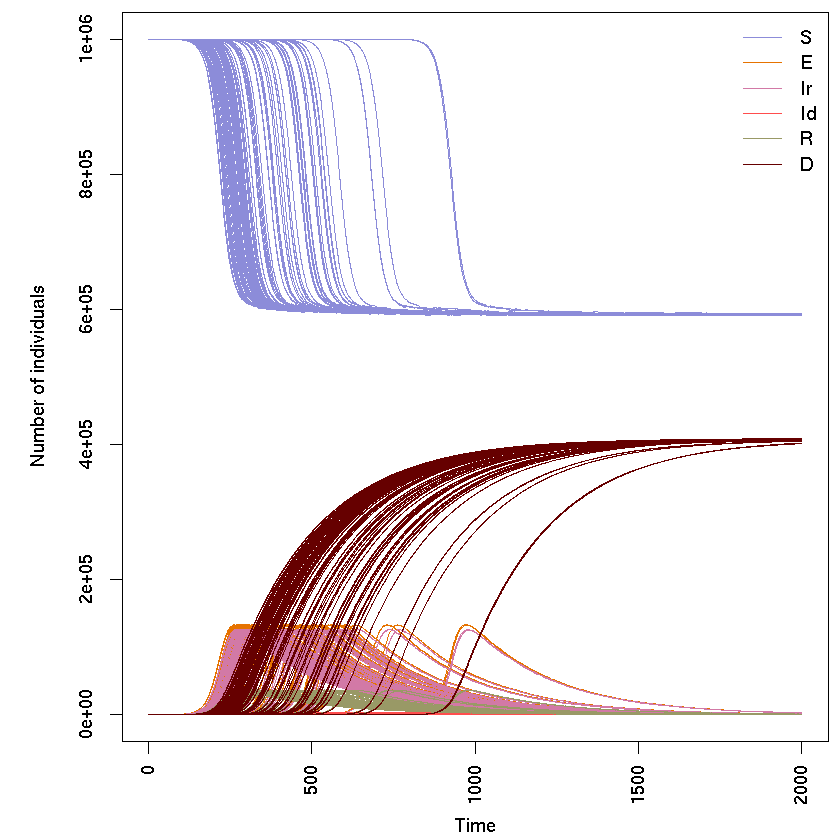

## Stochastic SEIRD model using odin

Author: Thibaut Jombart

Date: 2018-10-03

### Requirements
This code uses [*odin*](https://github.com/mrc-ide/odin), an **R** package for describing and solving differential equations. The commented commands will install the latest version of the package and its dependencies:


{:.input_area}
```R
#if (!require("drat")) install.packages("drat")
#drat:::add("mrc-ide")
#install.packages("dde")
#install.packages("odin")
library(odin)
```

We also use the following helper functions:


{:.input_area}
```R
## function to make colors transparent, stolen from adegenet::transp
transp <- function (col, alpha = 0.5) {
    res <- apply(col2rgb(col), 2,
                 function(c) rgb(c[1]/255, c[2]/255, 
                                 c[3]/255, alpha))
    return(res)
}

## x: instance of odin model
## t: time steps
## n: number of replicates
run_model <- function(x, t = 0:100, n = 1, ...) {
    res <- x$run(t, replicate = n, ...)
    res <- x$transform_variables(res)
    res <- cbind.data.frame(t = res[[1]], res[-1])
    attr(res, "n_compartments") <- length(x$names) - 1
    attr(res, "n_replicates") <- n
    attr(res, "compartments") <- x$names[-1]
    class(res) <- c("pretty_odin", class(res))
    res
}


## plot function
plot.pretty_odin <- function(x, pal = seird_pal, transparency=FALSE,...) {
    ## handle colors
    n_compartments <- attr(x, "n_compartments")
    n_replicates <- attr(x, "n_replicates")
    col_leg <- pal(n_compartments)
    alpha <- max(10 / n_replicates, 0.05)
    if(transparency){
        col <- rep(transp(col_leg, alpha), each = n_replicates)
    }else{
        col <- rep(col_leg, each = n_replicates)
    }
    ## make plot
    par(mar = c(4.1, 5.1, 0.5, 0.5), las = 3)
    matplot(x[, 1], x[, -1], xlab = "Time", ylab = "Number of individuals",
            type = "l", col = col, lty = 1, ...)
    legend("topright", lwd = 1, col = col_leg, bty = "n",
           legend = attr(x, "compartments"))
}

                 
## colors
seird_col <- c("#8c8cd9", "#e67300", "#d279a6", "#ff4d4d", "#999966", "#660000")
seird_pal <- colorRampPalette(seird_col)
```

### Model description

The model is specified in *odin* using:


{:.input_area}
```R
seird_generator <- odin::odin({
  ## Core equations for transitions between compartments:
  update(S) <- S - n_SE + n_RS
  update(E) <- E + n_SE - n_EI + n_import_E
  update(Ir) <- Ir + n_EIr - n_IrR
  update(Id) <- Id + n_EId - n_IdD
  update(R) <- R + n_IrR - n_RS
  update(D) <- D + n_IdD

  ## Individual probabilities of transition:
  p_SE <- 1 - exp(-beta * I / N)
  p_EI <-  1 - exp(-delta)
  p_IrR <- 1 - exp(-gamma_R) # Ir to R
  p_IdD <- 1 - exp(-gamma_D) # Id to d
  p_RS <- 1 - exp(-omega) # R to S


  ## Draws from binomial distributions for numbers changing between
  ## compartments:
  n_SE <- rbinom(S, p_SE)
  n_EI <- rbinom(E, p_EI)

  n_EIrId[] <- rmultinom(n_EI, p)
  p[1] <- 1 - mu
  p[2] <- mu
  dim(p) <- 2
  dim(n_EIrId) <- 2
  n_EIr <- n_EIrId[1]
  n_EId <- n_EIrId[2]
  n_IrR <- rbinom(Ir, p_IrR)
  n_IdD <- rbinom(Id, p_IdD)

  n_RS <- rbinom(R, p_RS)

  n_import_E <- rpois(epsilon)

  ## Total population size, and number of infecteds
  I <- Ir + Id
  N <- S + E + I + R + D

  ## Initial states
  initial(S) <- S_ini
  initial(E) <- E_ini
  initial(Id) <- 0
  initial(Ir) <- 0
  initial(R) <- 0
  initial(D) <- 0

  ## User defined parameters - default in parentheses:
  S_ini <- user(1000) # susceptibles
  E_ini <- user(1) # infected
  beta <- user(0.3) # infection rate
  delta <- user(0.2) # inverse incubation period
  gamma_R <- user(0.2) # recovery rate
  gamma_D <- user(0.4) # death rate
  mu <- user(0.05) # CFR
  omega <- user(0.1) # rate of waning immunity
  epsilon <- user(0.05) # import case rate
    
  }, verbose = FALSE)
```

## Running the model
The model is first parsed and compiled using `odin::odin`, and user-provided parameters are passed using the resulting model generator (the object `seird_generator`). All parameters specified in the model description above as `user()` can be set through the model generator. Here, we use 1 initial exposed individual, 1 million susceptibles, and run 100 independent simulations: 


{:.input_area}
```R
set.seed(1)
seird <- seird_generator(S_ini = 1e6, E_ini = 1, epsilon = 0.01, omega = 1)
x <- run_model(seird, t = 0:2000, n = 100)
plot(x)
```




