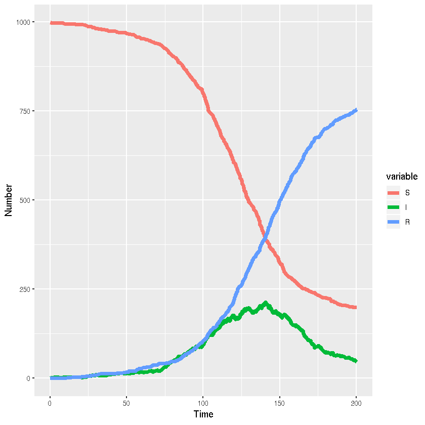

### Stochastic SIR model (discrete state, continuous time) in R using GillespieSSA


{:.input_area}
```R
library(GillespieSSA)
library(reshape2)
```


{:.input_area}
```R
a <- c("beta*S*I","gamma*I")
nu <- matrix(c(-1,+1,0,0,-1,+1),nrow=3,ncol=2,byrow=FALSE)
```


{:.input_area}
```R
# GillespieSSA
parms <- c(beta=0.1/1000,gamma=0.05)
x0 <- c(S=999,I=1,R=0)
tf <- 200
```


{:.input_area}
```R
set.seed(42)
```


{:.input_area}
```R
sir_out <- ssa(x0,a,nu,parms,tf=tf,simName="SIR")
```


{:.input_area}
```R
while(sir_out$stats$nSteps==1){
    sir_out <- ssa(x0,a,nu,parms,tf=tf,simName="SIR")
}
```


{:.input_area}
```R
head(sir_out$data)
```


<div markdown="0">
<table>
<thead><tr><th></th><th scope=col></th><th scope=col>S</th><th scope=col>I</th><th scope=col>R</th></tr></thead>
<tbody>
	<tr><th scope=row>timeSeries</th><td>0.000000</td><td>999     </td><td>1       </td><td>0       </td></tr>
	<tr><th scope=row></th><td>1.239429</td><td>998     </td><td>2       </td><td>0       </td></tr>
	<tr><th scope=row></th><td>3.427902</td><td>997     </td><td>3       </td><td>0       </td></tr>
	<tr><th scope=row></th><td>7.892282</td><td>997     </td><td>2       </td><td>1       </td></tr>
	<tr><th scope=row></th><td>9.059502</td><td>996     </td><td>3       </td><td>1       </td></tr>
	<tr><th scope=row></th><td>9.794212</td><td>995     </td><td>4       </td><td>1       </td></tr>
</tbody>
</table>

</div>


{:.input_area}
```R
sir_out_long <- melt(as.data.frame(sir_out$data),"V1")
```

#### Visualisation


{:.input_area}
```R
library(ggplot2)
```


{:.input_area}
```R
ggplot(sir_out_long,aes(x=V1,y=value,colour=variable,group=variable))+
  # Add line
  geom_line(lwd=2)+
  #Add labels
  xlab("Time")+ylab("Number")
```




