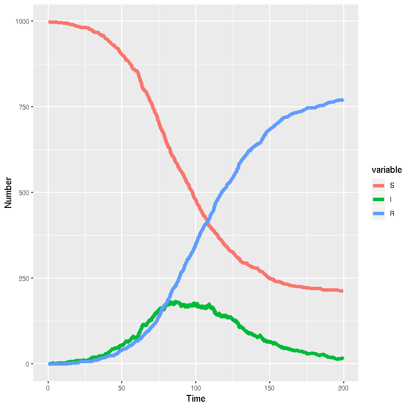

### Stochastic SIR model (discrete state, continuous time) in R/Rcpp


{:.input_area}
```R
library(reshape2)
library(Rcpp)
```


{:.input_area}
```R
cppFunction('
  List sirc(double beta, double gamma, double N, double S0, double I0, double R0, double tf){
    double t = 0;
    double S = S0;
    double I = I0;
    double R = R0;
    std::vector<double> ta;
    std::vector<double> Sa;
    std::vector<double> Ia;
    std::vector<double> Ra;
    do{
      ta.push_back(t);
      Sa.push_back(S);
      Ia.push_back(I);
      Ra.push_back(R);
      double pf1 = beta*S*I;
      double pf2 = gamma*I;
      double pf = pf1+pf2;
      double dt = rexp(1,pf)[0];
      t += dt;
      double r = runif(1)[0];
      if(r<pf1/pf){
        S--;
        I++;
      }else{
        I--;
        R++;
      }
      if(I==0){break;}
    } while (t<=tf && (I>0));
  return List::create(_["time"] = ta, _["S"] = Sa, _["I"] = Ia, _["R"]=Ra);
  }'
)
```


{:.input_area}
```R
set.seed(42)
```


{:.input_area}
```R
sir_out_list <- sirc(0.1/1000,0.05,1000,999,1,0,200)
```


{:.input_area}
```R
sir_out <- as.data.frame(sir_out_list)
```


{:.input_area}
```R
if(dim(sir_out)[1]==1){
    sir_out_list <- sirc(0.1/1000,0.05,1000,999,1,0,200)
    sir_out <- as.data.frame(sir_out_list)
}
```


{:.input_area}
```R
head(sir_out)
```


<div markdown="0">
<table>
<thead><tr><th scope=col>time</th><th scope=col>S</th><th scope=col>I</th><th scope=col>R</th></tr></thead>
<tbody>
	<tr><td> 0.000000</td><td>999      </td><td>1        </td><td>0        </td></tr>
	<tr><td> 1.891201</td><td>998      </td><td>2        </td><td>0        </td></tr>
	<tr><td> 3.470562</td><td>997      </td><td>3        </td><td>0        </td></tr>
	<tr><td> 4.169704</td><td>997      </td><td>2        </td><td>1        </td></tr>
	<tr><td> 8.149657</td><td>996      </td><td>3        </td><td>1        </td></tr>
	<tr><td>11.145904</td><td>995      </td><td>4        </td><td>1        </td></tr>
</tbody>
</table>

</div>


{:.input_area}
```R
sir_out_long <- melt(sir_out,"time")
```

#### Visualisation


{:.input_area}
```R
library(ggplot2)
```


{:.input_area}
```R
ggplot(sir_out_long,aes(x=time,y=value,colour=variable,group=variable))+
  # Add line
  geom_line(lwd=2)+
  #Add labels
  xlab("Time")+ylab("Number")
```




