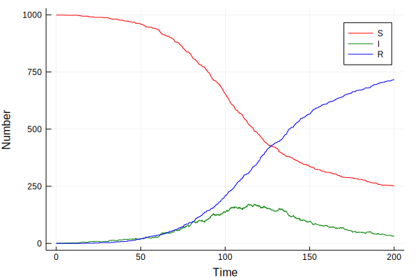

### Stochastic SIR model with Julia


{:.input_area}
```julia
using RandomNumbers
using DataFrames
```


{:.input_area}
```julia
@inline @fastmath function randbn(n,p,rng)
    q = 1.0 - p
    s = p/q
    a = (n+1)*s
    r = exp(n*log(q))
    x = 0
    u = rand(rng)
    while true
        if (u < r)
            return x
        end
        u -= r
        x += 1
        r *= (a/x)-s
    end
end
```


{:.output_data_text}
```
randbn (generic function with 1 method)
```


{:.input_area}
```julia
@inline @fastmath function sir(u, parms, rng)
    (S, I, R, Y) = u
    (β, γ, ι, N, δt) = parms
    λ = β * (I + ι) / N
    ifrac = 1.0 - exp(-λ * δt)
    rfrac = 1.0 - exp(-γ * δt)
    infection = randbn(S, ifrac, rng)
    recovery = randbn(I, rfrac, rng)
    return (S - infection, I + infection - recovery, R + recovery, Y + infection)
end
```


{:.output_data_text}
```
sir (generic function with 1 method)
```


{:.input_area}
```julia
function simulate(r)
    parms = (0.1, 0.05, 0.01, 1000.0, 0.1)
    tf = 200
    t = 0:0.1:tf
    tl = length(t)
    S = zeros(tl)
    I = zeros(tl)
    R = zeros(tl)
    Y = zeros(tl)
    u0 = (999, 1, 0, 0)
    (S[1],I[1],R[1],Y[1]) = u0
    u = u0
    for i in 2:tl
        u = sir(u, parms, r)
        (S[i],I[i],R[i],Y[i]) = u
    end
    return DataFrame(Time=t,S=S,I=I,R=R,Y=Y)
end
```


{:.output_data_text}
```
simulate (generic function with 1 method)
```


{:.input_area}
```julia
seed = 42
r = Xorshifts.Xorshift128Plus(seed);
```


{:.input_area}
```julia
sir_out = simulate(r);
```


{:.input_area}
```julia
head(sir_out)
```


<div markdown="0">
<table class="data-frame"><thead><tr><th></th><th>Time</th><th>S</th><th>I</th><th>R</th><th>Y</th></tr></thead><tbody><tr><th>1</th><td>0.0</td><td>999.0</td><td>1.0</td><td>0.0</td><td>0.0</td></tr><tr><th>2</th><td>0.1</td><td>999.0</td><td>1.0</td><td>0.0</td><td>0.0</td></tr><tr><th>3</th><td>0.2</td><td>999.0</td><td>1.0</td><td>0.0</td><td>0.0</td></tr><tr><th>4</th><td>0.3</td><td>999.0</td><td>1.0</td><td>0.0</td><td>0.0</td></tr><tr><th>5</th><td>0.4</td><td>999.0</td><td>1.0</td><td>0.0</td><td>0.0</td></tr><tr><th>6</th><td>0.5</td><td>999.0</td><td>1.0</td><td>0.0</td><td>0.0</td></tr></tbody></table>
</div>


#### Visualisation


{:.input_area}
```julia
using Plots, StatPlots
```


{:.input_area}
```julia
@df sir_out plot(:Time, [:S :I :R], colour = [:red :green :blue], xlabel="Time",ylabel="Number")
```





