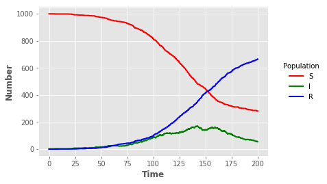

## Stochastic SIR model with Python

### Libraries


{:.input_area}
```python
import numpy as np
import math
import pandas as pd
import pythran
```


{:.input_area}
```python
 %load_ext pythran.magic
```


{:.input_area}
```python
np.random.seed(123)
```

### Plain Python version


{:.input_area}
```python
def sir(u,parms,t):
    bet,gamm,iota,N,dt=parms
    S,I,R,Y=u
    lambd = bet*(I+iota)/N
    ifrac = 1.0 - math.exp(-lambd*dt)
    rfrac = 1.0 - math.exp(-gamm*dt)
    infection = np.random.binomial(S,ifrac)
    recovery = np.random.binomial(I,rfrac)
    return [S-infection,I+infection-recovery,R+recovery,Y+infection]

def simulate():
    parms = [0.1, 0.05, 0.01, 1000.0, 0.1]
    tf = 200
    tl = 2001
    t = np.linspace(0,tf,tl)
    S = np.zeros(tl)
    I = np.zeros(tl)
    R = np.zeros(tl)
    Y = np.zeros(tl)
    u = [999,1,0,0]
    S[0],I[0],R[0],Y[0] = u
    for j in range(1,tl):
        u = sir(u,parms,t[j])
        S[j],I[j],R[j],Y[j] = u
    return {'t':t,'S':S,'I':I,'R':R,'Y':Y}
```


{:.input_area}
```python
%timeit simulate()
```

{:.output_stream}
```
10.6 ms ± 711 µs per loop (mean ± std. dev. of 7 runs, 100 loops each)

```


{:.input_area}
```python
sir_out = pd.DataFrame(simulate())
```


{:.input_area}
```python
sir_out
```


<div markdown="0">
<div>
<style scoped>
    .dataframe tbody tr th:only-of-type {
        vertical-align: middle;
    }

    .dataframe tbody tr th {
        vertical-align: top;
    }

    .dataframe thead th {
        text-align: right;
    }
</style>
<table border="1" class="dataframe">
  <thead>
    <tr style="text-align: right;">
      <th></th>
      <th>I</th>
      <th>R</th>
      <th>S</th>
      <th>Y</th>
      <th>t</th>
    </tr>
  </thead>
  <tbody>
    <tr>
      <th>0</th>
      <td>1.0</td>
      <td>0.0</td>
      <td>999.0</td>
      <td>0.0</td>
      <td>0.0</td>
    </tr>
    <tr>
      <th>1</th>
      <td>1.0</td>
      <td>0.0</td>
      <td>999.0</td>
      <td>0.0</td>
      <td>0.1</td>
    </tr>
    <tr>
      <th>2</th>
      <td>1.0</td>
      <td>0.0</td>
      <td>999.0</td>
      <td>0.0</td>
      <td>0.2</td>
    </tr>
    <tr>
      <th>3</th>
      <td>1.0</td>
      <td>0.0</td>
      <td>999.0</td>
      <td>0.0</td>
      <td>0.3</td>
    </tr>
    <tr>
      <th>4</th>
      <td>1.0</td>
      <td>0.0</td>
      <td>999.0</td>
      <td>0.0</td>
      <td>0.4</td>
    </tr>
    <tr>
      <th>5</th>
      <td>1.0</td>
      <td>0.0</td>
      <td>999.0</td>
      <td>0.0</td>
      <td>0.5</td>
    </tr>
    <tr>
      <th>6</th>
      <td>1.0</td>
      <td>0.0</td>
      <td>999.0</td>
      <td>0.0</td>
      <td>0.6</td>
    </tr>
    <tr>
      <th>7</th>
      <td>1.0</td>
      <td>0.0</td>
      <td>999.0</td>
      <td>0.0</td>
      <td>0.7</td>
    </tr>
    <tr>
      <th>8</th>
      <td>1.0</td>
      <td>0.0</td>
      <td>999.0</td>
      <td>0.0</td>
      <td>0.8</td>
    </tr>
    <tr>
      <th>9</th>
      <td>1.0</td>
      <td>0.0</td>
      <td>999.0</td>
      <td>0.0</td>
      <td>0.9</td>
    </tr>
    <tr>
      <th>10</th>
      <td>1.0</td>
      <td>0.0</td>
      <td>999.0</td>
      <td>0.0</td>
      <td>1.0</td>
    </tr>
    <tr>
      <th>11</th>
      <td>1.0</td>
      <td>0.0</td>
      <td>999.0</td>
      <td>0.0</td>
      <td>1.1</td>
    </tr>
    <tr>
      <th>12</th>
      <td>1.0</td>
      <td>0.0</td>
      <td>999.0</td>
      <td>0.0</td>
      <td>1.2</td>
    </tr>
    <tr>
      <th>13</th>
      <td>1.0</td>
      <td>0.0</td>
      <td>999.0</td>
      <td>0.0</td>
      <td>1.3</td>
    </tr>
    <tr>
      <th>14</th>
      <td>1.0</td>
      <td>0.0</td>
      <td>999.0</td>
      <td>0.0</td>
      <td>1.4</td>
    </tr>
    <tr>
      <th>15</th>
      <td>1.0</td>
      <td>0.0</td>
      <td>999.0</td>
      <td>0.0</td>
      <td>1.5</td>
    </tr>
    <tr>
      <th>16</th>
      <td>1.0</td>
      <td>0.0</td>
      <td>999.0</td>
      <td>0.0</td>
      <td>1.6</td>
    </tr>
    <tr>
      <th>17</th>
      <td>1.0</td>
      <td>0.0</td>
      <td>999.0</td>
      <td>0.0</td>
      <td>1.7</td>
    </tr>
    <tr>
      <th>18</th>
      <td>1.0</td>
      <td>0.0</td>
      <td>999.0</td>
      <td>0.0</td>
      <td>1.8</td>
    </tr>
    <tr>
      <th>19</th>
      <td>1.0</td>
      <td>0.0</td>
      <td>999.0</td>
      <td>0.0</td>
      <td>1.9</td>
    </tr>
    <tr>
      <th>20</th>
      <td>1.0</td>
      <td>0.0</td>
      <td>999.0</td>
      <td>0.0</td>
      <td>2.0</td>
    </tr>
    <tr>
      <th>21</th>
      <td>1.0</td>
      <td>0.0</td>
      <td>999.0</td>
      <td>0.0</td>
      <td>2.1</td>
    </tr>
    <tr>
      <th>22</th>
      <td>1.0</td>
      <td>0.0</td>
      <td>999.0</td>
      <td>0.0</td>
      <td>2.2</td>
    </tr>
    <tr>
      <th>23</th>
      <td>1.0</td>
      <td>0.0</td>
      <td>999.0</td>
      <td>0.0</td>
      <td>2.3</td>
    </tr>
    <tr>
      <th>24</th>
      <td>1.0</td>
      <td>0.0</td>
      <td>999.0</td>
      <td>0.0</td>
      <td>2.4</td>
    </tr>
    <tr>
      <th>25</th>
      <td>1.0</td>
      <td>0.0</td>
      <td>999.0</td>
      <td>0.0</td>
      <td>2.5</td>
    </tr>
    <tr>
      <th>26</th>
      <td>1.0</td>
      <td>0.0</td>
      <td>999.0</td>
      <td>0.0</td>
      <td>2.6</td>
    </tr>
    <tr>
      <th>27</th>
      <td>1.0</td>
      <td>0.0</td>
      <td>999.0</td>
      <td>0.0</td>
      <td>2.7</td>
    </tr>
    <tr>
      <th>28</th>
      <td>1.0</td>
      <td>0.0</td>
      <td>999.0</td>
      <td>0.0</td>
      <td>2.8</td>
    </tr>
    <tr>
      <th>29</th>
      <td>1.0</td>
      <td>0.0</td>
      <td>999.0</td>
      <td>0.0</td>
      <td>2.9</td>
    </tr>
    <tr>
      <th>...</th>
      <td>...</td>
      <td>...</td>
      <td>...</td>
      <td>...</td>
      <td>...</td>
    </tr>
    <tr>
      <th>1971</th>
      <td>62.0</td>
      <td>653.0</td>
      <td>285.0</td>
      <td>714.0</td>
      <td>197.1</td>
    </tr>
    <tr>
      <th>1972</th>
      <td>62.0</td>
      <td>653.0</td>
      <td>285.0</td>
      <td>714.0</td>
      <td>197.2</td>
    </tr>
    <tr>
      <th>1973</th>
      <td>62.0</td>
      <td>653.0</td>
      <td>285.0</td>
      <td>714.0</td>
      <td>197.3</td>
    </tr>
    <tr>
      <th>1974</th>
      <td>61.0</td>
      <td>654.0</td>
      <td>285.0</td>
      <td>714.0</td>
      <td>197.4</td>
    </tr>
    <tr>
      <th>1975</th>
      <td>60.0</td>
      <td>655.0</td>
      <td>285.0</td>
      <td>714.0</td>
      <td>197.5</td>
    </tr>
    <tr>
      <th>1976</th>
      <td>60.0</td>
      <td>655.0</td>
      <td>285.0</td>
      <td>714.0</td>
      <td>197.6</td>
    </tr>
    <tr>
      <th>1977</th>
      <td>59.0</td>
      <td>656.0</td>
      <td>285.0</td>
      <td>714.0</td>
      <td>197.7</td>
    </tr>
    <tr>
      <th>1978</th>
      <td>58.0</td>
      <td>657.0</td>
      <td>285.0</td>
      <td>714.0</td>
      <td>197.8</td>
    </tr>
    <tr>
      <th>1979</th>
      <td>57.0</td>
      <td>658.0</td>
      <td>285.0</td>
      <td>714.0</td>
      <td>197.9</td>
    </tr>
    <tr>
      <th>1980</th>
      <td>57.0</td>
      <td>658.0</td>
      <td>285.0</td>
      <td>714.0</td>
      <td>198.0</td>
    </tr>
    <tr>
      <th>1981</th>
      <td>57.0</td>
      <td>658.0</td>
      <td>285.0</td>
      <td>714.0</td>
      <td>198.1</td>
    </tr>
    <tr>
      <th>1982</th>
      <td>57.0</td>
      <td>658.0</td>
      <td>285.0</td>
      <td>714.0</td>
      <td>198.2</td>
    </tr>
    <tr>
      <th>1983</th>
      <td>57.0</td>
      <td>658.0</td>
      <td>285.0</td>
      <td>714.0</td>
      <td>198.3</td>
    </tr>
    <tr>
      <th>1984</th>
      <td>57.0</td>
      <td>658.0</td>
      <td>285.0</td>
      <td>714.0</td>
      <td>198.4</td>
    </tr>
    <tr>
      <th>1985</th>
      <td>56.0</td>
      <td>659.0</td>
      <td>285.0</td>
      <td>714.0</td>
      <td>198.5</td>
    </tr>
    <tr>
      <th>1986</th>
      <td>56.0</td>
      <td>659.0</td>
      <td>285.0</td>
      <td>714.0</td>
      <td>198.6</td>
    </tr>
    <tr>
      <th>1987</th>
      <td>55.0</td>
      <td>660.0</td>
      <td>285.0</td>
      <td>714.0</td>
      <td>198.7</td>
    </tr>
    <tr>
      <th>1988</th>
      <td>56.0</td>
      <td>660.0</td>
      <td>284.0</td>
      <td>715.0</td>
      <td>198.8</td>
    </tr>
    <tr>
      <th>1989</th>
      <td>56.0</td>
      <td>660.0</td>
      <td>284.0</td>
      <td>715.0</td>
      <td>198.9</td>
    </tr>
    <tr>
      <th>1990</th>
      <td>58.0</td>
      <td>660.0</td>
      <td>282.0</td>
      <td>717.0</td>
      <td>199.0</td>
    </tr>
    <tr>
      <th>1991</th>
      <td>58.0</td>
      <td>660.0</td>
      <td>282.0</td>
      <td>717.0</td>
      <td>199.1</td>
    </tr>
    <tr>
      <th>1992</th>
      <td>57.0</td>
      <td>661.0</td>
      <td>282.0</td>
      <td>717.0</td>
      <td>199.2</td>
    </tr>
    <tr>
      <th>1993</th>
      <td>57.0</td>
      <td>661.0</td>
      <td>282.0</td>
      <td>717.0</td>
      <td>199.3</td>
    </tr>
    <tr>
      <th>1994</th>
      <td>57.0</td>
      <td>661.0</td>
      <td>282.0</td>
      <td>717.0</td>
      <td>199.4</td>
    </tr>
    <tr>
      <th>1995</th>
      <td>57.0</td>
      <td>661.0</td>
      <td>282.0</td>
      <td>717.0</td>
      <td>199.5</td>
    </tr>
    <tr>
      <th>1996</th>
      <td>56.0</td>
      <td>662.0</td>
      <td>282.0</td>
      <td>717.0</td>
      <td>199.6</td>
    </tr>
    <tr>
      <th>1997</th>
      <td>55.0</td>
      <td>663.0</td>
      <td>282.0</td>
      <td>717.0</td>
      <td>199.7</td>
    </tr>
    <tr>
      <th>1998</th>
      <td>56.0</td>
      <td>663.0</td>
      <td>281.0</td>
      <td>718.0</td>
      <td>199.8</td>
    </tr>
    <tr>
      <th>1999</th>
      <td>55.0</td>
      <td>664.0</td>
      <td>281.0</td>
      <td>718.0</td>
      <td>199.9</td>
    </tr>
    <tr>
      <th>2000</th>
      <td>54.0</td>
      <td>665.0</td>
      <td>281.0</td>
      <td>718.0</td>
      <td>200.0</td>
    </tr>
  </tbody>
</table>
<p>2001 rows × 5 columns</p>
</div>
</div>


## Pythran compiled version

As the above code only uses simple Python and Numpy times, it is straightforward to obtain compiled versions of the code using Pythran.


{:.input_area}
```python
%%pythran -DUSE_XSIMD -march=native -O3

import numpy as np
import math

#pythran export sirp(float64 list, float64 list, float64)
def sirp(u,parms,t):
    bet,gamm,iota,N,dt=parms
    S,I,R,Y=u
    lambd = bet*(I+iota)/N
    ifrac = 1.0 - math.exp(-lambd*dt)
    rfrac = 1.0 - math.exp(-gamm*dt)
    infection = np.random.binomial(S,ifrac)
    recovery = np.random.binomial(I,rfrac)
    return [S-infection,I+infection-recovery,R+recovery,Y+infection]

#pythran export simulatep()
def simulatep():
    parms = [0.1, 0.05, 0.01, 1000.0, 0.1]
    tf = 200
    tl = 2001
    t = np.linspace(0,tf,tl)
    S = np.zeros(tl)
    I = np.zeros(tl)
    R = np.zeros(tl)
    Y = np.zeros(tl)
    u = [999,1,0,0]
    S[0],I[0],R[0],Y[0] = u
    for j in range(1,tl):
        u = sirp(u,parms,t[j])
        S[j],I[j],R[j],Y[j] = u
    return {'t':t,'S':S,'I':I,'R':R,'Y':Y}
```


{:.input_area}
```python
%timeit simulatep()
```

{:.output_stream}
```
752 µs ± 3.87 µs per loop (mean ± std. dev. of 7 runs, 1000 loops each)

```

This is around two orders of magnitude faster than the vanilla Python code.


{:.input_area}
```python
sir_outp = pd.DataFrame(simulatep())
```


{:.input_area}
```python
sir_outp
```


<div markdown="0">
<div>
<style scoped>
    .dataframe tbody tr th:only-of-type {
        vertical-align: middle;
    }

    .dataframe tbody tr th {
        vertical-align: top;
    }

    .dataframe thead th {
        text-align: right;
    }
</style>
<table border="1" class="dataframe">
  <thead>
    <tr style="text-align: right;">
      <th></th>
      <th>I</th>
      <th>R</th>
      <th>S</th>
      <th>Y</th>
      <th>t</th>
    </tr>
  </thead>
  <tbody>
    <tr>
      <th>0</th>
      <td>1.0</td>
      <td>0.0</td>
      <td>999.0</td>
      <td>0.0</td>
      <td>0.0</td>
    </tr>
    <tr>
      <th>1</th>
      <td>1.0</td>
      <td>0.0</td>
      <td>999.0</td>
      <td>0.0</td>
      <td>0.1</td>
    </tr>
    <tr>
      <th>2</th>
      <td>1.0</td>
      <td>0.0</td>
      <td>999.0</td>
      <td>0.0</td>
      <td>0.2</td>
    </tr>
    <tr>
      <th>3</th>
      <td>1.0</td>
      <td>0.0</td>
      <td>999.0</td>
      <td>0.0</td>
      <td>0.3</td>
    </tr>
    <tr>
      <th>4</th>
      <td>1.0</td>
      <td>0.0</td>
      <td>999.0</td>
      <td>0.0</td>
      <td>0.4</td>
    </tr>
    <tr>
      <th>5</th>
      <td>1.0</td>
      <td>0.0</td>
      <td>999.0</td>
      <td>0.0</td>
      <td>0.5</td>
    </tr>
    <tr>
      <th>6</th>
      <td>1.0</td>
      <td>0.0</td>
      <td>999.0</td>
      <td>0.0</td>
      <td>0.6</td>
    </tr>
    <tr>
      <th>7</th>
      <td>1.0</td>
      <td>0.0</td>
      <td>999.0</td>
      <td>0.0</td>
      <td>0.7</td>
    </tr>
    <tr>
      <th>8</th>
      <td>1.0</td>
      <td>0.0</td>
      <td>999.0</td>
      <td>0.0</td>
      <td>0.8</td>
    </tr>
    <tr>
      <th>9</th>
      <td>1.0</td>
      <td>0.0</td>
      <td>999.0</td>
      <td>0.0</td>
      <td>0.9</td>
    </tr>
    <tr>
      <th>10</th>
      <td>1.0</td>
      <td>0.0</td>
      <td>999.0</td>
      <td>0.0</td>
      <td>1.0</td>
    </tr>
    <tr>
      <th>11</th>
      <td>1.0</td>
      <td>0.0</td>
      <td>999.0</td>
      <td>0.0</td>
      <td>1.1</td>
    </tr>
    <tr>
      <th>12</th>
      <td>1.0</td>
      <td>0.0</td>
      <td>999.0</td>
      <td>0.0</td>
      <td>1.2</td>
    </tr>
    <tr>
      <th>13</th>
      <td>1.0</td>
      <td>0.0</td>
      <td>999.0</td>
      <td>0.0</td>
      <td>1.3</td>
    </tr>
    <tr>
      <th>14</th>
      <td>1.0</td>
      <td>0.0</td>
      <td>999.0</td>
      <td>0.0</td>
      <td>1.4</td>
    </tr>
    <tr>
      <th>15</th>
      <td>1.0</td>
      <td>0.0</td>
      <td>999.0</td>
      <td>0.0</td>
      <td>1.5</td>
    </tr>
    <tr>
      <th>16</th>
      <td>1.0</td>
      <td>0.0</td>
      <td>999.0</td>
      <td>0.0</td>
      <td>1.6</td>
    </tr>
    <tr>
      <th>17</th>
      <td>1.0</td>
      <td>0.0</td>
      <td>999.0</td>
      <td>0.0</td>
      <td>1.7</td>
    </tr>
    <tr>
      <th>18</th>
      <td>1.0</td>
      <td>0.0</td>
      <td>999.0</td>
      <td>0.0</td>
      <td>1.8</td>
    </tr>
    <tr>
      <th>19</th>
      <td>1.0</td>
      <td>0.0</td>
      <td>999.0</td>
      <td>0.0</td>
      <td>1.9</td>
    </tr>
    <tr>
      <th>20</th>
      <td>1.0</td>
      <td>0.0</td>
      <td>999.0</td>
      <td>0.0</td>
      <td>2.0</td>
    </tr>
    <tr>
      <th>21</th>
      <td>1.0</td>
      <td>0.0</td>
      <td>999.0</td>
      <td>0.0</td>
      <td>2.1</td>
    </tr>
    <tr>
      <th>22</th>
      <td>1.0</td>
      <td>0.0</td>
      <td>999.0</td>
      <td>0.0</td>
      <td>2.2</td>
    </tr>
    <tr>
      <th>23</th>
      <td>1.0</td>
      <td>0.0</td>
      <td>999.0</td>
      <td>0.0</td>
      <td>2.3</td>
    </tr>
    <tr>
      <th>24</th>
      <td>1.0</td>
      <td>0.0</td>
      <td>999.0</td>
      <td>0.0</td>
      <td>2.4</td>
    </tr>
    <tr>
      <th>25</th>
      <td>1.0</td>
      <td>0.0</td>
      <td>999.0</td>
      <td>0.0</td>
      <td>2.5</td>
    </tr>
    <tr>
      <th>26</th>
      <td>1.0</td>
      <td>0.0</td>
      <td>999.0</td>
      <td>0.0</td>
      <td>2.6</td>
    </tr>
    <tr>
      <th>27</th>
      <td>1.0</td>
      <td>0.0</td>
      <td>999.0</td>
      <td>0.0</td>
      <td>2.7</td>
    </tr>
    <tr>
      <th>28</th>
      <td>1.0</td>
      <td>0.0</td>
      <td>999.0</td>
      <td>0.0</td>
      <td>2.8</td>
    </tr>
    <tr>
      <th>29</th>
      <td>1.0</td>
      <td>0.0</td>
      <td>999.0</td>
      <td>0.0</td>
      <td>2.9</td>
    </tr>
    <tr>
      <th>...</th>
      <td>...</td>
      <td>...</td>
      <td>...</td>
      <td>...</td>
      <td>...</td>
    </tr>
    <tr>
      <th>1971</th>
      <td>38.0</td>
      <td>757.0</td>
      <td>205.0</td>
      <td>794.0</td>
      <td>197.1</td>
    </tr>
    <tr>
      <th>1972</th>
      <td>37.0</td>
      <td>758.0</td>
      <td>205.0</td>
      <td>794.0</td>
      <td>197.2</td>
    </tr>
    <tr>
      <th>1973</th>
      <td>37.0</td>
      <td>758.0</td>
      <td>205.0</td>
      <td>794.0</td>
      <td>197.3</td>
    </tr>
    <tr>
      <th>1974</th>
      <td>37.0</td>
      <td>758.0</td>
      <td>205.0</td>
      <td>794.0</td>
      <td>197.4</td>
    </tr>
    <tr>
      <th>1975</th>
      <td>37.0</td>
      <td>758.0</td>
      <td>205.0</td>
      <td>794.0</td>
      <td>197.5</td>
    </tr>
    <tr>
      <th>1976</th>
      <td>37.0</td>
      <td>758.0</td>
      <td>205.0</td>
      <td>794.0</td>
      <td>197.6</td>
    </tr>
    <tr>
      <th>1977</th>
      <td>37.0</td>
      <td>758.0</td>
      <td>205.0</td>
      <td>794.0</td>
      <td>197.7</td>
    </tr>
    <tr>
      <th>1978</th>
      <td>37.0</td>
      <td>758.0</td>
      <td>205.0</td>
      <td>794.0</td>
      <td>197.8</td>
    </tr>
    <tr>
      <th>1979</th>
      <td>37.0</td>
      <td>758.0</td>
      <td>205.0</td>
      <td>794.0</td>
      <td>197.9</td>
    </tr>
    <tr>
      <th>1980</th>
      <td>37.0</td>
      <td>758.0</td>
      <td>205.0</td>
      <td>794.0</td>
      <td>198.0</td>
    </tr>
    <tr>
      <th>1981</th>
      <td>37.0</td>
      <td>758.0</td>
      <td>205.0</td>
      <td>794.0</td>
      <td>198.1</td>
    </tr>
    <tr>
      <th>1982</th>
      <td>37.0</td>
      <td>758.0</td>
      <td>205.0</td>
      <td>794.0</td>
      <td>198.2</td>
    </tr>
    <tr>
      <th>1983</th>
      <td>38.0</td>
      <td>758.0</td>
      <td>204.0</td>
      <td>795.0</td>
      <td>198.3</td>
    </tr>
    <tr>
      <th>1984</th>
      <td>37.0</td>
      <td>759.0</td>
      <td>204.0</td>
      <td>795.0</td>
      <td>198.4</td>
    </tr>
    <tr>
      <th>1985</th>
      <td>36.0</td>
      <td>760.0</td>
      <td>204.0</td>
      <td>795.0</td>
      <td>198.5</td>
    </tr>
    <tr>
      <th>1986</th>
      <td>36.0</td>
      <td>760.0</td>
      <td>204.0</td>
      <td>795.0</td>
      <td>198.6</td>
    </tr>
    <tr>
      <th>1987</th>
      <td>36.0</td>
      <td>760.0</td>
      <td>204.0</td>
      <td>795.0</td>
      <td>198.7</td>
    </tr>
    <tr>
      <th>1988</th>
      <td>36.0</td>
      <td>760.0</td>
      <td>204.0</td>
      <td>795.0</td>
      <td>198.8</td>
    </tr>
    <tr>
      <th>1989</th>
      <td>35.0</td>
      <td>761.0</td>
      <td>204.0</td>
      <td>795.0</td>
      <td>198.9</td>
    </tr>
    <tr>
      <th>1990</th>
      <td>35.0</td>
      <td>761.0</td>
      <td>204.0</td>
      <td>795.0</td>
      <td>199.0</td>
    </tr>
    <tr>
      <th>1991</th>
      <td>35.0</td>
      <td>761.0</td>
      <td>204.0</td>
      <td>795.0</td>
      <td>199.1</td>
    </tr>
    <tr>
      <th>1992</th>
      <td>35.0</td>
      <td>761.0</td>
      <td>204.0</td>
      <td>795.0</td>
      <td>199.2</td>
    </tr>
    <tr>
      <th>1993</th>
      <td>34.0</td>
      <td>762.0</td>
      <td>204.0</td>
      <td>795.0</td>
      <td>199.3</td>
    </tr>
    <tr>
      <th>1994</th>
      <td>34.0</td>
      <td>762.0</td>
      <td>204.0</td>
      <td>795.0</td>
      <td>199.4</td>
    </tr>
    <tr>
      <th>1995</th>
      <td>35.0</td>
      <td>762.0</td>
      <td>203.0</td>
      <td>796.0</td>
      <td>199.5</td>
    </tr>
    <tr>
      <th>1996</th>
      <td>35.0</td>
      <td>762.0</td>
      <td>203.0</td>
      <td>796.0</td>
      <td>199.6</td>
    </tr>
    <tr>
      <th>1997</th>
      <td>35.0</td>
      <td>762.0</td>
      <td>203.0</td>
      <td>796.0</td>
      <td>199.7</td>
    </tr>
    <tr>
      <th>1998</th>
      <td>35.0</td>
      <td>762.0</td>
      <td>203.0</td>
      <td>796.0</td>
      <td>199.8</td>
    </tr>
    <tr>
      <th>1999</th>
      <td>35.0</td>
      <td>762.0</td>
      <td>203.0</td>
      <td>796.0</td>
      <td>199.9</td>
    </tr>
    <tr>
      <th>2000</th>
      <td>35.0</td>
      <td>762.0</td>
      <td>203.0</td>
      <td>796.0</td>
      <td>200.0</td>
    </tr>
  </tbody>
</table>
<p>2001 rows × 5 columns</p>
</div>
</div>


### Visualisation


{:.input_area}
```python
import matplotlib.pyplot as plt
```


{:.input_area}
```python
plt.style.use("ggplot")
```


{:.input_area}
```python
sline = plt.plot("t","S","",data=sir_out,color="red",linewidth=2)
iline = plt.plot("t","I","",data=sir_out,color="green",linewidth=2)
rline = plt.plot("t","R","",data=sir_out,color="blue",linewidth=2)
plt.xlabel("Time",fontweight="bold")
plt.ylabel("Number",fontweight="bold")
legend = plt.legend(title="Population",loc=5,bbox_to_anchor=(1.25,0.5))
frame = legend.get_frame()
frame.set_facecolor("white")
frame.set_linewidth(0)
```




