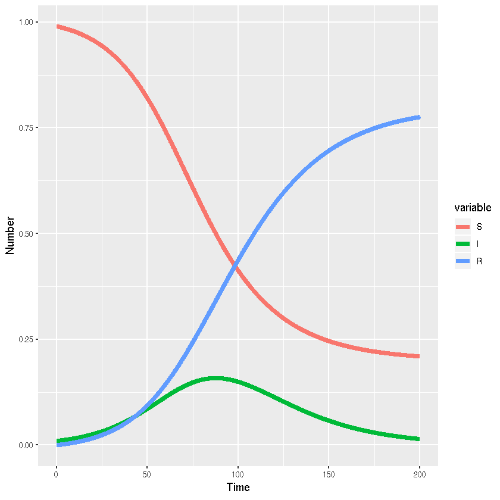

### R using deSolve

*Author*: Simon Frost

*Date*: 2018-07-12


{:.input_area}
```R
library(deSolve)
library(reshape2)
```


{:.input_area}
```R
sir_ode <- function(times,init,parms){
  with(as.list(c(parms,init)), {
  # ODEs
  dS <- -beta*S*I
  dI <- beta*S*I-gamma*I
  dR <- gamma*I
  list(c(dS,dI,dR))
  })
}
parms <- c(beta=0.1,gamma=0.05)
init <- c(S=0.99,I=0.01,R=0) 
times <- seq(0,200,length.out=2001)
sir_out <- lsoda(init,times,sir_ode,parms)
```


{:.input_area}
```R
sir_out_long <- melt(as.data.frame(sir_out),"time")
```

#### Visualisation


{:.input_area}
```R
library(ggplot2)
```


{:.input_area}
```R
ggplot(sir_out_long,aes(x=time,y=value,colour=variable,group=variable))+
  # Add line
  geom_line(lwd=2)+
  #Add labels
  xlab("Time")+ylab("Number")
```




