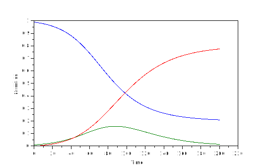

{:.input_area}
```scilab
function xdot = sir_eqn(t,x)
    // Parameter values
    bet=0.1;
    mu=0.05;

    // Define variables
    s = x(1);
    y = x(2);
    r = x(3);

    // Define ODEs
    ds=-bet*s*y;
    dy=bet*s*y-mu*y;
    dr=mu*y;

    // Return gradients
    xdot = [ds,dy,dr];
endfunction;
```

{:.output_stream}
```




















```


{:.input_area}
```scilab
// SIR model
// Define t
t = linspace(0, 200, 2001)+.1;

// Define initial conditions
s0=0.99;
y0=0.01;
r0=0.0;
x0=[s0,y0,r0];


// Run ODE
x = ode(x0,0,t,sir_eqn);

// Save output
out=matrix(x,3,-1)';
savematfile('sir_sci.out','-ascii','out');
```

{:.output_stream}
```



















```


{:.input_area}
```scilab
plot(t',out)
xlabel("Time")
ylabel("Number")
```

{:.output_stream}
```




```




