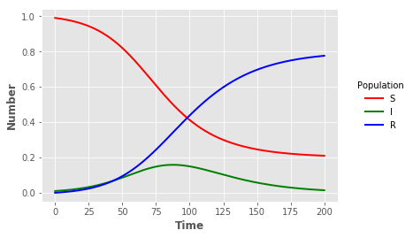

## SIR using XPP


{:.input_area}
```python
%%writefile sir.ode
par b=0.1
par g=0.05
s'=-b*s*y
y'=b*s*y-g*y
r'=g*y
init s=0.99 y=0.01 r=0.0
@ total=200
@ output=sir_xpp.out
done
```


{:.input_area}
```python
!xppaut sir.ode -silent
```

{:.output_stream}
```
Parameters:
|b|=0.100000 
Parameters:
|g|=0.050000 
0:dS/dt=-B*S*Y  
1:dY/dt=B*S*Y-G*Y  
2:dR/dt=G*Y  
 Initial S(0)=0.99
 Initial Y(0)=0.01
 Initial R(0)=0
 All formulas are valid!!
 nvar=3 naux=0 nfix=0 nmark=0 NEQ=3 NODE=3 
Used 8 constants and 111 symbols 
XPPAUT 8.0 Copyright (C) 2002-now  Bard Ermentrout 
 Run complete ... 

```

### Visualisation


{:.input_area}
```python
import pandas as pd
import matplotlib.pyplot as plt
```


{:.input_area}
```python
sir_out = pd.read_csv("sir_xpp.out",sep=" ",header=None,names=["t","S","I","R"],index_col=False)
```


{:.input_area}
```python
plt.style.use("ggplot")
```


{:.input_area}
```python
sline = plt.plot("t","S","",data=sir_out,color="red",linewidth=2)
iline = plt.plot("t","I","",data=sir_out,color="green",linewidth=2)
rline = plt.plot("t","R","",data=sir_out,color="blue",linewidth=2)
plt.xlabel("Time",fontweight="bold")
plt.ylabel("Number",fontweight="bold")
legend = plt.legend(title="Population",loc=5,bbox_to_anchor=(1.25,0.5))
frame = legend.get_frame()
frame.set_facecolor("white")
frame.set_linewidth(0)
```




